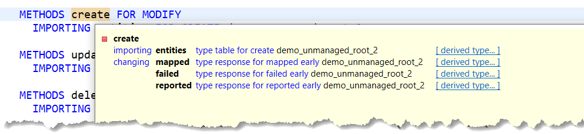
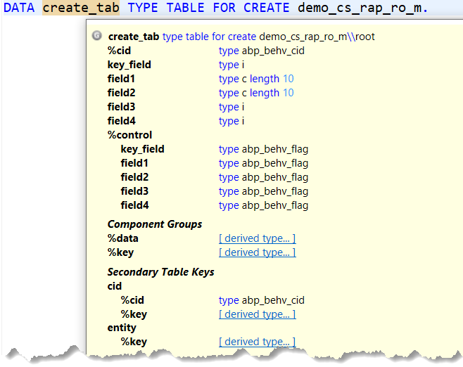
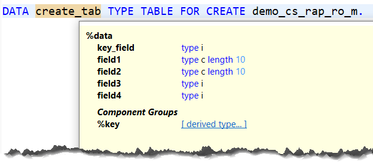
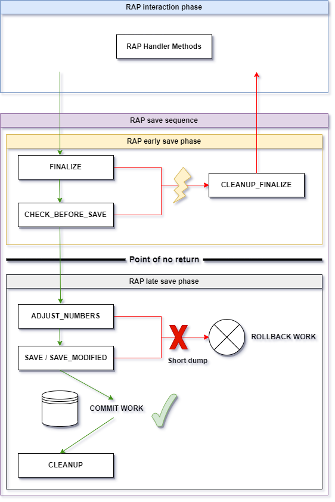

<a name="top"></a>

# ABAP for RAP: Entity Manipulation Language (ABAP EML)

- [ABAP for RAP: Entity Manipulation Language (ABAP EML)](#abap-for-rap-entity-manipulation-language-abap-eml)
  - [RAP Terms](#rap-terms)
  - [RAP Behavior Definition (BDEF)](#rap-behavior-definition-bdef)
  - [ABAP Behavior Pools (ABP)](#abap-behavior-pools-abp)
    - [RAP Handler Classes and Methods](#rap-handler-classes-and-methods)
      - [Parameters of Handler Methods](#parameters-of-handler-methods)
    - [RAP Saver Class and Saver Methods](#rap-saver-class-and-saver-methods)
    - [ABP Auxiliary Classes](#abp-auxiliary-classes)
  - [BDEF Derived Types](#bdef-derived-types)
    - [BDEF Derived Type Syntax and Declaring Data Types and Data Objects](#bdef-derived-type-syntax-and-declaring-data-types-and-data-objects)
    - [Components of BDEF Derived Types](#components-of-bdef-derived-types)
    - [Constants for BDEF Derived Type Components](#constants-for-bdef-derived-type-components)
    - [Secondary Table Keys of BDEF Derived Types](#secondary-table-keys-of-bdef-derived-types)
    - [Type Mapping for RAP](#type-mapping-for-rap)
      - [RAP-Specific Additions to the CORRESPONDING Operator](#rap-specific-additions-to-the-corresponding-operator)
      - [ABAP SQL Statements with BDEF Derived Types](#abap-sql-statements-with-bdef-derived-types)
  - [ABAP EML Syntax](#abap-eml-syntax)
    - [ABAP EML Syntax for Modifying Operations](#abap-eml-syntax-for-modifying-operations)
      - [Create Operation Using the Short Form of ABAP EML MODIFY Statements](#create-operation-using-the-short-form-of-abap-eml-modify-statements)
      - [Create Operation Using the Long Form of ABAP EML MODIFY Statements](#create-operation-using-the-long-form-of-abap-eml-modify-statements)
      - [Update Operations](#update-operations)
      - [Delete Operations](#delete-operations)
      - [Dynamic Form of ABAP EML MODIFY Statements](#dynamic-form-of-abap-eml-modify-statements)
      - [Executing Actions](#executing-actions)
      - [Excursions](#excursions)
        - [Specifying %control Component Values in the Short Form of VALUE Constructor Expressions](#specifying-control-component-values-in-the-short-form-of-value-constructor-expressions)
        - [Combining Multiple Operations in One ABAP EML Request](#combining-multiple-operations-in-one-abap-eml-request)
        - [Creating Instances for the Root and Child Entity (Deep Create)](#creating-instances-for-the-root-and-child-entity-deep-create)
    - [ABAP EML Syntax for Reading Operations](#abap-eml-syntax-for-reading-operations)
      - [Reading Operations](#reading-operations)
      - [Read-by-Association Operations](#read-by-association-operations)
      - [Dynamic ABAP EML READ Statements](#dynamic-abap-eml-read-statements)
    - [COMMIT ENTITIES: Persisting to the Database](#commit-entities-persisting-to-the-database)
    - [ROLLBACK ENTITIES](#rollback-entities)
    - [GET PERMISSIONS: Retrieving Information about RAP BO Permissions](#get-permissions-retrieving-information-about-rap-bo-permissions)
    - [Raising RAP Business Events](#raising-rap-business-events)
    - [Additions to ABAP EML Statements in ABAP Behavior Pools](#additions-to-abap-eml-statements-in-abap-behavior-pools)
      - [IN LOCAL MODE Addition](#in-local-mode-addition)
      - [AUGMENTING Addition to ABAP EML MODIFY Statements](#augmenting-addition-to-abap-eml-modify-statements)
  - [RAP Excursions](#rap-excursions)
    - [Using Keys and Identifying RAP BO Instances in a Nutshell](#using-keys-and-identifying-rap-bo-instances-in-a-nutshell)
      - [Assignment of Key Component Groups](#assignment-of-key-component-groups)
    - [RAP Concepts](#rap-concepts)
      - [Late Numbering and Key Identification in the Late Phase of the RAP Save Sequence](#late-numbering-and-key-identification-in-the-late-phase-of-the-rap-save-sequence)
    - [Ensuring Data Consistency in a RAP Transaction](#ensuring-data-consistency-in-a-rap-transaction)
      - [Phases of a RAP Transaction](#phases-of-a-rap-transaction)
      - [Commit and Rollback in a RAP Transaction](#commit-and-rollback-in-a-rap-transaction)
      - [Allowed/Forbidden Operations in a Behavior Implementation in a RAP Transaction](#allowedforbidden-operations-in-a-behavior-implementation-in-a-rap-transaction)
    - [RAP Additional and Unmanaged Save](#rap-additional-and-unmanaged-save)
    - [Handling Dependencies on RAP Business Objects in ABAP Unit](#handling-dependencies-on-rap-business-objects-in-abap-unit)
    - [RAP-Related System Classes and Functionality](#rap-related-system-classes-and-functionality)
  - [More Information](#more-information)
  - [Executable Examples](#executable-examples)

## RAP Terms

[ABAP Entity Manipulation Language](https://help.sap.com/doc/abapdocu_latest_index_htm/latest/en-US/index.htm?file=abenaeml_glosry.htm) (or EML for short) is a subset of ABAP that allows you to access the data of [RAP](https://help.sap.com/doc/abapdocu_latest_index_htm/latest/en-US/index.htm?file=abenarap_glosry.htm) business objects in an ABAP program.
The following points cover RAP-related terms such as *RAP business objects* and others for setting the context:

<table>

<tr>
<td> Terms </td> <td> Notes </td>
</tr>

<tr>
<td> 

RAP business objects (RAP BO)

 </td>

 <td> 

-   A RAP BO is based on a special, tree-like hierarchical structure
    of [CDS
    entities](https://help.sap.com/doc/abapdocu_cp_index_htm/CLOUD/en-US/index.htm?file=abencds_entity_glosry.htm "Glossary Entry")
    of a data model
-   Such a structure of entities can consist of [parent
    entities](https://help.sap.com/doc/abapdocu_cp_index_htm/CLOUD/en-US/index.htm?file=abenparent_entity_glosry.htm "Glossary Entry")
    and [child
    entities](https://help.sap.com/doc/abapdocu_cp_index_htm/CLOUD/en-US/index.htm?file=abenchild_entity_glosry.htm "Glossary Entry")
    that are themselves defined using [CDS
    compositions](https://help.sap.com/doc/abapdocu_cp_index_htm/CLOUD/en-US/index.htm?file=abencds_composition_glosry.htm "Glossary Entry")
    and [to-parent
    associations](https://help.sap.com/doc/abapdocu_cp_index_htm/CLOUD/en-US/index.htm?file=abento_parent_association_glosry.htm "Glossary Entry").
-   The top parent entity of a [CDS composition
    tree](https://help.sap.com/doc/abapdocu_cp_index_htm/CLOUD/en-US/index.htm?file=abencds_composition_tree_glosry.htm "Glossary Entry")
    is the root entity that represents the business object. With a
    large composition tree, RAP BOs can be fairly complex. Or they
    can be very simple by just consisting of one root entity alone.
-   Note: There is a special syntax for the [CDS root entity](https://help.sap.com/doc/abapdocu_cp_index_htm/CLOUD/en-US/index.htm?file=abenroot_entity_glosry.htm) of a RAP BO: [`define root view entity`](https://help.sap.com/doc/abapdocu_cp_index_htm/CLOUD/en-US/index.htm?file=abencds_define_root_view_v2.htm)


 </td>
</tr>

<tr>
<td> 

[RAP behavior definition](https://help.sap.com/doc/abapdocu_cp_index_htm/CLOUD/en-US/index.htm?file=abencds_behavior_definition_glosry.htm "Glossary Entry") (BDEF)

 </td>

 <td> 

-   RAP BOs are described by the definitions specified in a special
    [DDIC](https://help.sap.com/doc/abapdocu_cp_index_htm/CLOUD/en-US/index.htm?file=abenddic_glosry.htm "Glossary Entry")
    artifact: RAP behavior definition (BDEF)
-   A BDEF defines the [RAP business object
    behavior](https://help.sap.com/doc/abapdocu_cp_index_htm/CLOUD/en-US/index.htm?file=abenrap_bo_behavior_glosry.htm "Glossary Entry")
    (i. e. the transactional behavior of a RAP BO)
-   Transactional behavior means a BDEF defines [behavior
    characteristics](https://help.sap.com/doc/abapdocu_cp_index_htm/CLOUD/en-US/index.htm?file=abencds_entity_properties_glosry.htm "Glossary Entry")
    and [RAP BO
    operations](https://help.sap.com/doc/abapdocu_cp_index_htm/CLOUD/en-US/index.htm?file=abenrap_bo_operation_glosry.htm "Glossary Entry") i.
    e. [RAP BO standard
    operations](https://help.sap.com/doc/abapdocu_cp_index_htm/CLOUD/en-US/index.htm?file=abenrap_standard_operation_glosry.htm "Glossary Entry")
    ([CRUD
    operations](https://help.sap.com/doc/abapdocu_cp_index_htm/CLOUD/en-US/index.htm?file=abencrud_glosry.htm "Glossary Entry")),
    [non-standard
    operations](https://help.sap.com/doc/abapdocu_cp_index_htm/CLOUD/en-US/index.htm?file=abenrap_nstandard_operation_glosry.htm "Glossary Entry")
    like specific [RAP
    actions](https://help.sap.com/doc/abapdocu_cp_index_htm/CLOUD/en-US/index.htm?file=abenrap_action_glosry.htm "Glossary Entry")
    and
    [functions](https://help.sap.com/doc/abapdocu_cp_index_htm/CLOUD/en-US/index.htm?file=abenrap_function_glosry.htm "Glossary Entry"),
    and more.
-   There are many other things that can be included impacting the
    RAP BO behavior like [RAP feature
    control](https://help.sap.com/doc/abapdocu_cp_index_htm/CLOUD/en-US/index.htm?file=abenrap_feature_control_glosry.htm "Glossary Entry"),
    for example, defining which data is mandatory and which is
    read-only, or
    [determinations](https://help.sap.com/doc/abapdocu_cp_index_htm/CLOUD/en-US/index.htm?file=abenrap_determination_glosry.htm "Glossary Entry")
    and
    [validations](https://help.sap.com/doc/abapdocu_cp_index_htm/CLOUD/en-US/index.htm?file=abenrap_validation_glosry.htm "Glossary Entry").
-   BDEFs use [Behavior Definition
    Language](https://help.sap.com/doc/abapdocu_cp_index_htm/CLOUD/en-US/index.htm?file=abenbdl_glosry.htm "Glossary Entry")
    (BDL) for the definitions. Find more information on the topic
    and various options to define the transactional behavior in
    section [BDL for Behavior
    Definitions](https://help.sap.com/doc/abapdocu_cp_index_htm/CLOUD/en-US/index.htm?file=abenbdl.htm)
    in the ABAP Keyword Documentation.

 </td>
</tr>

<tr>
<td> 

Transactional buffer and implementation types

 </td>

 <td> 

-   A BDEF defines the behavior of a RAP BO and, thus, how to handle
    its data. This data is available in the [RAP transactional
    buffer](https://help.sap.com/doc/abapdocu_cp_index_htm/CLOUD/en-US/index.htm?file=abentransactional_buffer_glosry.htm "Glossary Entry").
-   It is a storage for a RAP BO's data that is used and worked on
    during an [SAP LUW](https://help.sap.com/doc/abapdocu_cp_index_htm/CLOUD/en-US/index.htm?file=abensap_luw_glosry.htm).
-   This data includes [RAP BO
    instances](https://help.sap.com/doc/abapdocu_cp_index_htm/CLOUD/en-US/index.htm?file=abenrap_bo_instance_glosry.htm "Glossary Entry")
    (i. e. concrete data sets of an entity). This is where EML
    enters the picture: EML is used, among others, to access this data in the transactional buffer.
-   Currently, there are two kinds of RAP BOs:
    [managed](https://help.sap.com/doc/abapdocu_cp_index_htm/CLOUD/en-US/index.htm?file=abenmanaged_rap_bo_glosry.htm "Glossary Entry")
    and [unmanaged RAP
    BOs](https://help.sap.com/doc/abapdocu_cp_index_htm/CLOUD/en-US/index.htm?file=abenunmanaged_rap_bo_glosry.htm "Glossary Entry").
-   Managed and unmanaged are implementation types that are also
    specified in the BDEF.
-   The implementation type determines the [RAP BO
    provider](https://help.sap.com/doc/abapdocu_cp_index_htm/CLOUD/en-US/index.htm?file=abenrap_bo_provider_glosry.htm "Glossary Entry"), i.
    e. how the transactional buffer is provided and how the behavior
    of a RAP BO is implemented.

 </td>
</tr>

<tr>
<td> 

Managed RAP BOs

 </td>

 <td> 

-   The managed RAP BO provider fully or partly provides the
    transactional buffer and RAP BO behavior (for standard
    operations only). In this case, the developers need not cater
    for the transactional buffer and implement the standard
    operations. This implementation is mostly relevant for
    greenfield scenarios when starting from scratch.
-   Example: Regarding CRUD operations in managed RAP BOs,
    developers need not cater for an implementation at all. The
    standard operations work out of the box. For example, in case of
    an update operation, RAP BO instance data that is to be updated
    is automatically read into the transactional buffer, and then
    updated accordingly there. Finally, when triggering the saving,
    the updated instance in the transactional buffer is
    automatically saved to the database without any custom
    development needed.
-   The transactional buffer is provided, too. You do not need to
    create the buffer yourself.
-   Note: Usually, the behavior of a RAP BO requires some
    additional implementations also in the context of managed RAP
    BOs. For example, non-standard operations or feature controls
    must be self-implemented in [ABAP behavior
    pools](https://help.sap.com/doc/abapdocu_cp_index_htm/CLOUD/en-US/index.htm?file=abenbehavior_pool_glosry.htm "Glossary Entry")
    (see the details further down).

 </td>
</tr>

<tr>
<td> 

Unmanaged RAP BOs

 </td>

 <td> 

-   Everything must be provided by the [unmanaged RAP BO
    provider](https://help.sap.com/doc/abapdocu_cp_index_htm/CLOUD/en-US/index.htm?file=abenunmanaged_rap_bo_prov_glosry.htm "Glossary Entry"), i.
    e. the transactional buffer and all RAP BO operations must be
    provided or self-implemented by developers in an ABAP behavior
    implementation
-   Unmanaged RAP BOs are, for example, relevant for brownfield
    scenarios, i. e. in scenarios in which transactional buffers and application logic is already
    available and should be embedded in the RAP world. Note that it is possible to have a managed RAP BO with unmanaged parts, e.g. unmanaged save or additional save. Find more information [here](https://help.sap.com/doc/abapdocu_cp_index_htm/CLOUD/en-US/index.htm?file=abenbdl_rap_bo.htm).

 </td>
</tr>

<tr>
<td> 

ABAP behavior implementation in an ABAP behavior pool (ABP)

 </td>

 <td> 

-   An [ABAP behavior
    pool](https://help.sap.com/doc/abapdocu_cp_index_htm/CLOUD/en-US/index.htm?file=abenbehavior_pool_glosry.htm "Glossary Entry")
    is a special [class
    pool](https://help.sap.com/doc/abapdocu_cp_index_htm/CLOUD/en-US/index.htm?file=abenclass_pool_glosry.htm "Glossary Entry")
    for an ABAP behavior implementation that implements the
    unmanaged RAP BO provider based on definitions in a BDEF. The
    class pool's name is specified in the BDEF.
-   The [global
    class](https://help.sap.com/doc/abapdocu_cp_index_htm/CLOUD/en-US/index.htm?file=abenglobal_class_glosry.htm "Glossary Entry")
    of a behavior pool does not implement the behavior itself. It is
    empty on creation apart from the declaration and implementation part skeletons. The behavior implementation is coded in local
    [RAP handler
    classes](https://help.sap.com/doc/abapdocu_cp_index_htm/CLOUD/en-US/index.htm?file=abenabp_handler_class_glosry.htm "Glossary Entry")
    and a [RAP saver
    class](https://help.sap.com/doc/abapdocu_cp_index_htm/CLOUD/en-US/index.htm?file=abenabp_saver_class_glosry.htm "Glossary Entry")
    in the [CCIMP
    include](https://help.sap.com/doc/abapdocu_cp_index_htm/CLOUD/en-US/index.htm?file=abenccimp_glosry.htm "Glossary Entry")
    of the behavior pool. These classes are called by the [RAP
    runtime
    engine](https://help.sap.com/doc/abapdocu_cp_index_htm/CLOUD/en-US/index.htm?file=abenrap_runtime_engine_glosry.htm "Glossary Entry")
    when the RAP BO is accessed. This is covered in more detail
    further down.
-   Usually, saver classes are not needed in managed RAP BOs (except
    for special variants of managed RAP BOs such as [RAP additional save](https://help.sap.com/doc/abapdocu_cp_index_htm/CLOUD/en-US/index.htm?file=abenrap_add_save_glosry.htm) and [RAP unmanaged save](https://help.sap.com/doc/abapdocu_cp_index_htm/CLOUD/en-US/index.htm?file=abenrap_unman_save_glosry.htm)). Local handler classes are usually
    needed in managed RAP BOs if implementations are required that
    go beyond standard operations.
-   Note: In more complex scenarios, with RAP BOs that
    consist of many entities, you can define behavior pools for
    individual entities by adding the syntax to the [`define
    behavior
    for`](https://help.sap.com/doc/abapdocu_cp_index_htm/CLOUD/en-US/index.htm?file=abenbdl_define_beh.htm)
    notation. There is not a saver class for each entity but only
    one saver class for the BO as a whole. Any number of behavior
    pools can be assigned to a BDEF allowing applications a
    structuring into multiple units.

 </td>
</tr>

</table>

> [!NOTE]  
> - Find more terms in the [RAP Glossary](https://help.sap.com/doc/abapdocu_cp_index_htm/CLOUD/en-US/index.htm?file=abenrap_glossary.htm) of the ABAP Keyword Documentation.
> - There are more artifacts and concepts related to RAP that go way beyond the scope of this cheat sheet. For example, a RAP BO can be exposed as a [business service](https://help.sap.com/doc/abapdocu_cp_index_htm/CLOUD/en-US/index.htm?file=abenbusiness_service_glosry.htm "Glossary Entry") to be accessed from outside [AS ABAP](https://help.sap.com/doc/abapdocu_latest_index_htm/latest/en-US/index.htm?file=abenas_abap_sys_environ_glosry.htm "Glossary Entry") and consumed. A [RAP BO
consumer](https://help.sap.com/doc/abapdocu_cp_index_htm/CLOUD/en-US/index.htm?file=abenrap_bo_consumer_glosry.htm "Glossary Entry")
is either the [RAP transactional engine](https://help.sap.com/doc/abapdocu_cp_index_htm/CLOUD/en-US/index.htm?file=abenrap_transac_engine_glosry.htm "Glossary Entry") that handles requests from outside the AS ABAP or, from inside AS ABAP,
an ABAP program using ABAP EML (which this cheat sheet and the examples focus on).
> - The cheat sheet and the examples focus on a minimal number of artifacts - from database table and view entity, to BDEF and ABAP behavior pool, including an ABAP class as consumer. Many other RAP-related artifacts and aspects are beyond the scope. Get a more thorough insight in the [Development guide for the ABAP RESTful Application Programming Model](https://help.sap.com/docs/ABAP_PLATFORM_NEW/fc4c71aa50014fd1b43721701471913d/289477a81eec4d4e84c0302fb6835035.html).
> - You can create all RAP service-related repository objects from scratch using a wizard in ADT. The wizard lets you manually input your RAP BO requirements or use the Joule chat. Find more information [here](https://help.sap.com/docs/abap-cloud/abap-rap/odata-ui-service-from-scratch).

<p align="right"><a href="#top">⬆️ back to top</a></p>

## RAP Behavior Definition (BDEF)

- As the name implies, a RAP behavior definition describes a RAP business object (RAP BO) by defining its behavior for all of its RAP BO entities. 
- BDL source code is used in a BDEF.
- Once you have created ...
  - the CDS root entity of a RAP BO, ADT helps you create the skeleton of a BDEF (e.g., right-click on the CDS root entity and choose *New Behavior Definition* from the pop-up). 
  - the BDEF, ADT helps you create the skeleton of an ABAP behavior pool, as well as RAP handler and saver method declarations and the skeleton of implementations via ADT quick fixes.
- More information (see also the subtopics there): 
  - [Structure of a RAP behavior definition](https://help.sap.com/doc/abapdocu_cp_index_htm/CLOUD/en-US/index.htm?file=abencds_bdef.htm)
  - [Infos about BDL syntax](https://help.sap.com/doc/abapdocu_cp_index_htm/CLOUD/en-US/index.htm?file=abenbdl_syntax.htm)
  - [Infos about behavior definitions](https://help.sap.com/doc/abapdocu_cp_index_htm/CLOUD/en-US/index.htm?file=abenbdl.htm)
  - [RAP BDL - Feature Tables](https://help.sap.com/doc/abapdocu_cp_index_htm/CLOUD/en-US/abenrap_feature_table.html)
 
The following example shows a commented BDEF, and is just an excursion. Note that there is a wide variety of possible specifications and options. The example shows only a selection. The example shows multiple specifications with comments and also syntax hidden with comments, just for the sake of showing more syntax options. For full details, correct specification and combination options, refer to the ABAP Keyword Documentation. For example, it is not possible to specify operations multiple times and more.

```js
//Possible implementation types: managed, unmanaged, abstract, projection, interface 
//(which restrict/enable further specifications)
//You can specifiy one or more implementation classes (behavior pools/ABPs -> bp...) 
//for the RAP BO (in some contexts, specifying no ABP is possible).
//Specifying unique is mandatory (each operation can only be implemented once).
managed implementation in class bp_some_demo unique;

//For managed RAP BOs, you can enable user-defined saving options (optional additions 
//are available).
//Purpose: Enhancing or replacing the default save sequence (Note: Only in this case, 
//the ABP has a local saver class/save_modified saver method)

//managed with additional save with full data implementation in class bp_some_demo unique; 

//full data: Full instance data is passed for saving

//managed with unmanaged save implementation in class bp_some_demo unique;

//Enabling the strict mode (and version) to apply additional syntax checks; handled by 
//the RAP framework; it is recommended that you use the most recent version
strict ( 2 );

//Enabling RAP draft handling

//with draft;

//It is mandatory to specify an entity behavior definition for the RAP BO root entity.
//Here, some_demo represents a CDS view entity.
define behavior for some_demo 
//Specifying an alias name (e.g. to have a more telling name than the technical name of 
//the entity). When specifying an alias name, you should address the entity with the alias 
//name instead of the full name (e.g. in the signature of handler methods).

//define behavior for some_demo alias root

//Specifying the database table a RAP BO is based on (only available/mandatory in managed 
//BOs); note further requirements for diverse scenarios in the documentation
persistent table some_dbtab

//Mandatory specification of a draft table when a RAP BO is draft-enabled

//draft table drafttab

//Specifying the locking mechanism for entities, e.g. to prevent a simultaneous 
//modification. In unmanaged RAP BOs, this must be self-implemented in a dedicated handler 
//method
lock master

//Controlling authorization that is to be implemented in an ABP (also for managed)
//You can specify variants: global (e.g. for restricting certain operations) and/or 
//instance (restrictions based on entity instances) or both of them (dedicated handler 
//methods must be implemented)
//More variants are available that can be specified in the { ... } block below for 
//excluding and delegating authorization checks (e.g. authorization:update)
authorization master ( instance )

//authorization master ( global )
//authorization master ( instance, global )

//Defining late numbering for primary key fields (see the adjust_numbers handler method)
//More numbering options are available such as early numbering, or, in the { ... } block below, 
//the 'numbering : managed' specification for particular fields.

//late numbering

//Defining a field as entity tag (ETag) field for optimistic concurrency control (i.e. 
//enabling transactional access to data by multiple users to avoid inconsistencies when 
//unintentionally changing already modified data). More options available, e.g. for 
//draft-enabled RAP BOs (total etag).
//etag master some_field

{
  //RAP BO operations
  //Standard operations (Note: Read is implicitly enabled, no specification available)
  create;
  update;
  //More additions are available dealing with authorization, feature control, precheck etc.
  //The example shows precheck. In doing so, you can implement a precheck (e.g. to prevent 
  //unwanted changes) before instances are deleted in a dedicated handler method. A precheck 
  //implementation is also available for other operations (e.g. actions).
  //As is true for various specifications, a comma-separated list of specifications is possible.
  delete( precheck );

  //Note: It is not possible to specify operations multiple times. The following specifications
  //just demonstrate syntax options. Anyway, the compiler helps you not to specify wrong notations.
  //Applying feature control
  //delete( features: global ); 

  //Applying authorization control 
  //delete( authorization : update ); 

  //Operations for associations (many specification options are possible)
  //The following example means enabling create-by-association operations for associations
  //Assumption: _child is specified in the underlying CDS data model.
  association _child { create; } 

  //Non-standard operations (check the specification options in the documentation, e.g. feature 
  //control and others are possible) such as actions (modify RAP BO instance) and functions (return 
  //information). There are different flavors of actions such as non-factory and factory actions, 
  //which themselves have different variations. Other flavors of actions are save actions (only to 
  //be executed during save sequence), determine actions (allow RAP BO consumers to execute 
  //determinations and validations on request), and draft actions.
  
  //Non-factory actions (modify existing instances)
  //Instance action, relates to instances, modify instances
  action act1;  

  //Static action, not bound to instances, relates to the entrie entity
  static action act2;  

  //Internal action, accessible only from within the ABP (internal can also be specified in other 
  //contexts, e.g. operations)
  internal action act3;  

  //You can optionally specify input or output parameters or both (not always possible for all 
  //action types). The following example shows an output parameter, defined with the result 
  //addition. It stores the result of an action in an internal table. Variants are possible for 
  //the return type. Here, it is $self (result type is the same type as entity) It can, for 
  //example, also be an abstract BDEF or a different entity.
  action act4 result [1] $self; 

  //Input parameter specified following 'parameter' (in this case, a CDS abstract entity)
  action act5 parameter some_cds_abstract; 

  //Factory action (to create instances, can be instance-bound or static)
  //Specifying the cardinality is mandatory
  factory action act6 [1]; 

  //Draft actions
  //Available for draft-enabled RAP BOs, allow data modification on the draft table; are 
  //implicitly available; it is recommended for the draft actions to be specified explicitly; 
  //for some of the methods, the 'with additional implementation' addition is available
  
  //Copies active instances to the draft table
  //draft action Edit;  

  //Sets a lock for entity instances on the persistent database table
  //draft action Resume;  

  //Copies draft table content to the persitent database table; recommendation: use the 
  //optimized addition
  //draft action Activate optimized; 

  //Clears entries from the draft database table
  //draft action Discard;  
  
  //Corresponds to the determine actions for active instances; 
  //used to validate draft data before transitioning to active data
  //draft determine action Prepare 
  // {
    //You can assign validations and determinations defined with 'on save'
    //    validation val;
  // }

  //Functions (similar to actions, there are optional additions, such as static)
  //Since they return information, specifying an output parameter is required.
  //Instance function
  function func1 result [0..*] $self; 

  //Static function
  static function func2 result [1] some_cds_abstract; 

  //Instance function with optional input parameter
  function func3 parameter some_cds_abstract result [1] $self; 

  //Field characteristics
  //Field values cannot be created/updated
  field ( readonly ) field1; 

  //Read-only during update (especially key fields created during create operations)
  field ( readonly : update ) key_field; 

  //The mandatory specification denotes that values must be provided for the fields before persisting 
  //them to the database.
  //Comma-separated list possible for the field characteristics in general; 
  //mutliple characteristics can also be specified in a comma-separated list in the parentheses  
  field ( mandatory ) field2, field3; 
                                      
  //Defining access restrictions for fields
  field ( features : instance ) field4; 

  //Validations
  //Checking the consitency of instances; validations are triggered based on conditions
  //Conditions (one or more are possible) can be specified for create, update, delete operations 
  //and modified fields; note: not available for unmanaged, non-draft RAP BOs.
  validation val on save { create; field field1; }
  
  //Determinations
  //Modifying instances based on trigger conditions; 
  //As above, conditions (one or more are possible) can be specified for create, update, delete 
  //operations and modified fields. The triggering is possible for 'on modify' and 'on save'.
  determination det1 on modify { update; delete; field field5, field6; }
  determination det2 on save { create; field field7, field8; }

  //RAP business event (derived events with the specification 'managed evt ...' are also possible)
  event evt;

  //RAP side effects, to trigger a reload of affected properties on the UI
  //Trigger properties: Field changes, action executions
  //Multiple side effects can be specified within a { ... } block, separated by a colon
  //There are multiple options to specify the target following 'affect'; the example uses fields 
  //to be reloaded
  side effects { field field1 affects field field4;
                 field field2 affects field field4;
                 field field3 affects field field4; 
                 action act1 affects field field4; }

}


//It is optional to specify an entity behavior definition for child entities
define behavior for some_child_entity alias child

//Applying locks dependent on the specified association (locks are delegated to 
//the specified association). In this case, it's the parent entity. Assumption: 
//_parent is specified in the the underlying CDS data model.
lock dependent by _parent

//Applying authorization checks dependent on the specified association
//As above, the assumption is that _parent is specified in the underlying CDS 
//data model.
authorization dependent by _parent

{
  update;
  delete;
  field ( readonly ) key_field;
  field ( readonly : update ) key_field_child;
  association _parent;
}
```

<p align="right"><a href="#top">⬆️ back to top</a></p>

## ABAP Behavior Pools (ABP)

You can access RAP BO data from inside AS ABAP using
EML. Among other things, EML allows you to read or modify RAP BOs by
accessing the RAP BO data (the RAP BO instances) in the transactional
buffer and trigger the persistent storage or reset changes. More
precisely, when EML statements are executed, the calling of [RAP handler
methods](https://help.sap.com/doc/abapdocu_cp_index_htm/CLOUD/en-US/index.htm?file=abenabp_handler_method_glosry.htm "Glossary Entry")
is triggered to access the transactional buffer of a RAP BO. As
mentioned, for unmanaged RAP BOs or unmanaged parts of managed RAP BOs,
the handler methods that are called are part of an ABAP behavior pool.

The global class of an ABP has the addition [`FOR BEHAVIOR OF bdef`](https://help.sap.com/doc/abapdocu_cp_index_htm/CLOUD/en-US/index.htm?file=abapclass_for_behavior_of.htm)
to the definition while `bdef` stands for the name of the BDEF.
This class is (initially) empty apart from the declaration and implementation part skeleton.

```abap
CLASS zbp_demo_abap_rap_draft_m DEFINITION PUBLIC ABSTRACT FINAL FOR BEHAVIOR OF zdemo_abap_rap_draft_m.
ENDCLASS.

CLASS zbp_demo_abap_rap_draft_m IMPLEMENTATION.
ENDCLASS.
```

The actual implementation is done in local classes in the CCIMP include (*Local Types* tab in ADT) of the behavior pool. There,
two kinds of local classes are to be defined and implemented that are
related to the RAP BO's runtime: one or more [handler
classes](https://help.sap.com/doc/abapdocu_cp_index_htm/CLOUD/en-US/index.htm?file=abenabp_handler_class_glosry.htm "Glossary Entry")
to implement the RAP BO behavior (in RAP handler methods) during the
[RAP interaction
phase](https://help.sap.com/doc/abapdocu_cp_index_htm/CLOUD/en-US/index.htm?file=abenrap_int_phase_glosry.htm "Glossary Entry")
(the data reading and modification phase) and a [saver
class](https://help.sap.com/doc/abapdocu_cp_index_htm/CLOUD/en-US/index.htm?file=abenabp_saver_class_glosry.htm "Glossary Entry")
to implement the [RAP save
sequence](https://help.sap.com/doc/abapdocu_cp_index_htm/CLOUD/en-US/index.htm?file=abenrap_save_seq_glosry.htm "Glossary Entry")
(in [saver
methods](https://help.sap.com/doc/abapdocu_cp_index_htm/CLOUD/en-US/index.htm?file=abenabp_saver_method_glosry.htm "Glossary Entry")
to save data from the transactional buffer to the database).


<p align="right"><a href="#top">⬆️ back to top</a></p>

### RAP Handler Classes and Methods

-   One or more handler classes implement the RAP interaction phase. For
    modularization purposes, one behavior pool can define multiple
    handler classes. For example, each entity can have its own handler
    class, or individual handler classes can be defined to distinguish
    between reading and changing RAP BO entities.
-   A handler class inherits from class
    `CL_ABAP_BEHAVIOR_HANDLER`.
-   These classes are implicitly `ABSTRACT` and `FINAL`
    since instantiating and calling only happens through the RAP runtime
    engine.
-   [ADT](https://help.sap.com/doc/abapdocu_cp_index_htm/CLOUD/en-US/index.htm?file=abenadt_glosry.htm "Glossary Entry")
    helps you create the classes and methods (and basically the ABP as
    such) when creating the BDEF. A quick fix is available that creates
    the method definitions and a skeleton of the implementations
    automatically.

Example: Handler class definition
``` abap
CLASS lhc_root DEFINITION INHERITING FROM cl_abap_behavior_handler.
...
ENDCLASS.
```
-   Handler method definitions include the additions `... FOR ... FOR
    ...` followed by the kinds of operations. There are various
    options depending on the RAP BO operation.
-   Depending on the definition in the BDEF, there might be more additions
    with dedicated method parameters. For example, an action might
    be defined with a result parameter, hence, the method must be
    defined with the addition `RESULT` and a parameter.
-   The `FOR MODIFY` handler method can handle multiple entities
    and operations, i. e. not only create but also update or delete
    might be integrated in the method definition. However, it might be
    useful to split the handler method into separate methods for better
    readability.
-   See more details on the handler method definitions in the topic
    [`METHODS, FOR`](https://help.sap.com/doc/abapdocu_cp_index_htm/CLOUD/en-US/index.htm?file=abapmethods_for_rap_behv.htm).

Example: Handler method definitions
``` abap
"Create
METHODS create FOR MODIFY
      IMPORTING entities FOR CREATE bdef.

"Read: Specifying a read result is mandatory.
METHODS read FOR READ
      IMPORTING keys FOR READ bdef RESULT result.

"Action: action name is preceded by the BDEF name and a tilde after FOR ACTION
METHODS some_action FOR MODIFY
      IMPORTING keys FOR ACTION bdef~some_action.
```

<p align="right"><a href="#top">⬆️ back to top</a></p>

#### Parameters of Handler Methods

-   The handler method definitions contain RAP-specific additions like
    `FOR MODIFY`, `FOR CREATE` or `FOR READ` as
    well as mandatory or optional additions like `RESULT` that
    are followed by parameters.
-   The parameters are typed with [BDEF derived
    types](https://help.sap.com/doc/abapdocu_cp_index_htm/CLOUD/en-US/index.htm?file=abenrap_derived_type_glosry.htm "Glossary Entry")
    that have special RAP-related components as covered further down.
-   The parameters' names can be chosen freely. This is also true for
    the method names except for some predefined names.
-   Each handler method must have at least one importing parameter. 
    Specifying the addition `IMPORTING` explicitly is optional since it is used
    implicitly. In most cases, entire instances or just key values
    of instances are imported.
-   All handler methods have changing parameters that are usually not
    explicitly specified in the definition but implicitly used. The
    explicit specification of the `CHANGING` addition is not needed. In most cases, these are
    [RAP response
    parameters](https://help.sap.com/doc/abapdocu_cp_index_htm/CLOUD/en-US/index.htm?file=abenrap_response_param_glosry.htm "Glossary Entry").
    The following image shows the F2 information in ADT for the create
    handler method.
    
-   The response parameters `mapped`, `failed` and
    `reported` (the names are predefined) can be considered as
    containers for information - information a RAP BO consumer is
    provided with by a RAP BO provider, for example, an SAP Fiori app
    displays an error message if something went wrong. The availability
    of the parameters depends on the handler method used (e. g.
    `mapped` is only available for operations creating
    instances).
    -   `mapped`: Used to provide mapping information on RAP BO
        instances, for example, which key values were created for given
        content IDs (
        [`%cid`](https://help.sap.com/doc/abapdocu_cp_index_htm/CLOUD/en-US/index.htm?file=abapderived_types_cid.htm)).
    -   `failed`: Information for identifying the data set for
        which an error occurred in a RAP operation
    -   `reported`: Used, for example, to exchange error messages for each
        entity defined in the BDEF and [not related to a specific
        entity](https://help.sap.com/doc/abapdocu_cp_index_htm/CLOUD/en-US/index.htm?file=abapderived_types_other.htm).
    -   Example: Technically, the `reported` parameter is a
        [deep
        structure](https://help.sap.com/doc/abapdocu_cp_index_htm/CLOUD/en-US/index.htm?file=abendeep_structure_glosry.htm "Glossary Entry")
        containing, for example, the messages of the root entity and
        child entities. For example, if a create operation fails for a
        RAP BO instance of the root entity, a message, information about
        the instance key and other things can be included in this
        parameter which is passed to a RAP BO consumer. You could
        imagine that such an error message is displayed on an SAP Fiori
        UI if something goes wrong to inform the user.

> [!NOTE]  
> It is essential to implement RAP handler methods correctly to ensure the stability and consistency of RAP business objects, particularly in populating the RAP response parameters. For more details on best practices for implementation, refer to the [documentation](https://help.sap.com/docs/abap-cloud/abap-rap/general-rap-bo-implementation-contract).

<p align="right"><a href="#top">⬆️ back to top</a></p>

### RAP Saver Class and Saver Methods

-   A RAP saver class implements the [RAP save
    sequence](https://help.sap.com/doc/abapdocu_cp_index_htm/CLOUD/en-US/index.htm?file=abenrap_save_seq_glosry.htm "Glossary Entry").
    A saver class is usually only available in unmanaged RAP BOs (except
    for special variants of managed RAP BOs that are not outlined here).
-   The saver class is implicitly `ABSTRACT` and `FINAL`
    since the instantiating and calling only happens through the RAP
    runtime engine.
-   A saver class can be defined in the CCIMP include (*Local Types* tab in ADT) of an ABAP
    behavior pool. It includes the definitions and implementations of
    RAP saver methods.
-   The saver methods consist of a set of predefined methods having
    predefined names. Some of them are mandatory to implement, some are
    optional. The
    [`adjust_numbers`](https://help.sap.com/doc/abapdocu_cp_index_htm/CLOUD/en-US/index.htm?file=abensaver_adjust_numbers.htm)
    method is only available in [late
    numbering](https://help.sap.com/doc/abapdocu_cp_index_htm/CLOUD/en-US/index.htm?file=abenrap_late_numbering_glosry.htm "Glossary Entry")
    scenarios.
-   A saver class inherits from class
    `CL_ABAP_BEHAVIOR_SAVER`. The saver methods are
    declared by redefining predefined methods of the superclass. They
    implicitly have response parameters.
-   In contrast to RAP handler methods, saver methods do not have data
    of RAP BO instances as import parameter. Therefore, instance data
    must be handled via the transactional buffer when self-implementing
    the saver methods.
-   Saver methods are called when the RAP save sequence has been triggered by a [`COMMIT
    ENTITIES`](https://help.sap.com/doc/abapdocu_cp_index_htm/CLOUD/en-US/index.htm?file=abapcommit_entities.htm)
    statement. Note that in natively supported RAP scenarios, for example, an SAP Fiori app using OData, the `COMMIT ENTITIES` call is performed implicitly and automatically by the [RAP runtime engine](https://help.sap.com/doc/abapdocu_cp_index_htm/CLOUD/en-US/index.htm?file=abenrap_runtime_engine_glosry.htm).
-   Find more information on RAP saver methods
    [here](https://help.sap.com/doc/abapdocu_cp_index_htm/CLOUD/en-US/index.htm?file=abenabp_saver_class.htm).

Example: Definition of a RAP saver class and saver methods
``` abap
CLASS lsc_bdef DEFINITION INHERITING FROM cl_abap_behavior_saver.
  PROTECTED SECTION.

    "For final calculations and data modifications involving all
    "BOs in the current RAP transaction
    METHODS finalize REDEFINITION.

    "Checks the consistency of the transactional buffer before
    "the save method saves data to the database
    METHODS check_before_save REDEFINITION.

    "Preliminary IDs are mapped to final keys. Only for late numbering.
    METHODS adjust_numbers REDEFINITION.

    "Saves the current state of the transactional buffer to the database
    METHODS save REDEFINITION.

    "Clear the transactional buffer
    METHODS cleanup REDEFINITION.
    METHODS cleanup_finalize REDEFINITION.

ENDCLASS.
```

<p align="right"><a href="#top">⬆️ back to top</a></p>

### ABP Auxiliary Classes

- You can optionally define auxiliary classes for ABPs using the syntax `... FOR BEHAVIOR OF bdef_name ...`. 
- These classes are implicitly final global classes and reference a RAP business object.
- They have enhanced access rights to RAP BOs, and ABAP EML statements with the `IN LOCAL MODE` and `PRIVILEGED` can be used. 
- Their main function is to support implementation in an ABAP behavior pool. They achieve this by offering reusable methods and enabling developers to implement RAP behavior simultaneously. Furthermore, they can be used to provide utility methods for raising [RAP business events](https://help.sap.com/doc/abapdocu_cp_index_htm/CLOUD/en-US/index.htm?file=abenrap_entity_event_glosry.htm). 
- Note that RAP handler, saver, and event handler methods as such can only be implemented in a behavior pool, but they can delegate tasks to methods in ABP auxiliary classes. It is not recommended to completely outsource the handler and saver method implementations to auxiliary classes to prevent unnecessary overhead.
- As a prerequisite, the ABAP auxiliary class name is specified in the BDEF using the [`auxiliary class ...` notation](https://help.sap.com/doc/abapdocu_cp_index_htm/CLOUD/en-US/ABENBDL_AUXILIARY_CLASS.html). Multiple ABAP auxiliary classes can be specified. 

<p align="right"><a href="#top">⬆️ back to top</a></p>

## BDEF Derived Types

The operands of EML statements and parameters of handler and saver methods are mainly special messenger tables for passing data and receiving results or messages, i. e. the communication between a [RAP BO consumer](https://help.sap.com/doc/abapdocu_cp_index_htm/CLOUD/en-US/index.htm?file=abenrap_bo_consumer_glosry.htm) and the [RAP BO provider](https://help.sap.com/doc/abapdocu_cp_index_htm/CLOUD/en-US/index.htm?file=abenrap_bo_provider_glosry.htm) using EML consists (in most cases) of exchanging data stored in internal tables that have special ABAP types - [BDEF derived types](https://help.sap.com/doc/abapdocu_cp_index_htm/CLOUD/en-US/index.htm?file=abenrap_derived_type_glosry.htm "Glossary Entry").
These types are tailor-made for RAP purposes.

As the name implies, the types are derived by the [ABAP runtime framework](https://help.sap.com/doc/abapdocu_cp_index_htm/CLOUD/en-US/index.htm?file=abenabap_runtime_frmwk_glosry.htm "Glossary Entry")
from CDS entities and their behavior definition in the BDEF. With these special types, a type-safe access to RAP BOs is guaranteed.

> [!NOTE]  
> - To explore BDEF derived types in your RAP BO, you can access the CCIMP include (*Local Types* tab in ADT) of your ABAP behavior pool, position the cursor on the methods, choose F2 and check the parameters typed with BDEF derived types. 
> - As mentioned, CRUD operations are implicitly supported in managed scenarios (when specified in the BDEF). So, there will not be method declarations and implementations for CRUD operation methods. 

<p align="right"><a href="#top">⬆️ back to top</a></p>


### BDEF Derived Type Syntax and Declaring Data Types and Data Objects

- For all operations and behavior characteristics defined in the BDEF, you can derive types. For example, if you enable create operations (using the `create` specification in the BDEF), you can create respective BDEF derived types. If you do not enable delete operations, you cannot create respective types.
- The syntax, similar to method definitions mentioned earlier, uses the addition `FOR` followed by further RAP-related additions (such as `CREATE` for create operations).
- These additions include the name of an entity and, if necessary, a specific name (e.g., the action name for a BDEF derived type related to an action).
- The following syntax options are available in the context of BDEF derived types:

    | Syntax  | Notes |
    |---|---|
    | [`TYPE TABLE FOR`](https://help.sap.com/doc/abapdocu_cp_index_htm/CLOUD/en-US/index.htm?file=abaptype_table_for.htm)  |  For creating internal tables with BDEF derived types. Most RAP handler method parameters use tabular BDEF derived types.  |
    | [`TYPE STRUCTURE FOR`](https://help.sap.com/doc/abapdocu_cp_index_htm/CLOUD/en-US/index.htm?file=abaptype_structure_for.htm)  | In many cases, structures of type `TYPE STRUCTURE FOR` serve as both the [work area](https://help.sap.com/doc/abapdocu_cp_index_htm/CLOUD/en-US/index.htm?file=abenwork_area_glosry.htm "Glossary Entry") and the line type of the internal tables. There are also structured BDEF derived types that function as types for RAP handler method parameters. |
    | [`TYPE RESPONSE FOR`](https://help.sap.com/doc/abapdocu_cp_index_htm/CLOUD/en-US/index.htm?file=abaptype_response_for.htm)  | These types refer to the RAP response parameters `mapped`, `failed`, and `reported`. They are deep structures containing information for individual RAP BO entities. The components of these structures are internal tables of appropriate types with `TYPE TABLE FOR`.  |
    | [`TYPE REQUEST FOR`](https://help.sap.com/doc/abapdocu_cp_index_htm/CLOUD/en-US/index.htm?file=abaptype_request_for.htm)  | The types `TYPE REQUEST FOR CHANGE` and `TYPE REQUEST FOR DELETE` are relevant for importing parameters of the `save_modified` RAP saver method in the context of RAP additional and unmanaged save. These BDEF derived types are deep structures containing internal tables with RAP BO instance keys and/or data for create, update, or delete operations.  |


- Find an overview of available BDEF derived types [here](https://help.sap.com/doc/abapdocu_cp_index_htm/CLOUD/en-US/index.htm?file=abenrpm_derived_types.htm).
- You can use `TYPES` and `DATA` statements to declare data types and objects with BDEF derived types.
- Both long and short forms are available to declare data types and objects. Example:
  - Create an internal table typed with a BDEF derived type for create operations in ADT: `DATA d1 TYPE TABLE FOR CREATE zdemo_abap_rap_ro_m.`
  - Position the cursor on `d1` and press F2 to get type information. The long form shows the root entity plus the concrete entity (which is the root entity itself, an alias name is specified for the root entity in the example): `d1 type table for create zdemo_abap_rap_ro_m\\root.`
- The following specification options are available:
  - Long form: Specifying the name of the RAP BO root entity followed by `\\` and an entity of the composition tree.
    - If an alias is defined for the entity, you must specify it; otherwise, you can specify the entity name.
    - If no alias name was specified for the example entity, the long form would be: `DATA d2 TYPE TABLE FOR CREATE zdemo_abap_rap_ro_m\\zdemo_abap_rap_ro_m.`
  - Short form: For convenience, you can specify RAP BO entities such as the RAP BO root entity or other CDS entities of a CDS composition tree. Examples: `DATA d1 TYPE TABLE FOR CREATE zdemo_abap_rap_ro_m.` (root entity), `DATA d3 TYPE TABLE FOR UPDATE zdemo_abap_rap_ch_m.` (child entity). Note that most example codes in the cheat sheet and in the executable example use the short form.
  - Specifying associations defined in a BDEF preceded by `\`: For example, `DATA d4 TYPE TABLE FOR CREATE zdemo_abap_rap_ro_m\_child.`. The long form with `\\` followed by an entity name, `\`, and an association is also possible.

> [!NOTE]  
> Certain types derived from the BDEF can only be specified and used within implementation classes, not beyond. These types include the following: `FOR CHANGE`, `FOR DETERMINATION`, `FOR VALIDATION`, `FOR ... FEATURES`, `FOR ... AUTHORIZATION`.


BDEF derived type examples:

> [!NOTE]  
> The demo BDEF `zdemo_abap_rap_ro_m` ...
> - specifies the alias name `root` for the RAP BO root entity `zdemo_abap_rap_ro_m`.
> - specifies the association `_child`.
> - includes the child entity `zdemo_abap_rap_ch_m`, for which an alias name `child` is specified and which specifies the association `_parent`.


```abap
*&---------------------------------------------------------------------*
*& BDEF derived types demonstrating long and short forms
*&---------------------------------------------------------------------*

"Short forms
"Specifying the RAP BO root entity
TYPES t1 TYPE TABLE FOR CREATE zdemo_abap_rap_ro_m.
DATA d1 TYPE TABLE FOR CREATE zdemo_abap_rap_ro_m.
"Specifying child entity
TYPES t2 TYPE TABLE FOR UPDATE zdemo_abap_rap_ch_m.
DATA d2 TYPE TABLE FOR UPDATE zdemo_abap_rap_ch_m.

"Long form: Specifying the name of the RAP BO root entity, followed
"by \\ and an entity of the composition tree
"Since an alias name is specified for the example entities, it must
"be specified after \\. Otherwise, the entity name can be specified.
"t3/d3 are the same as t1/d1.
TYPES t3 TYPE TABLE FOR CREATE zdemo_abap_rap_ro_m\\root.
DATA d3 TYPE TABLE FOR CREATE zdemo_abap_rap_ro_m\\root.
"In this example, t4/d4 are the same as t2/d2.
TYPES t4 TYPE TABLE FOR UPDATE zdemo_abap_rap_ro_m\\child.
DATA d4 TYPE TABLE FOR UPDATE zdemo_abap_rap_ro_m\\child.

"Specifying associations that are declared in the BDEF preceded by \
"with both short and long forms
"In this example, t5/d5 are the same as t6/d6.
TYPES t5 TYPE TABLE FOR CREATE zdemo_abap_rap_ro_m\_child.
DATA d5 TYPE TABLE FOR CREATE zdemo_abap_rap_ro_m\_child.
TYPES t6 TYPE TABLE FOR CREATE zdemo_abap_rap_ro_m\\root\_child.
DATA d6 TYPE TABLE FOR CREATE zdemo_abap_rap_ro_m\\root\_child.
"In this example, t7/d7 are the same as t8/d8.
TYPES t7 TYPE TABLE FOR READ IMPORT zdemo_abap_rap_ro_m\\child\_parent.
DATA d7 TYPE TABLE FOR READ IMPORT zdemo_abap_rap_ro_m\\child\_parent.
TYPES t8 TYPE TABLE FOR READ IMPORT zdemo_abap_rap_ch_m\_parent.
DATA d8 TYPE TABLE FOR READ IMPORT zdemo_abap_rap_ch_m\_parent.

*&---------------------------------------------------------------------*
*& Miscellaneous BDEF derived types
*&---------------------------------------------------------------------*

"The examples show a selection of possible types. The types mostly use
"the short form.

*&---------------------------------------------------------------------*
*& Table types
*&---------------------------------------------------------------------*

"Create
DATA create_tab TYPE TABLE FOR CREATE zdemo_abap_rap_ro_m.

"Update
DATA update_tab TYPE TABLE FOR UPDATE zdemo_abap_rap_ro_m.

"Create-by-association operation specifying the name of the entity
"and the association
DATA cba_tab TYPE TABLE FOR CREATE zdemo_abap_rap_ro_m\_child.

"Action; the name of the action is preceded by a tilde
DATA action_import TYPE TABLE FOR ACTION IMPORT zdemo_abap_rap_ro_m~multiply_by_2.
"The example action does not specify a result parameter, therefore the following
"type is not available.
"DATA action_result TYPE TABLE FOR ACTION RESULT zdemo_abap_rap_ro_m~multiply_by_2.

"Read
DATA read_import TYPE TABLE FOR READ IMPORT zdemo_abap_rap_ro_m.
DATA read_result TYPE TABLE FOR READ RESULT zdemo_abap_rap_ro_m.

"The previous examples use the RAP BO root entity. The following ones
"use a child entity specified in the example BDEF.
"Update
DATA update_tab_ch TYPE TABLE FOR UPDATE zdemo_abap_rap_ch_m.
"Which corresponds to the long form sepcifying the RAP BO root entity
"name and the (alias) name of the child entity followed by \\
DATA update_tab_ch_2 TYPE TABLE FOR UPDATE zdemo_abap_rap_ro_m\\child.
DATA delete_tab_ch TYPE TABLE FOR DELETE zdemo_abap_rap_ch_m.
"Read-by-association
DATA rba_import_child_to_parent TYPE TABLE FOR READ IMPORT zdemo_abap_rap_ch_m\_parent.
DATA rba_import_child_to_parent_2 TYPE TABLE FOR READ IMPORT zdemo_abap_rap_ro_m\\child\_parent.
DATA rba_result_child_to_parent TYPE TABLE FOR READ RESULT zdemo_abap_rap_ch_m\_parent.
DATA rba_result_child_to_parent_2 TYPE TABLE FOR READ IMPORT zdemo_abap_rap_ro_m\\child\_parent.

*&---------------------------------------------------------------------*
*& Structured types
*&---------------------------------------------------------------------*

DATA create_wa TYPE STRUCTURE FOR CREATE zdemo_abap_rap_ro_m.
DATA update_wa TYPE STRUCTURE FOR UPDATE zdemo_abap_rap_ro_m.
TYPES delete_wa TYPE STRUCTURE FOR DELETE zdemo_abap_rap_ro_m.
DATA update_child_wa TYPE STRUCTURE FOR UPDATE zdemo_abap_rap_ch_m.
TYPES delete_child_wa TYPE STRUCTURE FOR DELETE zdemo_abap_rap_ch_m.

"Retrieving permissions
DATA perm_req TYPE STRUCTURE FOR PERMISSIONS REQUEST zdemo_abap_rap_ro_m.

"Retrieving global features
"... FOR ... FEATURES ... can only be used within implementation classes
"DATA feat_req TYPE STRUCTURE FOR GLOBAL FEATURES RESULT zdemo_abap_rap_ro_m.

"The same applies to validations and determinations
"DATA validate TYPE TABLE FOR VALIDATION zdemo_abap_rap_ro_m~val.
"DATA determine TYPE TABLE FOR DETERMINATION zdemo_abap_rap_ro_m~det_add_text.

*&---------------------------------------------------------------------*
*& BDEF derived types relating to RAP response parameters
*&---------------------------------------------------------------------*

"Response parameters
"Note: The addition EARLY or no addition is relevant in the context of the
"RAP interaction phase. The addition LATE is relevant in the context of the
"save phase.
DATA map TYPE RESPONSE FOR MAPPED zdemo_abap_rap_ro_m.
DATA fail TYPE RESPONSE FOR FAILED zdemo_abap_rap_ro_m.
DATA resp TYPE RESPONSE FOR REPORTED zdemo_abap_rap_ro_m.
"Same as resp
DATA resp_2 TYPE RESPONSE FOR REPORTED EARLY zdemo_abap_rap_ro_m.
"Relevant for the late RAP save phase
DATA map_late TYPE RESPONSE FOR MAPPED LATE zdemo_abap_rap_ro_m.
DATA fail_late TYPE RESPONSE FOR FAILED LATE zdemo_abap_rap_ro_m.
DATA resp_late TYPE RESPONSE FOR REPORTED LATE zdemo_abap_rap_ro_m.

"You can check the F2 information in ADT for the types. The types above
"are deep structures, containing tables typed with TYPE TABLE FOR MAPPED
"and so on.
DATA map_tab_early_1 TYPE TABLE FOR MAPPED zdemo_abap_rap_ro_m.
DATA map_tab_early_2 TYPE TABLE FOR MAPPED EARLY zdemo_abap_rap_ro_m.
DATA map_tab_late TYPE TABLE FOR MAPPED LATE zdemo_abap_rap_ro_m.

*&---------------------------------------------------------------------*
*& BDEF derived types relating to the save phase in RAP additional
*& and unmanaged save scenarios
*&---------------------------------------------------------------------*

"REQUEST FOR ... can only be used within implementation classes
"For create and update operations
"DATA req_change TYPE REQUEST FOR CHANGE zdemo_abap_rap_ro_m_as.
"For delete operations
"DATA req_delete TYPE REQUEST FOR DELETE zdemo_abap_rap_ro_m_as.

*&---------------------------------------------------------------------*
*& Excursion: Typing method parameters with BDEF derived types
*&---------------------------------------------------------------------*

"TYPES tab_type TYPE TABLE FOR CREATE zdemo_abap_rap_ro_m.
"METHODS some_meth IMPORTING itab TYPE tab_type.
``` 

<p align="right"><a href="#top">⬆️ back to top</a></p>

### Components of BDEF Derived Types

Many of the BDEF derived types contain components of CDS entities like
key and data fields that retain their original data type, for example, a
messenger table typed with `TYPE TABLE FOR CREATE`. Certainly,
if an instance is to be created, key and field values of a RAP BO
instance are of relevance.

Yet, all BDEF derived types contain special RAP components serving a
dedicated purpose. The names of these RAP components begin with
`%` to avoid naming conflicts with components of the CDS
entities. The following image shows the F2 information of a BDEF derived
type containing the `%` components and fields from the CDS
entity.



Some of the `%` components are [component
groups](https://help.sap.com/doc/abapdocu_cp_index_htm/CLOUD/en-US/index.htm?file=abencomponent_group_glosry.htm "Glossary Entry")
summarizing groups of table columns under a single name. In doing so,
they simplify the handling of derived types for developers. For example,
the component group
[`%data`](https://help.sap.com/doc/abapdocu_cp_index_htm/CLOUD/en-US/index.htm?file=abapderived_types_data.htm)
contains all primary key and data fields of a RAP BO entity (actually,
by containing the keys, it also contains the component group
[`%key`](https://help.sap.com/doc/abapdocu_cp_index_htm/CLOUD/en-US/index.htm?file=abapderived_types_key.htm)
in the case above). The F2 information in ADT helps you find out about
the available components in a variable. The image below shows the
details of `%data` when clicking the *derived type*
link in the first ADT F2 information screen.



The availability of `%` components depends on definitions in the
BDEF. Their availability also depends on more criteria, for example, the
scenario. For example, the component
[`%pid`](https://help.sap.com/doc/abapdocu_cp_index_htm/CLOUD/en-US/index.htm?file=abapderived_types_pid.htm)
that represents a preliminary ID for a RAP BO instance is only available
in [late
numbering](https://help.sap.com/doc/abapdocu_cp_index_htm/CLOUD/en-US/index.htm?file=abenrap_late_numbering_glosry.htm "Glossary Entry")
scenarios. The draft indicator
[`%is_draft`](https://help.sap.com/doc/abapdocu_cp_index_htm/CLOUD/en-US/index.htm?file=abapderived_types_is_draft.htm)
is only relevant in the context of
[draft](https://help.sap.com/doc/abapdocu_cp_index_htm/CLOUD/en-US/index.htm?file=abenbdl_with_draft.htm).


The following table covers a selection of available BDEF derived type components. Find more details on the available components in section [Components of BDEF Derived Types](https://help.sap.com/doc/abapdocu_cp_index_htm/CLOUD/en-US/index.htm?file=abapderived_types_comp.htm) of the ABAP Keyword Documentation.

<table>

<tr>
<th> Component </th> <th> Notes </th> <th> Code Snippet </th>
</tr>

<tr>
<td> 

[`%cid`](https://help.sap.com/doc/abapdocu_cp_index_htm/CLOUD/en-US/index.htm?file=abapderived_types_cid.htm), 
[`%cid_ref`](https://help.sap.com/doc/abapdocu_cp_index_htm/CLOUD/en-US/index.htm?file=abapderived_types_cid_ref.htm)

 </td>

 <td> 

- [`%cid`](https://help.sap.com/doc/abapdocu_cp_index_htm/CLOUD/en-US/index.htm?file=abapderived_types_cid.htm) is a string to define a content ID.
- Content IDs are used as a unique and preliminary identifier for
RAP BO operations in which instances are created and especially
in cases where the key values of RAP BO instances are not yet
determined
-   Assume that you create a RAP BO instance with an EML create
request and the key value has not yet been determined. In the
same request - a save has not yet been triggered - an update is
requested for this RAP BO instance. Using the content ID, it is
guaranteed that the update operation happens for the desired
instance. For this purpose, derived types for operations like
update or delete include the component
[`%cid_ref`](https://help.sap.com/doc/abapdocu_cp_index_htm/CLOUD/en-US/index.htm?file=abapderived_types_cid_ref.htm)
to refer to the content ID `%cid` as the name implies.
-   Note: You should always fill `%cid` even if not
needed. The specified content ID is only valid within one ABAP
EML request. You can use the optional addition [`AUTO FILL CID`](https://help.sap.com/doc/abapdocu_cp_index_htm/CLOUD/en-US/index.htm?file=abapmodify_entity_entities_fields.htm#!ABAP_ONE_ADD@1@) in EML modify operations to create `%cid` automatically. However, if you use this addition, you cannot refer to `%cid` in subsequent operations.

 </td>

<td> 

``` abap
MODIFY ENTITIES OF zdemo_abap_rap_ro_m
    ENTITY root
    CREATE FROM VALUE #(
        %control-key_field = if_abap_behv=>mk-on
        %control-field1 = if_abap_behv=>mk-on
        %control-field2 = if_abap_behv=>mk-on
        %control-field3 = if_abap_behv=>mk-on
        %control-field4 = if_abap_behv=>mk-on
        ( %cid = 'cid5'
          key_field = 5
          field1    = 'iii'
          field2    = 'jjj'
          field3    = 50
          field4    = 51 ) )
    UPDATE FIELDS ( field1 field3 field4 )
        WITH VALUE #( ( %cid_ref = 'cid5'
                        field1   = 'up_kkk'
                        field2   = 'up_lll' "Value not considered
                        field3   = 500
                        field4   = 501 ) )
    MAPPED FINAL(mapped)
    FAILED FINAL(failed)
    REPORTED FINAL(reported).
``` 

 </td>
</tr>

<tr>
<td> 

[`%key`](https://help.sap.com/doc/abapdocu_cp_index_htm/CLOUD/en-US/index.htm?file=abapderived_types_key.htm), [`%tky`](https://help.sap.com/doc/abapdocu_cp_index_htm/CLOUD/en-US/index.htm?file=abapderived_types_tky.htm)

 </td>

 <td> 

-   Both are component groups summarizing all primary keys of a RAP
    BO instance.
-   Where possible, it is recommended that you use `%tky`
    instead of `%key`. `%tky` includes
    `%key` and also the draft indicator
    `%is_draft`. When using `%tky` in non-draft
    scenarios, you are prepared for a potential, later switch to a
    draft scenario. In doing so, you can avoid lots of adaptations
    in your code by manually adding the indicator.

 </td>

<td> 

The code snippet visualizes various specification options regarding `%key` and `%tky` as component groups, emphasizing how contained components may be accessed and that these component groups can contain further component groups. 

``` abap
MODIFY ENTITY zdemo_abap_rap_ro_m
      CREATE FROM VALUE #(
         %control = VALUE #( key_field = if_abap_behv=>mk-on
                             field1 = if_abap_behv=>mk-on
                             field2 = if_abap_behv=>mk-on
                             field3 = if_abap_behv=>mk-on
                             field4 = if_abap_behv=>mk-on )
        ( %cid = 'cid1' %key-key_field = 1
          field1 = 'aaa' field2 = 'bbb' field3 = 10 field4 = 11 )
        ( %cid = 'cid2' %key = VALUE #( key_field = 2 )
          field1 = 'ccc' field2 = 'ddd' field3 = 20 field4 = 21 )
        ( %cid = 'cid3' key_field = 3
          field1 = 'eee' field2 = 'fff' field3 = 30 field4 = 31 )
        ( %cid = 'cid4' %data-%key-key_field = 4
          field1 = 'ggg' field2 = 'hhh' field3 = 40 field4 = 41 )
        ( %cid = 'cid5' %data-key_field = 5
          field1 = 'iii' field2 = 'jjj' field3 = 50 field4 = 51 ) )
      "Other options for referring to the key besides using %key
      "are demonstrated.
      UPDATE FIELDS ( field2 ) WITH VALUE #(
        ( %key-key_field = 1 field2 = 'up1' )
        ( key_field = 2 field2 = 'up2' )
        ( %tky-%key-key_field = 3 field2 = 'up3' )
        ( %tky-key_field = 4 field2 = 'up4' )
        ( %tky-%pky-%key-key_field = 5 field2 = 'up5' )
        ( %tky-%pky-key_field = 6 field2 = 'up6' )
        ( %pky-key_field = 7 field2 = 'up7' )
        ( %pky-%key-key_field = 8 field2 = 'up8' )
        ( %data-%key-key_field = 9 field2 = 'up9' )
        ( %data-key_field = 10 field2 = 'up10' ) )
       MAPPED FINAL(mapped)
       FAILED FINAL(failed)
       REPORTED FINAL(reported).
``` 

 </td>
</tr>


<tr>
<td> 

[`%control`](https://help.sap.com/doc/abapdocu_cp_index_htm/CLOUD/en-US/index.htm?file=abapderived_types_control.htm)

 </td>

 <td> 

-   Structured component that is a component of many BDEF derived types. It contains the names of all key
and data fields of a RAP BO instance, which indicate flags.
-   For example, it is used to get information on which fields are provided or set a
flag for which fields are requested by RAP BO providers or RAP
BO consumers respectively during the current EML request.
-   For this purpose, the value of each field in the
`%control` structure is of type
`ABP_BEHV_FLAG`. For the value setting,
you can use the structured constant `mk` of interface
`IF_ABAP_BEHV`. Note that the technical
type is `x length 1`.
-   Example: If you want to read data from a RAP BO instance and
particular non-key fields in `%control` are set to
`if_abap_behv=>mk-off`, the values of these fields
are not returned in the result.

 </td>

<td> 

``` abap
MODIFY ENTITY zdemo_abap_rap_ro_m 
  CREATE FROM VALUE #(  %control-key_field = if_abap_behv=>mk-on 
                        %control-field1 = if_abap_behv=>mk-on 
                        %control-field2 = if_abap_behv=>mk-on 
                        %control-field3 = if_abap_behv=>mk-on 
                        %control-field4 = if_abap_behv=>mk-on 
                        ( %cid = 'cid1' 
                          key_field = 1 
                          field1 = 'aaa' 
                          field2 = 'bbb' 
                          field3 = 10 
                          field4 = 11 ) 
                        ( %cid = 'cid2' 
                          key_field = 2 
                          field1 = 'ccc' 
                          field2 = 'ddd' 
                          field3 = 20 
                          field4 = 21 ) ) 
      MAPPED FINAL(mapped) 
      FAILED FINAL(failed) 
      REPORTED FINAL(reported). 
``` 

 </td>
</tr>

<tr>
<td> 

[%is_draft](https://help.sap.com/doc/abapdocu_cp_index_htm/CLOUD/en-US/index.htm?file=abapderived_types_is_draft.htm)

 </td>

 <td> 

- Represents the draft indicator
- Used in [RAP draft handling](https://help.sap.com/doc/abapdocu_cp_index_htm/CLOUD/en-US/ABENRAP_DRAFT_HANDLING_GLOSRY.html) and indicates whether a RAP BO instance is active or not. A RAP BO instance with the draft indicator set to true represents a [RAP draft instance](https://help.sap.com/doc/abapdocu_cp_index_htm/CLOUD/en-US/index.htm?file=abenrap_draft_instance_glosry.htm), e.g. created by a create operation. A commit triggers the saving of the instance to a [draft table](https://help.sap.com/doc/abapdocu_cp_index_htm/CLOUD/en-US/index.htm?file=abendraft_table_glosry.htm).
- Is contained in `%tky`
- Is of type `ABP_BEHV_FLAG`

 </td>

<td> 

``` abap
MODIFY ENTITY zdemo_abap_rap_draft_m
    CREATE AUTO FILL CID
    FIELDS ( num1 arithm_op num2 )
    WITH VALUE #( ( %is_draft = if_abap_behv=>mk-on
                    num1 = 1 arithm_op = '+' num2 = 2 )
                  ( %is_draft = if_abap_behv=>mk-on
                    num1 = 2 arithm_op = '*' num2 = 4 )
                  ( %is_draft = if_abap_behv=>mk-on
                    num1 = 3 arithm_op = '-' num2 = 5 )
                  ( %is_draft = if_abap_behv=>mk-on
                    num1 = 1 arithm_op = '/' num2 = 4 )
                  ( %is_draft = if_abap_behv=>mk-on
                    num1 = 2 arithm_op = 'P' num2 = 5 ) )
    FAILED FINAL(f)
    REPORTED FINAL(r)
    MAPPED FINAL(m).
``` 

 </td>
</tr>

<tr>
<td> 

[%target](https://help.sap.com/doc/abapdocu_cp_index_htm/CLOUD/en-US/index.htm?file=abapderived_types_target.htm)

 </td>

 <td> 

- Used to address compositions such as child entities in create operations.
- Includes the target's primary key and data fields.

 </td>

<td> 

``` abap
MODIFY ENTITIES OF zdemo_abap_rap_ro_m
    ENTITY root
    CREATE FIELDS ( key_field field1 field2 field3 field4 )
    WITH VALUE #( ( %cid      = 'cid_cba'
                    key_field = 9
                    field1    = 'qqq'
                    field2    = 'rrr'
                    field3    = 90
                    field4    = 91 ) )
    CREATE BY \_child
    FIELDS ( key_ch field_ch1 field_ch2 ) WITH VALUE #(      
      ( %cid_ref = 'cid_cba'
        %target = VALUE #( ( %cid      = 'cid_ch1'
                             key_ch    = 9
                             field_ch1 = 'aaa_ch'
                             field_ch2 = 99 )
                           ( %cid      = 'cid_ch2'
                             key_ch    = 10
                             field_ch1 = 'bbb_ch'
                             field_ch2 =  100 ) ) ) )
      MAPPED FINAL(mapped)
      FAILED FINAL(failed)
      REPORTED FINAL(reported).  
``` 

 </td>
</tr>

</table>


The following code snippet illustrates the importance of careful component access and value assignment with component groups in BDEF derived types:
- It uses the key component of a demo RAP BO and an internal table of type `FOR CREATE` as an example.
- The type includes the component groups `%data` and `%key`.
- `%data` contains `%key` as a component.
- Component access may be done in various ways.
- Especially in value assignments, make sure that there is only one assignment per component.

```abap
DATA cr_tab TYPE TABLE FOR CREATE zdemo_abap_rap_ro_m.
cr_tab = VALUE #( ( key_field = 1 ) ).

DATA(a) = cr_tab[ 1 ]-key_field.
DATA(b) = cr_tab[ 1 ]-%key-key_field.
DATA(c) = cr_tab[ 1 ]-%data-key_field.
DATA(d) = cr_tab[ 1 ]-%data-%key-key_field.

"Even more specification options with another BDEF derived type.
"This is only to visualize the variety of component groups in BDEF 
"derived types.
DATA upd_tab TYPE TABLE FOR UPDATE zdemo_abap_rap_ro_m.
upd_tab = VALUE #( ( key_field = 1 ) ).

DATA(e) = upd_tab[ 1 ]-key_field.
DATA(f) = upd_tab[ 1 ]-%key-key_field.
DATA(g) = upd_tab[ 1 ]-%tky-%key-key_field.
DATA(h) = upd_tab[ 1 ]-%tky-key_field.
DATA(i) = upd_tab[ 1 ]-%tky-%pky-%key-key_field.
DATA(j) = upd_tab[ 1 ]-%tky-%pky-key_field.
DATA(k) = upd_tab[ 1 ]-%pky-key_field.
DATA(l) = upd_tab[ 1 ]-%pky-%key-key_field.
DATA(m) = upd_tab[ 1 ]-%data-%key-key_field.
DATA(o) = upd_tab[ 1 ]-%data-key_field.
```

<p align="right"><a href="#top">⬆️ back to top</a></p>

### Constants for BDEF Derived Type Components

Several BDEF derived types contain `%` components, which have a specific type and represent flags. The mentioned `%control` structure, whose components are of type `ABP_BEHV_FLAG`, is such a component. When assigning values to these components, ensure you use appropriate values. The `IF_ABAP_BEHV` interface provides a range of structured constants for this purpose. Although these constants are technically identical, it is recommended that you use them in the right context.

| Type    | Structured Constant | Details |
| -------- | ------- | ------- |
| `ABP_BEHV_FLAG`  |  `IF_ABAP_BEHV=>MK`   | Marks and unmarks fields in ABAP EML modify and read operations, such as in `%control` and `%element`. |
| `ABP_BEHV_FIELD_PERM`  | `IF_ABAP_BEHV=>PERM-F`   |  Used in the context of field permission results, such as a field marked as mandatory or read-only.   |
| `ABP_BEHV_OP_PERM`  |  `IF_ABAP_BEHV=>PERM-O`   |  For operation permission results, such as a delete operation that is marked as enabled.   |
| `ABP_BEHV_FIELD_CTRL`  |  `IF_ABAP_BEHV=>FC-F`   |  For field feature control results, such as a field marked with no restrictions.   |
| `ABP_BEHV_OP_CTRL` |  `IF_ABAP_BEHV=>FC-O`   |  For operation feature control results, such as a disabled update operation.   |
| `ABP_BEHV_AUTH` |  `IF_ABAP_BEHV=>AUTH`   |  For authorization results, such as an unauthorized operation.   |
| `IF_ABAP_BEHV=>T_CHAR01` |  `IF_ABAP_BEHV=>OP`   |  For dynamic ABAP EML statements; e.g. `if_abap_behv=>op-m-create` for create and `if_abap_behv=>op-r-read` for read operations. |
| `IF_ABAP_BEHV=>T_CHAR01` |  `IF_ABAP_BEHV=>COP`   |  For accumulated change operation information such as in the context of draft additional save; e.g. `if_abap_behv=>cop-update` for update operations. |


<p align="right"><a href="#top">⬆️ back to top</a></p>

### Secondary Table Keys of BDEF Derived Types
- Internal tables typed with BDEF derived types (`TYPE TABLE FOR ...`) are standard tables with an empty [primary table key](https://help.sap.com/doc/abapdocu_cp_index_htm/CLOUD/en-US/index.htm?file=abenprimary_table_key_glosry.htm) (`primary_key`). 
- Predefined [secondary table keys](https://help.sap.com/doc/abapdocu_cp_index_htm/CLOUD/en-US/index.htm?file=abensecondary_table_key_glosry.htm) are available for many types. 
- These secondary table keys are always [sorted keys](https://help.sap.com/doc/abapdocu_cp_index_htm/CLOUD/en-US/index.htm?file=abensorted_key_glosry.htm). 
- Currently available secondary table keys (as also visible in one of the images above when using the F2 help in ADT):
  - `entity`: Includes `%key`
  - `cid`: Includes `%cid` or `%cid_ref`, and can - depending on the type - also include `%key` and `%pid`
  - `draft`: Available in draft scenarios; includes `%is_draft`; can also include `%key` and `%pid`
  - `pid`: Available in late numbering scenarios; includes `%pid`; can also include `%tmp` and `%key`
  - The [alias name](https://help.sap.com/doc/abapdocu_cp_index_htm/CLOUD/en-US/index.htm?file=abenalias_glosry.htm) `id` is available for either `entity`, `draft`, or `pid` depending on the context. Check the F2 information in ADT for the respective types.

```abap
DATA itab_cr TYPE TABLE FOR CREATE zdemo_abap_rap_ro_m.

itab_cr = VALUE #( %control-key_field = if_abap_behv=>mk-on
                   %control-field1 = if_abap_behv=>mk-on
                   %control-field2 = if_abap_behv=>mk-on
                   %control-field3 = if_abap_behv=>mk-on
                   %control-field4 = if_abap_behv=>mk-on
                   ( %cid           = `cid1`
                     %key-key_field = 1
                     field1         = 'aaa'
                     field2         = 'bbb'
                     field3         = 11
                     field4         = 111 ) ).

"Secondary table keys available in the example table: cid, entity

"The statements demonstrate the secondary table keys using table expressions.
"The statements commented out raise a syntax warning. The secondary table key 
"should be specified explicitly.
"DATA(line_a) = itab_cr[ %cid = `cid1` ].
"DATA(line_b) = itab_cr[ %cid = `cid1` %key = VALUE #( key_field = 1 ) ].
DATA(line_c) = itab_cr[ KEY cid COMPONENTS %cid = `cid1`
                                           %key = VALUE #( key_field = 1 ) ].

"DATA(line_d) = itab_cr[ %key = VALUE #( key_field = 1 ) ].
"The COMPONENTS addition is optional.
DATA(line_e) = itab_cr[ KEY entity %key = VALUE #( key_field = 1 ) ].
``` 

<p align="right"><a href="#top">⬆️ back to top</a></p>

### Type Mapping for RAP

#### RAP-Specific Additions to the CORRESPONDING Operator

The [`CORRESPONDING`](https://help.sap.com/doc/abapdocu_cp_index_htm/CLOUD/en-US/index.htm?file=abenconstructor_expr_corresponding.htm) operator offers RAP-specific additions for handling type mappings related to BDEF derived types and other types. For more information, see the [ABAP Keyword Documentation topic](https://help.sap.com/doc/abapdocu_cp_index_htm/CLOUD/en-US/index.htm?file=abapeml_type_mapping.htm).

The following additions are available:
```abap
... CORRESPONDING ...( ... MAPPING FROM ENTITY ) ...
... CORRESPONDING ...( ... MAPPING TO ENTITY ) ...
... CORRESPONDING ...( ... USING CONTROL ) ...
... CORRESPONDING ...( ... MAPPING FROM ENTITY USING CONTROL ) ...
... CORRESPONDING ...( ... CHANGING CONTROL ) ...
```

For some additions, a mapping needs to be specified in the BDEF. For more information, see the  
[ABAP Keyword Documentation topic](https://help.sap.com/doc/abapdocu_cp_index_htm/CLOUD/en-US/index.htm?file=abenbdl_type_mapping.htm).

The following example uses a BDEF derived type from the ABAP cheat sheets. It shows additions that do not require a type mapping to be specified.  

```abap
"BDEF derived type 
DATA derived_type TYPE STRUCTURE FOR UPDATE zdemo_abap_rap_ro_m.

"Other type
"For simplicity, the structure has the same component names
"and types to avoid further additions in the statement.
DATA: BEGIN OF some_other_type,
		key_field TYPE i,
		field1    TYPE c LENGTH 10,
		field2    TYPE c LENGTH 10,
		field3    TYPE i,
		field4    TYPE i,
		END OF some_other_type.

derived_type = VALUE #( key_field = 1
                        field1 = 'aaa'
                        field2 = 'bbb'
                        field3 = 2
                        field4 = 3
                        %control = VALUE #( key_field = if_abap_behv=>mk-on
                                            field1    = if_abap_behv=>mk-off
                                            field2    = if_abap_behv=>mk-on
                                            field3    = if_abap_behv=>mk-on
                                            field4    = if_abap_behv=>mk-off ) ).

*&---------------------------------------------------------------------*
*& USING CONTROL addition
*&---------------------------------------------------------------------*

"This addition respects the %control component of BDEF derived types, i.e.
"only those fields for which the %control field has been marked as enabled
"are respected by the mapping. A disabled %control field means that the
"mapping is not applied.

"In the example, components are marked as disabled in %control.
"Consequently, the field values are not assigned, and the type-specific
"initial values are used.
some_other_type = CORRESPONDING #( derived_type USING CONTROL ).

*KEY_FIELD    FIELD1     FIELD2    FIELD3    FIELD4
*1                       bbb       2         0

*&---------------------------------------------------------------------*
*& CHANGING CONTROL addition
*&---------------------------------------------------------------------*

"This variant fills the %control structure of a BDEF-derived type based on
"a non-BDEF-derived type that does not include control information.
"In the example, two components are not assigned (i.e. they remain initial).
"Consequently, when using the CORRESPONDING operator with CHANGING CONTROL,
"the %control values are marked as disabled, the others as enabled.

some_other_type = VALUE #( key_field = 4 field1 = 'ccc' field4 = 5 ).

derived_type = CORRESPONDING #( some_other_type CHANGING CONTROL ).

*%CID_REF    KEY_FIELD    FIELD1    FIELD2     FIELD3    FIELD4    %CONTROL
*            4            ccc                  0         5         KEY_FIELD    FIELD1    FIELD2    FIELD3    FIELD4
*                                                                  01           01        00        00        01
```

#### ABAP SQL Statements with BDEF Derived Types

The ABAP SQL statements `INSERT`, `UPDATE`, `MODIFY`, and `DELETE` offer the [`MAPPING FROM ENTITY`](https://help.sap.com/doc/abapdocu_cp_index_htm/CLOUD/en-US/index.htm?file=abapmapping_from_entity.htm) addition to handle BDEF derived types.

```abap
*&---------------------------------------------------------------------*
*& INSERT
*&---------------------------------------------------------------------*

"Populating a BDEF derived type
DATA cr_der_type TYPE STRUCTURE FOR CREATE zdemo_abap_rap_ro_m.
"%control is not relevant in this example
cr_der_type = VALUE #( key_field = 1
                       field1 = 'aaa'
                       field2 = 'bbb'
                       field3 = 2
                       field4 = 3 ).

INSERT zdemo_abap_rapt1 FROM @cr_der_type MAPPING FROM ENTITY.

*KEY_FIELD    FIELD1    FIELD2    FIELD3    FIELD4
*1            aaa       bbb       2         3

*&---------------------------------------------------------------------*
*& MODIFY
*&---------------------------------------------------------------------*

cr_der_type = VALUE #( BASE cr_der_type
                       field1 = 'YYY'
                       field2 = 'ZZZ' ).

MODIFY zdemo_abap_rapt1 FROM @cr_der_type MAPPING FROM ENTITY.

*KEY_FIELD    FIELD1    FIELD2    FIELD3    FIELD4
*1            YYY       ZZZ       2         3

*&---------------------------------------------------------------------*
*& UPDATE with the INDICATORS SET STRUCTURE %control addition
*&---------------------------------------------------------------------*

"Populating a BDEF derived type
"%control is relevant in this example. Some %control values are enabled,
"some are not.
cr_der_type = VALUE #( key_field = 1
                       field1 = '###'
                       field2 = '...'
                       field3 = 100
                       field4 = 200
                       %control = VALUE #( key_field = if_abap_behv=>mk-on
                                           field1    = if_abap_behv=>mk-on
                                           field2    = if_abap_behv=>mk-off
                                           field3    = if_abap_behv=>mk-off
                                           field4    = if_abap_behv=>mk-on ) ).

UPDATE zdemo_abap_rapt1 FROM @cr_der_type
	INDICATORS SET STRUCTURE %control MAPPING FROM ENTITY.

*KEY_FIELD    FIELD1    FIELD2    FIELD3    FIELD4
*1            ###       ZZZ       2         200

*&---------------------------------------------------------------------*
*& DELETE
*&---------------------------------------------------------------------*

DELETE zdemo_abap_rapt1 FROM @cr_der_type MAPPING FROM ENTITY.
```

> [!NOTE]  
> More information and ABAP statements: [Type Mapping for RAP](https://help.sap.com/doc/abapdocu_cp_index_htm/CLOUD/en-US/index.htm?file=abapeml_type_mapping.htm)

<p align="right"><a href="#top">⬆️ back to top</a></p>

## ABAP EML Syntax

The focus is here on selected EML statements. These statements can be
fairly long and various additions are possible. Find more information on
the EML statements
[here](https://help.sap.com/doc/abapdocu_cp_index_htm/CLOUD/en-US/index.htm?file=abeneml.htm).

### ABAP EML Syntax for Modifying Operations

The modifying operations covered include the standard operations (using
the additions
[`CREATE`](https://help.sap.com/doc/abapdocu_cp_index_htm/CLOUD/en-US/index.htm?file=abapmodify_entity_entities_op.htm),
[`CREATE
BY`](https://help.sap.com/doc/abapdocu_cp_index_htm/CLOUD/en-US/index.htm?file=abapmodify_entity_entities_op.htm),
[`UPDATE`](https://help.sap.com/doc/abapdocu_cp_index_htm/CLOUD/en-US/index.htm?file=abapmodify_entity_entities_op.htm),
and
[`DELETE`](https://help.sap.com/doc/abapdocu_cp_index_htm/CLOUD/en-US/index.htm?file=abapmodify_entity_entities_op.htm))
and non-standard operations (actions) using the addition
[`EXECUTE`](https://help.sap.com/doc/abapdocu_cp_index_htm/CLOUD/en-US/index.htm?file=abapmodify_entity_entities_op.htm).
All EML statements for the mentioned operations begin with
[`MODIFY`](https://help.sap.com/doc/abapdocu_cp_index_htm/CLOUD/en-US/index.htm?file=abapmodify_entity_entities.htm).
The following commented code snippets demonstrate the
[short](https://help.sap.com/doc/abapdocu_cp_index_htm/CLOUD/en-US/index.htm?file=abapmodify_entity_short.htm)
and [long
form](https://help.sap.com/doc/abapdocu_cp_index_htm/CLOUD/en-US/index.htm?file=abapmodify_entities_long.htm)
of EML `MODIFY` statements.

> [!NOTE]
> Unlike reading operations, modifying operations are not enabled by default. You must make the respective notations in the BDEF: 
> ```
> ...
> create;
> update;
> delete;
> action some_act;
> ...
> ```

<p align="right"><a href="#top">⬆️ back to top</a></p>

#### Create Operation Using the Short Form of ABAP EML MODIFY Statements

- The following code snippet demonstrates the creation of new instances of a RAP BO entity.
- The [short form](https://help.sap.com/doc/abapdocu_cp_index_htm/CLOUD/en-US/ABAPMODIFY_ENTITY_SHORT.html) of the `MODIFY` statement is used.
- Note that the statement has multiple (optional) additions.
- The statement uses the [`FIELDS ( ... ) WITH`](https://help.sap.com/doc/abapdocu_cp_index_htm/CLOUD/en-US/index.htm?file=abapmodify_entity_entities_fields.htm) addition. See more details in the documentation and below.
- The statements, as is also valid for the following sections, can also use data objects declared and created inline.


``` abap
"Declaration of data objects using BDEF derived types

DATA: cr_tab        TYPE TABLE FOR CREATE root_ent,    "input derived type
      mapped_resp   TYPE RESPONSE FOR MAPPED root_ent, "response parameters
      failed_resp   TYPE RESPONSE FOR FAILED root_ent,
      reported_resp TYPE RESPONSE FOR REPORTED root_ent.

"Input derived type for the EML statement is filled using the VALUE operator
"Assumption: key_field is the key field having type i,
"field1 and field2 are data fields with character-like data type.
"Specify %cid even if not used or of interest; it must be unique within a request

cr_tab = VALUE #(
        ( %cid   = 'cid1' key_field = 1
          field1 = 'A'    field2    = 'B' )
        ( %cid = 'cid2'
          "Just to demo %data/%key. You can specify fields with or without
          "the derived type components
          %data = VALUE #( %key-key_field = 2
                          field1         = 'C'
                          field2         = 'D' ) ) ).

"EML statement, short form
"root_ent must be the full name of the root entity, it is basically the name of the BDEF

MODIFY ENTITY root_ent
  CREATE "determines the kind of operation
  FIELDS ( key_field field1 field2 ) WITH cr_tab   "Fields to be respected for the
                                                   "input derived type and the input
                                                   "derived type itself
  MAPPED mapped_resp          "mapping information
  FAILED failed_resp          "information on failures with instances
  REPORTED reported_resp.     "messages
```

<p align="right"><a href="#top">⬆️ back to top</a></p>

> [!NOTE]
> -   Addition [`FIELDS ( ... ) WITH`](https://help.sap.com/doc/abapdocu_cp_index_htm/CLOUD/en-US/index.htm?file=abapmodify_entity_entities_fields.htm):
    This field selection option specifies which fields are to be
    respected for the operation. The derived type, i. e. an internal
    table containing the concrete RAP BO instance values, follows
    `WITH`. If a field is specified in the field list within the
    pair of parentheses after `FIELDS`, the `%control`
    flag for this field is automatically set to
    `if_abap_behv=>mk-on`. Likewise, if a field is not
    contained in the list, the flag in `%control` is set to
    `if_abap_behv=>mk-off`. Assume `field2` is not
    specified in the list. The value for `field2` will not be
    respected (even if a value is specified in the internal table). The
    initial value will be used for the field.
>-   Retrieving the responses and specifying the parameters is optional.
    Assuming a data set with the value 2 for `key_field`
    already exists on the database for this BO, you should expect an
    entry for this particular instance in the `failed_resp`
    operand and potentially an error message in
    `reported_resp`, too. Nevertheless, especially in ABP
    implementations and depending on the context, you should implement
    and fill these parameters according to the [RAP BO
    contract](https://help.sap.com/doc/abapdocu_cp_index_htm/CLOUD/en-US/index.htm?file=abenrap_bo_contract_glosry.htm "Glossary Entry")
    to meet the variety of implementation rules.
>-   `%cid` should be provided even if you are not interested in
    it and subsequent operations do not require the reference.

<p align="right"><a href="#top">⬆️ back to top</a></p>

#### Create Operation Using the Long Form of ABAP EML MODIFY Statements

- The example demonstrates the long form of an ABAP EML `MODIFY` statement.
- The example statement uses the [`FROM`](https://help.sap.com/doc/abapdocu_cp_index_htm/CLOUD/en-US/index.htm?file=abapmodify_entity_entities_fields.htm) addition instead of `FIELDS ( ... ) WITH`. See more details in the documentation and below.


``` abap
MODIFY ENTITIES OF root_ent      "full name of root entity
  ENTITY root                    "root or child entity (alias name if available)
  CREATE FROM                    "FROM as further field selection variant
  VALUE #( ( %cid      = 'cid'   "Input derived type created inline
             key_field = 3
             field1    = 'E'
             field2    = 'F'
             %control = VALUE #(                "Must be filled when using FROM
               key_field = if_abap_behv=>mk-on
               field1    = if_abap_behv=>mk-on
               field2    = if_abap_behv=>mk-on ) ) )
  MAPPED DATA(m)       "Target variables declared inline
  FAILED DATA(f)
  REPORTED DATA(r).

"Note: You can use the AUTO FILL CID addition to fill %cid automatically. It is 
"also possible in the short form. 
MODIFY ENTITIES OF root_ent      
  ENTITY root                    
  CREATE AUTO FILL CID WITH 
  VALUE #( ( key_field = 3
             field1    = 'E'
             field2    = 'F'
             %control = VALUE #(                
               key_field = if_abap_behv=>mk-on
               field1    = if_abap_behv=>mk-on
               field2    = if_abap_behv=>mk-on ) ) )
  MAPPED DATA(m2)       
  FAILED DATA(f2)
  REPORTED DATA(r2).
```

> [!NOTE]
>-   The entity specified after `ENTITY` can be either the root
    entity itself or a child entity. If an alias is defined, the alias
    should be used.
>-   The addition `FIELDS ( ... ) WITH` from the previous
    snippet is basically a shortcut for the addition
    [`FROM`](https://help.sap.com/doc/abapdocu_cp_index_htm/CLOUD/en-US/index.htm?file=abapmodify_entity_entities_fields.htm)
    that is used here. When using `FROM`, the values of the
    `%control` structure must be specified explicitly. 
>-   The BDEF derived types can also be created
    [inline](https://help.sap.com/doc/abapdocu_cp_index_htm/CLOUD/en-US/index.htm?file=abendata_inline.htm)
    as shown in the example using a [constructor
    expression](https://help.sap.com/doc/abapdocu_cp_index_htm/CLOUD/en-US/index.htm?file=abenconstructor_expression_glosry.htm "Glossary Entry")
    for the input derived type and with `DATA` or
    [`FINAL`](https://help.sap.com/doc/abapdocu_cp_index_htm/CLOUD/en-US/index.htm?file=abenfinal_inline.htm)
    for the responses.
>-   The long form allows you to bundle several operations in one
    statement, either different operations on the same entity (for
    example, deleting some instances and updating some others) or
    operations on different entities of the same RAP BO (for example,
    creating a root entity instance and related instances of a child
    entity in one EML request). Long and short forms are also available
    for other EML statements.
>-  The [`SET FIELDS WITH`](https://help.sap.com/doc/abapdocu_latest_index_htm/latest/en-US/index.htm?file=abapmodify_entity_entities_fields.htm#!ABAP_VARIANT_4@4@) addition is available as another field specification option. However, it has limitations that you should be aware of. It can cause syntax warnings. Check the documentation. It is recommended that you use `FIELDS ... WITH` and `FROM`.

<p align="right"><a href="#top">⬆️ back to top</a></p>

#### Update Operations

``` abap
*&---------------------------------------------------------------------*
*& Short form of EML MODIFY statement
*&---------------------------------------------------------------------*

"The example code snippet uses data objects declared upfront instead of
"inline declarations.

DATA: upd_tab       TYPE TABLE FOR UPDATE zdemo_abap_rap_ro_m,
      failed_resp   TYPE RESPONSE FOR FAILED zdemo_abap_rap_ro_m,
      reported_resp TYPE RESPONSE FOR REPORTED zdemo_abap_rap_ro_m.

"Note:
"The BDEF derived type does not have a %cid component but %cid_ref
"to refer to an existing instance (its %cid value) within the same
"EML request. The example includes the reference to an existing
"instance using %cid_ref for demonstration purposes, commented out.
"The example does not include an actually referable instance. When 
"there is no referable instance, a runtime error occurs.

upd_tab = VALUE #(
        ( key_field = 1 field1 = 'A' field2 = 'B' field3 = 1 field4 = 2 )
        ( key_field = 2 field1 = 'C' field2 = 'D' field3 = 3 field4 = 4 )
        "( %cid_ref = `some_cid` field1 = 'E' field2 = 'F' field3 = 5 field4 = 6 )
        ).

"Note:
"- The statement includes the field specification option FIELDS ( ... ) WITH.
"  The fields to be respected are included in the parentheses. For these,
"  %control is flagged as if_abap_behv=>mk-on. The others, field3 and field4,
"  are not specified. Therefore, %control is flagged as if_abap_behv=>mk-off
"  for these fields.
"- Typically, the key fields are not included since changing them is ruled
"  out in the example's BDEF: field ( readonly:update ) key_field;
"- The EML statement does not have the mapped response parameter. No
"  new instance are created in update operations.

MODIFY ENTITY zdemo_abap_rap_ro_m
  UPDATE
  FIELDS ( field1 field2 ) WITH upd_tab
  FAILED failed_resp
  REPORTED reported_resp.

*&---------------------------------------------------------------------*
*& Long form of EML MODIFY statement
*&---------------------------------------------------------------------*

"Note:
"- The statement's operands are all declared inline.
"- The statement includes the field specification option FROM.
"- This specification option requires %control to be filled explicitly.
"  Unlike the previous example, the update operation also respects
"  field3 and field4, indicated by flagging all non-key components with
"  if_abap_behv=>mk-on. As above, changing the key values is ruled out.
"  Flagging key_field with if_abap_behv=>mk-on results in a runtime error.
"- See the excursion with specifying the %control component values.
"  Applying the coding technique mentioned there (providing the corresponding
"  values for all table lines outside of the inner parentheses), you can
"  save the specification of code lines.
"- As above, an example with %cid_ref is included but commented out since
"  the example does not inlcude a referable instance.

MODIFY ENTITIES OF zdemo_abap_rap_ro_m
  ENTITY root
  UPDATE
  FROM VALUE #(
    ( key_field = 4 field1 = 'G' field2 = 'H' field3 = 7 field4 = 8
      %control = VALUE #( key_field = if_abap_behv=>mk-off
                          field1 = if_abap_behv=>mk-off
                          field2 = if_abap_behv=>mk-on
                          field3 = if_abap_behv=>mk-on
                          field4 = if_abap_behv=>mk-on ) )
    ( key_field = 5 field1 = 'I' field2 = 'J' field3 = 9 field4 = 10
      %control = VALUE #( key_field = if_abap_behv=>mk-off
                          field1 = if_abap_behv=>mk-on
                          field2 = if_abap_behv=>mk-on
                          field3 = if_abap_behv=>mk-on
                          field4 = if_abap_behv=>mk-on ) )
*    ( %cid_ref = `another_cid` field1 = 'K' field2 = 'L' field3 = 11 field4 = 12
*      %control = VALUE #( key_field = if_abap_behv=>mk-off
*                          field1 = if_abap_behv=>mk-on
*                          field2 = if_abap_behv=>mk-on
*                          field3 = if_abap_behv=>mk-on
*                          field4 = if_abap_behv=>mk-on ) )
     )
  FAILED DATA(f_resp)
  REPORTED DATA(r_resp).
```

<p align="right"><a href="#top">⬆️ back to top</a></p>


#### Delete Operations


``` abap
*&---------------------------------------------------------------------*
*& Short form of EML MODIFY statement
*&---------------------------------------------------------------------*

"The example code snippet uses data objects declared upfront instead of
"inline declarations.

DATA: del_tab           TYPE TABLE FOR DELETE zdemo_abap_rap_ro_m,
      failed_response   TYPE RESPONSE FOR FAILED zdemo_abap_rap_ro_m,
      reported_response TYPE RESPONSE FOR REPORTED zdemo_abap_rap_ro_m.

"Note:
"The BDEF derived type only includes components to identify instances.
"This can be either referring to an existing existing using %cid_ref
"- its %cid value - within the same EML request, or the key. The example
"includes the reference to an existing instance using %cid_ref for
"demonstration purposes, commented out. The example does not include an
"actually referable instance. When there is no referable instance, a
"runtime error occurs.

del_tab = VALUE #(
    ( key_field = 1 )
    ( key_field = 2 )
    "( %cid_ref = `some_cid` )
    ).

"Note:
"EML MODIFY staments for delete operations can only use the field
"specification option FROM.

MODIFY ENTITY zdemo_abap_rap_ro_m
  DELETE
  FROM del_tab
  FAILED failed_response
  REPORTED reported_response.

*&---------------------------------------------------------------------*
*& Long form of EML MODIFY statement
*&---------------------------------------------------------------------*

"Note:
"The statement's operands are all declared inline.

MODIFY ENTITIES OF zdemo_abap_rap_ro_m
  ENTITY root
  DELETE
  FROM VALUE #(
    ( key_field = 4 )
    ( key_field = 5 )
    "( %cid_ref = `another_cid` )
    )
  FAILED DATA(f_del_resp)
  REPORTED DATA(r_del_resp).
```

<p align="right"><a href="#top">⬆️ back to top</a></p>

#### Dynamic Form of ABAP EML MODIFY Statements

- The code snippet demonstrates the dynamic form `MODIFY ENTITIES OPERATIONS ...`.
- Using the statement, you can execute multiple modify operations for multiple RAP BOs in a single statement.
- Find more information [here](https://help.sap.com/doc/abapdocu_cp_index_htm/CLOUD/en-US/ABAPMODIFY_ENTITIES_OPERATIONS_DYN.html).

```abap
DATA: op_tab           TYPE abp_behv_changes_tab,
        create_root_tab  TYPE TABLE FOR CREATE zdemo_abap_rap_ro_m,
        update_root_tab  TYPE TABLE FOR UPDATE zdemo_abap_rap_ro_m,
        delete_root_tab  TYPE TABLE FOR UPDATE zdemo_abap_rap_ro_m,
        cba              TYPE TABLE FOR CREATE zdemo_abap_rap_ro_m\_child,
        update_child_tab TYPE TABLE FOR UPDATE zdemo_abap_rap_ch_m,
        delete_child_tab TYPE TABLE FOR DELETE zdemo_abap_rap_ch_m.

create_root_tab = VALUE #(
            ( %cid = 'cid1'
                key_field = 5
                %control-key_field = if_abap_behv=>mk-on
                field1 = 'a'
                %control-field1 = if_abap_behv=>mk-on
                field2 = 'b'
                %control-field2 = if_abap_behv=>mk-on )
            ( %cid = 'cid2'
                key_field = 6
                %control-key_field = if_abap_behv=>mk-on
                field1 = 'd'
                %control-field1 = if_abap_behv=>mk-on
                field2 = 'd'
                %control-field2 = if_abap_behv=>mk-on )
            ( %cid = 'cid3'
                key_field = 7
                %control-key_field = if_abap_behv=>mk-on
                field1 = 'e'
                %control-field1 = if_abap_behv=>mk-on
                field2 = 'f'
                %control-field2 = if_abap_behv=>mk-on ) ).

update_root_tab = VALUE #(
            ( %cid_ref = 'cid2'
            field1 = 'g'
            %control-field1 = if_abap_behv=>mk-on
            field2 = 'h'
            %control-field2 = if_abap_behv=>mk-on ) ).

cba = VALUE #(
            ( %cid_ref = 'cid1'
                %target = VALUE #( (
                %cid = 'cid_cba1'
                key_ch = 10
                %control-key_ch = if_abap_behv=>mk-on
                field_ch1 = 'i'
                %control-field_ch1 = if_abap_behv=>mk-on
                field_ch2 = 1
                %control-field_ch2 = if_abap_behv=>mk-on
            ) ) )
            ( %cid_ref = 'cid2'
                %target = VALUE #( (
                %cid = 'cid_cba2'
                key_ch = 20
                %control-key_ch = if_abap_behv=>mk-on
                field_ch1 = 'j'
                %control-field_ch1 = if_abap_behv=>mk-on
                field_ch2 = 2
                %control-field_ch2 = if_abap_behv=>mk-on
            ) ) )
            ( %cid_ref = 'cid3'
                %target = VALUE #( (
                %cid = 'cid_cba3'
                key_ch = 30
                %control-key_ch = if_abap_behv=>mk-on
                field_ch1 = 'k'
                %control-field_ch1 = if_abap_behv=>mk-on
                field_ch2 = 3
                %control-field_ch2 = if_abap_behv=>mk-on
            ) ) ) ).

update_child_tab = VALUE #(
            ( key_field = 6
                field_ch1 = 'l'
                %control-field_ch1 = if_abap_behv=>mk-on
                field_ch2 = 4
                %control-field_ch2 = if_abap_behv=>mk-on ) ).

delete_root_tab = VALUE #( ( key_field = 7 ) ).

delete_child_tab = VALUE #( ( key_field = 7 ) ).

op_tab = VALUE #(
        ( op = if_abap_behv=>op-m-create
            entity_name = 'ZDEMO_ABAP_RAP_RO_M'
            instances   = REF #( create_root_tab ) )
        ( op = if_abap_behv=>op-m-update
            entity_name = 'ZDEMO_ABAP_RAP_RO_M'
            instances   = REF #( update_root_tab ) )
        ( op = if_abap_behv=>op-m-delete
            entity_name = 'ZDEMO_ABAP_RAP_RO_M'
            instances   = REF #( delete_root_tab ) )
        ( op = if_abap_behv=>op-m-create_ba
            entity_name = 'ZDEMO_ABAP_RAP_RO_M'
            sub_name    = '_CHILD'
            instances   = REF #( cba ) )
        ( op = if_abap_behv=>op-m-update
            entity_name = 'ZDEMO_ABAP_RAP_CH_M'
            instances   = REF #( update_child_tab ) )
        ( op = if_abap_behv=>op-m-delete
            entity_name = 'ZDEMO_ABAP_RAP_CH_M'
            instances   = REF #( delete_child_tab ) )
        ).

MODIFY ENTITIES OPERATIONS op_tab
    MAPPED   DATA(m)
    FAILED   DATA(f)
    REPORTED DATA(r).
```

<p align="right"><a href="#top">⬆️ back to top</a></p>

#### Executing Actions

- A RAP action is a [non-standard operation](https://help.sap.com/doc/abapdocu_cp_index_htm/CLOUD/en-US/ABENRAP_NSTANDARD_OPERATION_GLOSRY.html) that modifies the state of a RAP BO entity instance.
- Various flavors of actions are available. Find more information [here](https://help.sap.com/doc/abapdocu_cp_index_htm/CLOUD/en-US/ABENBDL_ACTION.html).
- To execute actions, use the syntax `MODIFY ... EXECUTE ...`.

``` abap
"Example snippet taken from the executable example
"The long form of the MODIFY statement is used. It includes
"a create operation and executes an action 
MODIFY ENTITIES OF zdemo_abap_rap_ro_m
    ENTITY root
    CREATE FIELDS ( key_field field1 field2 field3 field4 )
        WITH VALUE #(
        ( %cid = 'cid_x2'
          key_field = 7
          field1    = 'ooo'
          field2    = 'ppp'
          field3    = 70
          field4    = 71 ) )
    EXECUTE multiply_by_2 FROM VALUE #(
        "Executing action via %cid_ref
        ( %cid_ref = 'cid_x2' )
        "Executing action via key
        ( key_field  =  1  )
        ( key_field  =  2  ) ) 
    MAPPED DATA(mapped)
    FAILED DATA(failed)
    REPORTED DATA(reported).
```

<p align="right"><a href="#top">⬆️ back to top</a></p>

#### Excursions 

##### Specifying %control Component Values in the Short Form of VALUE Constructor Expressions

- The following EML statement creates RAP BO instances. The BDEF derived type is created inline. 
- With the `FROM` addition, the `%control` values must be specified explicitly. 
- There is also a short form of `VALUE` constructor expressions. In this case, you can provide the corresponding values for all table lines  outside of the inner parentheses, instead of individually specifying the values for each instance within the parentheses. 
- The corresponding `%control` component value is then assigned for all of the following table lines.

```abap
MODIFY ENTITIES OF zdemo_abap_rap_ro_m
    ENTITY root
    CREATE FROM VALUE #(
        %control-key_field = if_abap_behv=>mk-on
        %control-field1    = if_abap_behv=>mk-on
        %control-field2    = if_abap_behv=>mk-on
        %control-field3    = if_abap_behv=>mk-on
        %control-field4    = if_abap_behv=>mk-off
        ( %cid      = 'cid1'
          key_field = 1
          field1    = 'aaa'
          field2    = 'bbb'
          field3    = 10
          field4    = 100 )
        ( %cid      = 'cid2'
          key_field = 2
          field1    = 'ccc'
          field2    = 'ddd'
          field3    = 20
          field4    = 200 ) )
    MAPPED DATA(m)
    FAILED DATA(f)
    REPORTED DATA(r).
```

<p align="right"><a href="#top">⬆️ back to top</a></p>

##### Combining Multiple Operations in One ABAP EML Request

The following EML statement combines multiple operations in one EML request. It demonstrates the use of the BDEF derived type components `%cid` and `%cid_ref`. 

- First, two instances are created by specifying `%cid`. 
- An update operation in the same request only specifies a certain field within the parentheses of the `FIELDS ( ... ) WITH` addition which denotes that only this particular field should be updated. 
- The other field values remain unchanged. 
- The reference to the instance is made via `%cid_ref`. 
- Consider an EML request in which no instance to refer to using `%cid_ref` exists, e. g. for an update operation. You can also make the reference using the unique key. 
- A delete operation is available in the same request, too. 
- `DELETE` can only be followed by the addition `FROM`. 
- In contrast to other derived types, the derived type that is expected here (`TYPE TABLE FOR DELETE`) only has `%cid_ref` and the key as components.

``` abap
MODIFY ENTITIES OF root_ent
  ENTITY root
  CREATE FIELDS ( key_field field1 field2 ) WITH
    VALUE #( ( %cid    = 'cid4' key_field = 4
                field1 = 'G'    field2    = 'H' )
              ( %cid   = 'cid5' key_field = 5
                field1 = 'I'    field2    = 'J' ) )

  UPDATE FIELDS ( field2 ) WITH
    VALUE #( ( %cid_ref = 'cid4' field2 = 'Z' ) )

  DELETE FROM
    VALUE #( ( %cid_ref  = 'cid5' ) "Instance referenced via %cid_ref
             ( key_field = 9 ) )    "Instance referenced via the key
...
```

<p align="right"><a href="#top">⬆️ back to top</a></p>

##### Creating Instances for the Root and Child Entity (Deep Create)

The following code snippet shows a deep create. 

- First, an instance is created for the root entity. 
- Then, in the same request, instances are created for the child entity based on the root instance. 
- In the example below, the assumption is that a composition is specified in the root view entity like `composition [1..*] of root_ent as _child` and `key_field` and `key_field_child` are the keys of the child view entity. 
- The structured component [`%target`](https://help.sap.com/doc/abapdocu_cp_index_htm/CLOUD/en-US/index.htm?file=abapderived_types_target.htm) enters the picture here which contains the target's primary key and data fields.

``` abap
MODIFY ENTITIES OF root_ent
  ENTITY root_ent
  CREATE FIELDS ( key_field field1 field2 ) WITH
    VALUE #( ( %cid = 'cid6' key_field = 6
                field1 = 'I' field2 = 'J' ) )
  CREATE BY \_child
  FIELDS ( key_field_child field1_child field2_child  ) WITH
    VALUE #( ( %cid_ref = 'cid6'
                %target = VALUE #( ( %cid            = 'cid_child_1'
                                     key_field_child = 1
                                     field1_child    = 'aa'
                                     field2_child    = 'bb' )
                                   ( %cid            = 'cid_child_2'
                                     key_field_child = 2
                                     field1_child    = 'cc'
                                     field2_child    = 'dd' ) ) ) )
...
```

<p align="right"><a href="#top">⬆️ back to top</a></p>

### ABAP EML Syntax for Reading Operations

-   Read-only operations always return a result, i.e. the syntax of the
    EML statement requires the addition `RESULT` and an operand.
-   When RAP BO instances are read, the returned data include the
    current status of instances in the transactional buffer which
    includes unsaved modifications on instances. If an instance is not
    yet available in the transactional buffer, the currently persisted
    data set is (automatically - in case of a managed scenario) read into the transactional buffer.
-   Note that read operations are always implicitly enabled for each
    entity listed in a BDEF, i. e. there is no extra definition in the
    BDEF in contrast to, for example, create or update.

<p align="right"><a href="#top">⬆️ back to top</a></p>

#### Reading Operations

- The following code snippet shows the long form of the EML
[`READ`](https://help.sap.com/doc/abapdocu_cp_index_htm/CLOUD/en-US/index.htm?file=abapread_entity_entities_op.htm)
statement for reading instances from the root entity. 
- In `READ` statements, the additions `FIELDS ( ... ) WITH` and `FROM` can also be used to specify the fields that you intend to
read. Here, the addition [`ALL FIELDS WITH`](https://help.sap.com/doc/abapdocu_cp_index_htm/CLOUD/en-US/index.htm?file=abapread_entity_entities_fields.htm) is available for reading all field values.
- There are also short and dynamic forms of the statement.

``` abap
READ ENTITIES OF root_ent
  ENTITY root_ent
  ALL FIELDS WITH
  VALUE #( ( key_field = 1 )   "Derived type TYPE TABLE FOR READ IMPORT only includes the keys
           ( key_field = 2 ) )
  RESULT DATA(result)
  FAILED DATA(f)
  REPORTED DATA(r).
```

<p align="right"><a href="#top">⬆️ back to top</a></p>

#### Read-by-Association Operations

- Read-by-association operations include the optional addition
[`LINK`](https://help.sap.com/doc/abapdocu_cp_index_htm/CLOUD/en-US/index.htm?file=abapread_entity_entities_op&sap-language=EN&sap-client=000&version=X&anchor=!ABAP_ONE_ADD@1@&tree=X) with which you can retrieve the keys of the source and target (i. e. the
associated entity). 
- The by-association operations work reciprocally, i. e. you can, for example, read a child instance via the parent and a
parent instance via the child, too.

``` abap
"Read-by association operation: parent to child
READ ENTITIES OF root_ent
  ENTITY root_ent
  BY \_child
  ALL FIELDS WITH VALUE #( ( key_field = 1 ) )
  RESULT DATA(rba_res1)
  LINK DATA(links1).
  ...

"Read-by association operation: child to parent
READ ENTITIES OF root_ent
  ENTITY child_ent
  BY \_parent
  ALL FIELDS WITH VALUE #( ( key_field = 1 key_field_child = 1 ) )
  RESULT DATA(rba_res2)
  LINK DATA(links2).
  ...
```
<p align="right"><a href="#top">⬆️ back to top</a></p>

#### Dynamic ABAP EML READ Statements

In addition to the short and long forms described above, various ABAP EML statements also have dynamic forms. 
Taking EML read operations as an example, the following code snippet shows a dynamic EML [`READ ENTITIES`](https://help.sap.com/doc/abapdocu_cp_index_htm/CLOUD/en-US/index.htm?file=abapread_entities_operations.htm) statement. The relevant syntax element is the `OPERATIONS` addition.
The dynamic form allows the collection of read operations for multiple RAP BOs in one EML statement.
For more information, see the ABAP keyword documentation and the comments in the snippet.

```abap
"The statement is taken from the executable example. The example has a 
"root entity and a child entity. For both entities, RAP BO instances
"are to be read (read and read-by-association operation).

DATA:
    "The following data object is the operand of the dynamic EML statement
    "It is an internal table and has a special, RAP-specific type.
    op_tab          TYPE abp_behv_retrievals_tab,

    "More data object declarations (internal tables typed with BDEF
    "derived types) that are relevant for the EML statement.
    "For both entities (root and child), RAP BO instances are to be 
    "read. The internal tables are used for components of the internal
    "table op_tab further down.
    read_dyn        TYPE TABLE FOR READ IMPORT zdemo_abap_rap_ro_m,
    read_dyn_result TYPE TABLE FOR READ RESULT zdemo_abap_rap_ro_m,
    rba_dyn         TYPE TABLE FOR READ IMPORT zdemo_abap_rap_ro_m\_child,
    rba_dyn_result  TYPE TABLE FOR READ RESULT zdemo_abap_rap_ro_m\_child,
    rba_dyn_link    TYPE TABLE FOR READ LINK zdemo_abap_rap_ro_m\_child.

"Filling the internal tables, i.e. which instances are to be read
"Root entity
"Example:
"- The key is comprised of the field 'key_field'. It is of type i.
"- The %control structure is filled, flagging those fields that
"  are to be read. Flagging the key field is not required.
read_dyn = VALUE #(
    ( %key-key_field = 1
      %control = VALUE #(
        field1 = if_abap_behv=>mk-on
        field2 = if_abap_behv=>mk-on
        field3 = if_abap_behv=>mk-on
        field4 = if_abap_behv=>mk-on ) )
    ( %key-key_field = 2
      %control = VALUE #(
        field1 = if_abap_behv=>mk-on
        field2 = if_abap_behv=>mk-on
        field3 = if_abap_behv=>mk-on
        field4 = if_abap_behv=>mk-on ) ) ).

"Child entity
"Instances to be read for a read-by-association operation
"The shared key is 'key_field'.
rba_dyn = VALUE #(
    ( %key-key_field = 1
      %control = VALUE #(
        key_ch    = if_abap_behv=>mk-on        
        field_ch1 = if_abap_behv=>mk-on
        field_ch2 = if_abap_behv=>mk-on ) )
    ( %key-key_field = 2
      %control = VALUE #(
        key_ch    = if_abap_behv=>mk-on
        field_ch1 = if_abap_behv=>mk-on
        field_ch2 = if_abap_behv=>mk-on ) ) ).

"Filling the internal table that is the operand of the
"dynamic EML statement
"This table has optional and mandatory components.
op_tab = VALUE #(
    ( "op: Specifies the operation to be executed; is mandatory;
        "    can be set with the predefined constants, e.g. OP-R-READ
        "    etc., of interface IF_ABAP_BEHV
        op = if_abap_behv=>op-r-read
        "entity_name: Specifies the name of the RAP BO entity for which
        "             the operation is executed; is mandatory
        entity_name = 'ZDEMO_ABAP_RAP_RO_M'
        "instances: Specifies a reference to an internal table holding
        "           the input keys; must be appropriately typed; is mandatory
        instances   = REF #( read_dyn )
        "results: Specifies a reference to an internal table with the required
        "         BDEF derived type for the read results; is mandatory
        results     = REF #( read_dyn_result ) )
    ( op = if_abap_behv=>op-r-read_ba
        entity_name = 'ZDEMO_ABAP_RAP_RO_M'
        "sub_name: Only relevant for specifying association names in
        "          read-by-association operations; in that context, it is mandatory
        sub_name    = '_CHILD'
        "full: Optional flag; specifies if all target instances are to be retrieved
        full        = abap_true
        instances   = REF #( rba_dyn )
        results     = REF #( rba_dyn_result )
        "links: Reference to internal table holding the key pairs of the source and
        "       target
        links       = REF #( rba_dyn_link ) ) ).

READ ENTITIES OPERATIONS op_tab.
```
<p align="right"><a href="#top">⬆️ back to top</a></p>

### COMMIT ENTITIES: Persisting to the Database

-   A [`COMMIT
    ENTITIES`](https://help.sap.com/doc/abapdocu_cp_index_htm/CLOUD/en-US/index.htm?file=abapcommit_entities.htm)
    statement triggers the RAP save sequence. Without such a statement,
    the modified RAP BO instances that are available in the
    transactional buffer are not persisted to the database. In case of a natively supported RAP
    scenario (for example, when using OData), the `COMMIT
    ENTITIES` request is executed automatically.
-   `COMMIT ENTITIES` implicitly includes [`COMMIT
    WORK`](https://help.sap.com/doc/abapdocu_cp_index_htm/CLOUD/en-US/index.htm?file=abapcommit.htm).
-   Note: `COMMIT ENTITIES` statements cannot be used
    in behavior implementations. 
-   There are multiple variants available for the statement as described
    in the ABAP Keyword Documentation
    [here](https://help.sap.com/doc/abapdocu_cp_index_htm/CLOUD/en-US/index.htm?file=abapcommit_entities.htm). They deal with different variants of how to handle RAP responses, among others. 
-   `COMMIT ENTITIES` statements set the system field
    `sy-subrc`. When using `COMMIT ENTITIES`, it is not
    guaranteed that `COMMIT WORK` is carried out successfully.
    Hence, you should include a check for `sy-subrc` after
    `COMMIT ENTITIES` so that you can react to failures
    accordingly.


<table>

<tr>
<td> Variant/Addition </td> <td> Notes </td>
</tr>

<tr>
<td> 

Short form of `COMMIT ENTITIES` 

</td>
<td> 

The following snippet shows a create operation. This operation has only
an impact on the database with the `COMMIT ENTITIES` statement.
Triggering the save sequence means that the execution of the statement
triggers the calling of the saver methods available in the saver class
of a behavior implementation. In managed scenarios (except for some
special variants), the saving is done automatically without implementing
a dedicated saver method. Optionally, you can specify the `RESPONSES` addition followed by a data object of type `ABP_BEHV_RESPONSE_TAB` to retrieve information returned by the response parameters of RAP saver methods.

<br>

```abap
MODIFY ENTITIES OF root_ent
  ENTITY root_ent
  CREATE FIELDS ( key_field field1 field2 ) WITH
  VALUE #( ( %cid = 'cid' key_field = 7
             field1 = 'K' field2 = 'L' ) )
  MAPPED DATA(mapped)
  FAILED DATA(failed)
  REPORTED DATA(rep).

COMMIT ENTITIES.

IF sy-subrc <> 0.
  ...
ENDIF.

... "Some modifications

DATA f_resp TYPE abp_behv_response_tab.
DATA r_resp TYPE abp_behv_response_tab.
"Note: Inline declarations for the data objects are also possible.
COMMIT ENTITIES RESPONSES FAILED f_resp REPORTED r_resp.

IF sy-subrc <> 0.
  ...
ENDIF.
```

 </td>
</tr>

<tr>
<td> 

Long form of `COMMIT ENTITIES` 

 </td>

 <td> 

The long syntax form includes the retrieval of information for one or more RAP BO entities. Root entities must be specified.

<br>

``` abap
COMMIT ENTITIES
 RESPONSE OF zdemo_abap_rap_ro_m
   FAILED   DATA(f1)
   REPORTED DATA(r1)
 RESPONSE OF zdemo_abap_rap_draft_m
   FAILED   DATA(f2)
   REPORTED DATA(r2).

IF sy-subrc <> 0.
    ...
ENDIF.
``` 

 </td>
</tr>

<tr>
<td> 

Dynamic form of `COMMIT ENTITIES` 

 </td>

 <td> 

The dynamic syntax form allows you to retrieve RAP responses from RAP saver methods by dynamically specifying one or more RAP BO root entities.


<br>

``` abap
DATA: root_name1  TYPE abp_root_entity_name VALUE 'ZDEMO_ABAP_RAP_RO_M',
      root_name2  TYPE abp_root_entity_name VALUE 'ZDEMO_ABAP_RAP_DRAFT_M',
      failed_resp TYPE abp_behv_response_tab.

DATA(dyn_tab) = VALUE abp_entity_name_tab( ( root_name1 )
                                           ( root_name2 ) ).

COMMIT ENTITIES  RESPONSES OF dyn_tab
    FAILED   failed_resp
    REPORTED DATA(reported_resp).

IF sy-subrc <> 0.
    ...
ENDIF.
``` 

 </td>
</tr>

<tr>
<td> 

Specifying a commit scope

 </td>

 <td> 

- Especially used in late numbering scenarios to get the final keys from the preliminary keys (using the [`CONVERT KEY`](https://help.sap.com/doc/abapdocu_cp_index_htm/CLOUD/en-US/index.htm?file=abapconvert_key.htm) addition)
- The commit scope is opened by `COMMIT ENTITIES BEGIN ...` (`...` stands for further syntax options such as the specification of `RESPONSES ...` or `RESPONSE OF ...` ), and closed by `COMMIT ENTITIES END.`.


<br>

``` abap
COMMIT ENTITIES BEGIN. 
 
... 

"CONVERT KEY OF some_bo FROM ...-%pid TO DATA(some_key).

"For example, converting the preliminary keys (e.g. %pid components) 
"based on entries in the MAPPED table of a RAP BO entity. 
"Using a CONVERT KEY statement, you can retrieve the final keys of
"individual instances, and store them in a local variable. 
 
COMMIT ENTITIES END.
``` 

 </td>
</tr>

<tr>
<td> 

Simulating a commit

 </td>

 <td> 

- The optional `IN SIMULATION MODE` addition can be specified with `COMMIT ENTITIES` statements allowing a RAP transaction to be checked.
- With this addition, only the RAP early save phase is processed without saving data, i.e. a final `COMMIT WORK` is not performed. 
- The addition can be used to check the consistency of the transaction by evaluating, for example, the `sy-subrc` value as a result of executing the commit in simulation mode.


<br>

``` abap
DELETE FROM zdemo_abap_rapt1.

DO 2 TIMES.
 MODIFY ENTITIES OF zdemo_abap_rap_ro_m
  ENTITY root
  CREATE FIELDS ( key_field )
  AUTO FILL CID WITH VALUE #( ( key_field = 100 ) )
  MAPPED DATA(m1)
  FAILED DATA(f1)
  REPORTED DATA(r1).

 IF sy-index = 1.
   COMMIT ENTITIES IN SIMULATION MODE.
 ELSE.
   COMMIT ENTITIES.
 ENDIF.

 IF sy-subrc <> 0.
  ...
 ENDIF.

 SELECT FROM zdemo_abap_rapt1
  FIELDS key_field
  ORDER BY key_field
  INTO TABLE @DATA(tab).

 IF sy-index = 1.
  ASSERT tab IS INITIAL.
  "Clearing the transactional buffer
  ROLLBACK ENTITIES.
 ELSE.
  ASSERT lines( tab ) = 1.
  ASSERT tab[ 1 ]-key_field = 100.
 ENDIF.
ENDDO.
``` 

 </td>
</tr>

</table>

<p align="right"><a href="#top">⬆️ back to top</a></p>

### ROLLBACK ENTITIES

- The `ROLLBACK ENTITIES` statement rolls back all changes of the current [RAP transaction](https://help.sap.com/doc/abapdocu_cp_index_htm/CLOUD/en-US/index.htm?file=abenrap_luw_glosry.htm).
- This rollback includes the clearing of the transactional buffer (by calling the `cleanup` method) and locks.
- Note that in unmanaged scenarios, you must implement the behavior yourself. For example, the `cleanup` method must include an appropriate implementation to clear the transactional buffer.
- Same as for `COMMIT ENTITIES`, in natively supported RAP scenarios, such as an SAP Fiori application using OData, the `ROLLBACK ENTITIES` call is implicitly and automatically performed by the RAP runtime engine.

The following example demonstrates the effect of `ROLLBACK ENTITIES`. In the second loop pass, `ROLLBACK ENTITIES` clears the transactional buffer, leaving nothing to commit. Therefore, the assertions are also true for the second loop.


```abap
DELETE FROM zdemo_abap_rapt1.

DO 2 TIMES.
 MODIFY ENTITIES OF zdemo_abap_rap_ro_m
  ENTITY root
  CREATE FIELDS ( key_field )
  AUTO FILL CID WITH VALUE #( ( key_field = sy-index ) )
  MAPPED DATA(m1)
  FAILED DATA(f1)
  REPORTED DATA(r1).

 IF sy-index = 2.
   ROLLBACK ENTITIES.
 ENDIF.

COMMIT ENTITIES.

 IF sy-subrc <> 0.
  ...
 ENDIF.

 SELECT FROM zdemo_abap_rapt1
  FIELDS key_field
  ORDER BY key_field
  INTO TABLE @DATA(tab).

  ASSERT lines( tab ) = 1.
  ASSERT tab[ 1 ]-key_field = 1.
ENDDO.
```

<p align="right"><a href="#top">⬆️ back to top</a></p>

### GET PERMISSIONS: Retrieving Information about RAP BO Permissions

- RAP BO permissions cover aspects such as global and instance authorization, or global, instance, and static feature control.
- Using ABAP EML `GET PERMISSIONS` statements, you can retrieve information about these permissions.
- Like other ABAP EML statements, `GET PERMISSIONS` offers multiple (optional) additions and syntax variants. 
- Find more information [here](https://help.sap.com/doc/abapdocu_cp_index_htm/CLOUD/en-US/ABAPGET_PERMISSIONS.html) and in the subtopics.
- The example code snippet uses the short form of `GET PERMISSIONS`, specifying an [only clause](https://help.sap.com/doc/abapdocu_cp_index_htm/CLOUD/en-US/ABAPGET_PERMISSIONS_ONLY_CLAUSE.html). The `ONLY GLOBAL` addition ensures the result includes only global authorization, global and static feature control.
- Unlike many other ABAP EML statements, the `GET PERMISSIONS` example statement works with a data object having a structured BDEF derived type (after `REQUEST`), not a tabular BDEF derived type.

```abap
DATA request TYPE STRUCTURE FOR PERMISSIONS REQUEST zdemo_abap_rap_ro_m.

request = VALUE #(
    %create          = if_abap_behv=>mk-on
    %update          = if_abap_behv=>mk-on
    %delete          = if_abap_behv=>mk-on
    %field-key_field = if_abap_behv=>mk-on
    %field-field1    = if_abap_behv=>mk-on
    %field-field2    = if_abap_behv=>mk-on
    %field-field3    = if_abap_behv=>mk-on
    %field-field4    = if_abap_behv=>mk-on ).

GET PERMISSIONS ONLY GLOBAL ENTITY zdemo_abap_rap_ro_m
    REQUEST request
    RESULT DATA(result)
    FAILED DATA(failed)
    REPORTED DATA(reported).
```

<p align="right"><a href="#top">⬆️ back to top</a></p>

### Raising RAP Business Events

- [RAP business events](https://help.sap.com/doc/abapdocu_cp_index_htm/CLOUD/en-US/index.htm?file=abenrap_entity_event_glosry.htm) can be raised in ABAP behavior pools with [`RAISE ENTITY EVENT`](https://help.sap.com/doc/abapdocu_cp_index_htm/CLOUD/en-US/index.htm?file=abapraise_entity_event.htm) statements. 
- The focus of the snippets is on the local consumption of RAP business events. Prerequisites:
  - `event` specifications are available in the BDEF (e.g. `... event some_evt; ...`). For more details, refer to the [BDL documentation](https://help.sap.com/doc/abapdocu_cp_index_htm/CLOUD/en-US/index.htm?file=abenbdl_event.htm).
  - A [RAP event handler class](https://help.sap.com/doc/abapdocu_cp_index_htm/CLOUD/en-US/index.htm?file=abenrap_event_handler_class_glosry.htm) is available that is used to implement [RAP event handler methods](https://help.sap.com/doc/abapdocu_cp_index_htm/CLOUD/en-US/index.htm?file=abenrap_event_handler_meth_glosry.htm). 
    - Note that these methods are called asynchronously.
    - Similar to RAP handler and saver methods, RAP event handler methods are implemented in the CCIMP include (*Local Types* tab in ADT) of the RAP event handler class.
    - To locally consume RAP business events, a local class that inherits from `CL_ABAP_BEHAVIOR_EVENT_HANDLER` can be implemented in the CCIMP include of a RAP event handler class.
- More information: 
  - [ABAP for RAP Business Events](https://help.sap.com/doc/abapdocu_cp_index_htm/CLOUD/en-US/index.htm?file=abenrap_events.htm) in the ABAP Keyword Documentation
  - [Business Events](https://help.sap.com/docs/abap-cloud/abap-rap/business-events) in the SAP Help Portal

```abap
*&---------------------------------------------------------------------*
*& Syntax for the declaration part of a global RAP event handler class
*&---------------------------------------------------------------------*

CLASS cl_event_handler DEFINITION PUBLIC FOR EVENTS OF some_bdef.
  ...
ENDCLASS.

*&---------------------------------------------------------------------*
*& Syntax for the declaration part of a local event handler class
*& in the CCIMP include of a RAP event handler class 
*&---------------------------------------------------------------------*

CLASS lhe_event DEFINITION INHERITING FROM cl_abap_behavior_event_handler.
  ...
ENDCLASS.

*&---------------------------------------------------------------------*
*& RAP event handler method definition
*&---------------------------------------------------------------------*

"Notes: 
"- Must be defined as instance methods in the private visibility section. 
"- The input parameter par is an internal table of type TYPE TABLE FOR EVENT.
"- This type includes the keys of RAP BO instances (and %param, if the event
"  is specified with a parameter in the BDEF)
"- The methods do not contain RAP response parameters.
METHODS meth FOR ENTITY EVENT par FOR some_bdef~some_evt.

*&---------------------------------------------------------------------*
*& RAISE ENTITY EVENT statement in an ABP, e.g. the save_modified method
*& in managed scenarios with additional save
*&---------------------------------------------------------------------*

...
CLASS lsc IMPLEMENTATION.
  METHOD save_modified.
   "Assumption: An event is specified for create operations in the BDEF as follows
   "event created;
   IF create-some_bdef IS NOT INITIAL.    
     RAISE ENTITY EVENT some_bdef~created 
        FROM VALUE #( FOR <cr> IN create-root ( %key = VALUE #( some_key = <cr>-some_key ) ) ).
   ENDIF.

   "Assumption: An event is specified for delete operations in the BDEF as follows
   "event deleted parameter some_abstract_entity;
   "The abstract entity has two parameters, for example, with which additional
   "information can be passed.
   IF delete-some_bdef IS NOT INITIAL.
     RAISE ENTITY EVENT some_bdef~deleted
       FROM VALUE #( FOR <del> IN delete-some_bdef (
         %key   = VALUE #( some_key = <del>-some_key )
         %param = VALUE #( par_a = '01'
                           par_b = 'Item deleted' ) ) ).
   ENDIF.
  ENDMETHOD.
ENDCLASS.
```

<p align="right"><a href="#top">⬆️ back to top</a></p>

### Additions to ABAP EML Statements in ABAP Behavior Pools

There are a [special additions when using EML in behavior pools](https://help.sap.com/doc/abapdocu_cp_index_htm/CLOUD/en-US/index.htm?file=abeneml_in_abp.htm).

#### IN LOCAL MODE Addition

-   Using the [`IN LOCAL MODE`](https://help.sap.com/doc/abapdocu_cp_index_htm/CLOUD/en-US/index.htm?file=abapin_local_mode.htm) addition to ABAP EML `READ` and `MODIFY` statements can be used to suppress feature controls, authorization checks, and prechecks.
-   Consider the following use case: There is a field to display the
    booking status of a trip on a UI. In the BDEF, this field is
    specified as read-only. Hence, it cannot be modified by a user on
    the UI. However, there is a button on the UI to book the trip. This
    button might trigger an action to book the trip so that the value of
    the field changes from open to booked. To enable this, the
    underlying handler method for the modify operation with the action
    to be executed has the addition `IN LOCAL MODE` that ignores
    the feature control.

Syntax:

``` abap
MODIFY ENTITIES OF root_ent IN LOCAL MODE
  ENTITY root
  EXECUTE book
  FROM action_tab
  ...
```

<p align="right"><a href="#top">⬆️ back to top</a></p>

#### AUGMENTING Addition to ABAP EML MODIFY Statements

- ABAP EML `MODIFY` statements include a special syntax variant used only in the context of projections: `MODIFY AUGMENTING ENTITY|ENTITIES`.
  - RAP projection business objects prepare a business object for specific services, allowing flexible service consumption and role-based service design. Find more details in the [Development guide for the ABAP RESTful Application Programming Model](https://help.sap.com/docs/abap-cloud/abap-rap/business-object-projection).
- Purpose: Modify and enrich requests from the base BO at the projection layer before storing the data in the transactional buffer. All standard operations and actions are supported.
- You can use the statement with the `AUGMENTING` addition only in RAP BO providers.
- Response parameters are not supported with these statements.
- Note the `RELATING` addition in this context. This is relevant if the augmented request contains instances not in the original request. It establishes a relationship between the new instances and the original ones in a relationship table to associate potential responses.


```abap
MODIFY AUGMENTING ENTITY some_bdef
    UPDATE FROM ...

"relates_tab is of type abp_behv_relating_tab
MODIFY AUGMENTING ENTITY some_bdef
    UPDATE FROM ... RELATING TO some_instances BY relates_tab.
```


<p align="right"><a href="#top">⬆️ back to top</a></p>

## RAP Excursions

### Using Keys and Identifying RAP BO Instances in a Nutshell

The following bullet points outline important aspects regarding
 keys and identifying [RAP BO
instances](https://help.sap.com/doc/abapdocu_cp_index_htm/CLOUD/en-US/index.htm?file=abenrap_bo_instance_glosry.htm "Glossary Entry") in ABAP EML statements.

**Why is it important?**

-   The [primary
    key](https://help.sap.com/doc/abapdocu_cp_index_htm/CLOUD/en-US/index.htm?file=abenprimary_key_glosry.htm "Glossary Entry")
    of a [RAP BO entity instance](https://help.sap.com/doc/abapdocu_cp_index_htm/CLOUD/en-US/index.htm?file=abenrap_bo_entity_inst_glosry.htm "Glossary Entry")
    is composed of one or more [key fields](https://help.sap.com/doc/abapdocu_cp_index_htm/CLOUD/en-US/index.htm?file=abenkey_field_glosry.htm "Glossary Entry").
-   These key fields stand for the fields that are specified with
    `key` in the underlying [CDS view entity](https://help.sap.com/doc/abapdocu_cp_index_htm/CLOUD/en-US/index.htm?file=abencds_v2_view_glosry.htm "Glossary Entry")
    of the RAP BO.
-   The primary key uniquely identifies each RAP BO entity instance.
-   As a general rule, after the creation of an instance including the primary key during a [RAP create operation](https://help.sap.com/doc/abapdocu_cp_index_htm/CLOUD/en-US/index.htm?file=abenrap_create_operation_glosry.htm "Glossary Entry"), the primary key can no longer be changed. 
    -   Note that there are different numbering concepts, such as [early](https://help.sap.com/doc/abapdocu_cp_index_htm/CLOUD/en-US/index.htm?file=abenrap_early_numbering_glosry.htm) and [late numbering](https://help.sap.com/doc/abapdocu_cp_index_htm/CLOUD/en-US/index.htm?file=abenlate_numbering_glosry.htm "Glossary Entry"). In the latter concept, newly created entity instances are given their final key only shortly before saving in the database. Until then, the business logic uses a temporary key that has to be replaced.
-   If a data set with a particular primary key already exists in the
    persistent database table, the saving of a RAP BO instance is rejected because of a duplicate primary key.

**How can a RAP BO instance be uniquely identified?**

-   It can be done by using a [RAP instance identifier](https://help.sap.com/doc/abapdocu_cp_index_htm/CLOUD/en-US/index.htm?file=abenrap_inst_identifier_glosry.htm "Glossary Entry")
    or [RAP content identifier](https://help.sap.com/doc/abapdocu_cp_index_htm/CLOUD/en-US/index.htm?file=abenrap_cont_identifier_glosry.htm "Glossary Entry")
    or both of them.
-   RAP instance identifier:
    -   It consists of the primary key fields and all relevant [BDEF derived type](https://help.sap.com/doc/abapdocu_cp_index_htm/CLOUD/en-US/index.htm?file=abenrap_derived_type_glosry.htm "Glossary Entry")
        components.
    -   To ease the reference to all of these components, special
        [component groups](https://help.sap.com/doc/abapdocu_cp_index_htm/CLOUD/en-US/index.htm?file=abencomponent_group_glosry.htm "Glossary Entry")
        are available to summarize the components and make them
        addressable via one single name.
    -   [`%key`](https://help.sap.com/doc/abapdocu_cp_index_htm/CLOUD/en-US/index.htm?file=abapderived_types_key.htm):
        Contains the primary key fields of a RAP BO instance
    -   [`%tky`](https://help.sap.com/doc/abapdocu_cp_index_htm/CLOUD/en-US/index.htm?file=abapderived_types_tky.htm):
        Specifies the transactional key. Comprises `%key` (and,
        thus, the primary key fields of a RAP BO instance) and more
        components that are relevant to uniquely identify a RAP BO
        instance. Among them,
        [`%pid`](https://help.sap.com/doc/abapdocu_cp_index_htm/CLOUD/en-US/index.htm?file=abapderived_types_pid.htm)
        (relevant for late numbering scenarios) and the draft indicator
        [`%is_draft`](https://help.sap.com/doc/abapdocu_cp_index_htm/CLOUD/en-US/index.htm?file=abapderived_types_is_draft.htm)
        (relevant for
        [draft](https://help.sap.com/doc/abapdocu_cp_index_htm/CLOUD/en-US/index.htm?file=abenbdl_with_draft.htm)
        scenarios). In non-late numbering or non-draft scenarios, these
        extra components are just blank. However, it is recommended that
        you use `%tky` in all scenarios since it simplifies a
        possible later switch, for example, to a draft scenario. In
        doing so, lots of adaptations to the code regarding the keys and
        the inclusion of `%is_draft` can be avoided.
-   RAP content identifier:
    -   Reflected in the component
        [`%cid`](https://help.sap.com/doc/abapdocu_cp_index_htm/CLOUD/en-US/index.htm?file=abapderived_types_cid.htm)
        which is a string of type
        `ABP_BEHV_CID` to define a content ID.
    -   Used as a unique and preliminary identifier for RAP BO instances
        in RAP create operations, especially where no primary key exists
        for the particular instance.
    -   For newly created instances, the ID can then be used for performing further modifications, referencing to those instances using [`%cid_ref`](https://help.sap.com/doc/abapdocu_cp_index_htm/CLOUD/en-US/index.htm?file=abapderived_types_cid_ref.htm) (which has the same value as %cid), for example, in RAP operations using [`CREATE BY`](https://help.sap.com/doc/abapdocu_cp_index_htm/CLOUD/en-US/index.htm?file=abapmodify_entity_entities_op.htm), [`UPDATE`](https://help.sap.com/doc/abapdocu_cp_index_htm/CLOUD/en-US/index.htm?file=abapmodify_entity_entities_op.htm)
        and
        [`DELETE`](https://help.sap.com/doc/abapdocu_cp_index_htm/CLOUD/en-US/index.htm?file=abapmodify_entity_entities_op.htm),
        as well as
        [actions](https://help.sap.com/doc/abapdocu_cp_index_htm/CLOUD/en-US/index.htm?file=abenbdl_action.htm)
        with
        [`EXECUTE`](https://help.sap.com/doc/abapdocu_cp_index_htm/CLOUD/en-US/index.htm?file=abapmodify_entity_entities_op.htm)).
    -   In contrast to the primary key and the preliminary ID
        `%pid` for late numbering scenarios, `%cid` (and
        `%cid_ref`) are only available on a short-term basis
        for the current ABAP EML request within the [RAP interaction phase](https://help.sap.com/doc/abapdocu_cp_index_htm/CLOUD/en-US/index.htm?file=abenrap_int_phase_glosry.htm "Glossary Entry") in one RAP transaction.
    -   **Note:**  Specify `%cid` even if there are no further operations referring to it.
-   Special case: Late numbering
    -   In late numbering scenarios newly created
        entity instances are given their final key only shortly before
        saving in the database, i. e. you deal with preliminary keys in
        the RAP interaction phase and the early phase of the [RAP save sequence](https://help.sap.com/doc/abapdocu_cp_index_htm/CLOUD/en-US/index.htm?file=abenrap_save_seq_glosry.htm "Glossary Entry").
    -   In this case, you can use `%key` to hold the preliminary
        keys or use a preliminary ID in the dedicated component
        [`%pid`](https://help.sap.com/doc/abapdocu_cp_index_htm/CLOUD/en-US/index.htm?file=abapderived_types_pid.htm)
        which is of type `ABP_BEHV_PID` and
        only available in late numbering scenarios.
    -   Similar to above, to uniquely identify RAP BO instances in late
        numbering scenarios, you can use either `%key` or
        `%pid` or both of them. In any case, the use of
        `%tky` is handy because it includes both components. You
        must ensure that `%tky` in total uniquely identifies the
        instances.
    -   **Note:** A further component group to refer to the keys is available: [`%pky`](https://help.sap.com/doc/abapdocu_cp_index_htm/CLOUD/en-US/index.htm?file=abapderived_types_pky.htm). `%pky` contains `%pid` and `%key` in late numbering scenarios. In non-late numbering scenarios, it just contains `%key`. `%pky` itself is contained in `%tky`. There are contexts, for example, particular actions, where `%tky` is not available but `%pky` is. This way, there is still the option to summarize `%pid` and `%key` in one component group in the absence of `%tky`.

**General rule**: A RAP BO instance must - where available - always be uniquely
identifiable by its transactional key (`%tky`) for internal
processing during the RAP interaction phase. `%tky` always
contains all relevant components for the chosen scenario.

#### Assignment of Key Component Groups

- As a general best practice, you should use a RAP BO instance key component group when referring to the entire key, rather than listing the individual key fields. It is recommended that you use `%tky` whenever possible. 
- Avoid specifying multiple keys. For example, check the F2 information to understand what is included in the component groups to avoid redundancy. You should avoid specifying a component group and a key separately if the group already includes that key.
- In the following cases, type compatibility cannot be guaranteed in component group assignments:
    - Mixing key component groups when they refer to the same RAP BO entity, e.g. `wa-%tky = wa-%key`. Such an assignment should also be avoided when both component groups have an identical scope in terms of components (e.g. `%tky` and `%key` in non-late-numbering and non-draft scenarios).
    - Mixing the same key component groups when referring to two different RAP BO entities, for example, `wa_root-%tky = wa_child-%tky`. In this case, adding more components later may cause syntax errors for an assignment that worked previously.
    - Defining structured types that have the same components as key component groups, and then assigning data objects of that type to those of the respective, original key component group.
- In the above cases, the `CORRESPONDING` operator can be used to ensure type compatibility in assignments to key component groups:
    ```abap 
    ... %tky = CORRESPONDING #( wa-%tky ) ...
    ... %key = CORRESPONDING #( wa-%key ) ...
    ... %pky = CORRESPONDING #( wa-%pky ) ...
    ```
- In cases where different data objects of key component groups of a BDEF derived type are to be assigned to the same key component group of the same entity, a direct assignment works without a syntax warning because the content is identical. A direct assignment is recommended (`...wa1_root-%tky = wa2_root-%tky ...`). The use of the `CORRESPONDING` operator is unnecessary and less performant. This is true, for example, for key component group assignments in the context of RAP response parameters failed and reported.

<p align="right"><a href="#top">⬆️ back to top</a></p>

### RAP Concepts

**RAP numbering**

-   A concept that deals with setting values for primary key fields.
-   There are multiple options to handle the numbering for primary key
    fields depending on when (early in the RAP interaction phase or late
    in the RAP save sequence) and by whom (RAP BO consumer, behavior
    pool, or framework) the primary key values are set.
-   When:
    -   [Early numbering](https://help.sap.com/doc/abapdocu_cp_index_htm/CLOUD/en-US/index.htm?file=abenrap_early_numbering_glosry.htm "Glossary Entry"):
        The final key values are assigned during a RAP create operation
        in the interaction phase.
    -   [Late numbering](https://help.sap.com/doc/abapdocu_cp_index_htm/CLOUD/en-US/index.htm?file=abenrap_late_numbering_glosry.htm "Glossary Entry"):
        The final key values are assigned during the RAP save sequence
        (and here only in the RAP saver method
        [`adjust_numbers`](https://help.sap.com/doc/abapdocu_cp_index_htm/CLOUD/en-US/index.htm?file=abensaver_adjust_numbers.htm)).
-   By whom
    -   [External numbering](https://help.sap.com/doc/abapdocu_cp_index_htm/CLOUD/en-US/index.htm?file=abenrap_ext_numbering_glosry.htm "Glossary Entry"):
        Key values are provided by the RAP BO consumer. For example, in
        a create operation, the key values are specified by the RAP BO
        consumer like other non-key field values. Basically, this is the
        concept with which the snippets above are tailored.
    -   [Internal numbering](https://help.sap.com/doc/abapdocu_cp_index_htm/CLOUD/en-US/index.htm?file=abenrap_int_numbering_glosry.htm "Glossary Entry"):
        Key values are provided by the RAP BO provider. For example, in
        a create operation, the key values are not specified in an EML
        create request by the RAP BO consumer but rather by the RAP BO
        provider. In case of a managed RAP BO, the key is automatically
        created by the framework which only works if the key is of a
        certain type (16-character byte-like
        [UUID](https://help.sap.com/doc/abapdocu_cp_index_htm/CLOUD/en-US/index.htm?file=abenuuid_glosry.htm "Glossary Entry")).
        In case of an unmanaged RAP BO, the key values are provided in a
        dedicated handler method which must be self-implemented. Note
        that late numbering is internal by default since no further RAP
        BO consumer interaction is possible in the late phase of the RAP
        save sequence.

**Draft**

-   The draft concept in RAP allows the content of the transactional
    buffer to be stored in intermediate storages ([draft tables](https://help.sap.com/doc/abapdocu_cp_index_htm/CLOUD/en-US/index.htm?file=abendraft_table_glosry.htm "Glossary Entry"))
    in order to allow transactions to expand over different ABAP
    sessions.
-   Like the concepts mentioned above, a RAP BO can be draft-enabled in
    the BDEF. If enabled, the application allows data modifications and the temporary storage of modifications but does not yet persist them to the database. The users of the application can continue modifying this data later and they might even use a different device from the one where they modified the data previously.
-   The draft indicator `%is_draft` is available for RAP BO instance identification. It is used to indicate if a RAP BO
    instance is a [draft instance](https://help.sap.com/doc/abapdocu_cp_index_htm/CLOUD/en-US/index.htm?file=abenrap_draft_instance_glosry.htm "Glossary Entry")
    or an [active instance](https://help.sap.com/doc/abapdocu_cp_index_htm/CLOUD/en-US/index.htm?file=abenrap_active_instance_glosry.htm "Glossary Entry").
    Conveniently, the component group `%tky` contains
    `%is_draft`. `%is_draft` can then be addressed via
    `%tky`.

<p align="right"><a href="#top">⬆️ back to top</a></p>

#### Late Numbering and Key Identification in the Late Phase of the RAP Save Sequence

- Context: RAP saver method [`adjust_numbers`](https://help.sap.com/doc/abapdocu_cp_index_htm/CLOUD/en-US/index.htm?file=abensaver_adjust_numbers.htm) in which the final key values are assigned; the preliminary keys can
    be included in `%key` or `%pid` or both of them.
- `%pid` and the preliminary key values in `%key` are automatically assigned to the following components when
    reaching the `adjust_numbers` method:
    - [`%tmp`](https://help.sap.com/doc/abapdocu_cp_index_htm/CLOUD/en-US/index.htm?file=abapderived_types_tmp.htm): A component that is assigned the preliminary key values
        contained in `%key`. In doing so, `%tmp` takes
        over the role that `%key` has had in the RAP interaction
        phase to hold the preliminary key values.
    - `%pid` remains as is. The component group
        [`%pre`](https://help.sap.com/doc/abapdocu_cp_index_htm/CLOUD/en-US/index.htm?file=abapderived_types_pre.htm)
        contains `%pid` and `%tmp` and, thus, all
        preliminary identifiers.
- In the `adjust_numbers` method, the preliminary keys are
    transformed into the final keys, i. e. the preliminary keys are
    mapped to `%key` (which holds the final keys in this
    context) in the `mapped` [response parameter](https://help.sap.com/doc/abapdocu_cp_index_htm/CLOUD/en-US/index.htm?file=abenrap_response_param_glosry.htm "Glossary Entry").
- Depending on your use case to use either `%pid` or (the
    preliminary key values in) `%key` (which is `%tmp`
    here in this method) during the interaction phase or both of them,
    you must ensure that `%pre` in total (since it contains both
    `%pid` and `%tmp`) is unique and mapped to the final
    keys that are to be contained in `%key`.

<p align="right"><a href="#top">⬆️ back to top</a></p>

### Ensuring Data Consistency in a RAP Transaction

The [LUW](https://help.sap.com/doc/abapdocu_cp_index_htm/CLOUD/en-US/index.htm?file=abenluw_glosry.htm) concept, which deals with the transfer of data from one consistent state to another, applies to applications using RAP. RAP transactions are integrated with the [SAP LUW](https://help.sap.com/doc/abapdocu_cp_index_htm/CLOUD/en-US/index.htm?file=abensap_luw_glosry.htm), which is a prerequisite for transactional consistency. RAP provides a standardized approach and rules ([RAP BO contract](https://help.sap.com/doc/abapdocu_cp_index_htm/CLOUD/en-US/index.htm?file=abenrap_bo_contract_glosry.htm)) for the [RAP business object (BO)](https://help.sap.com/doc/abapdocu_cp_index_htm/CLOUD/en-US/index.htm?file=abenrap_bo_glosry.htm) runtime to ensure that the RAP transaction is correctly implemented, data inconsistencies are avoided, and the SAP LUW is successfully completed.  

<p align="right"><a href="#top">⬆️ back to top</a></p>

#### Phases of a RAP Transaction

A RAP transaction is divided into two phases during the runtime of a RAP BO, while the second phase can be divided into two subphases that serve different purposes. 



[RAP interaction phase](https://help.sap.com/doc/abapdocu_cp_index_htm/CLOUD/en-US/index.htm?file=abenrap_int_phase_glosry.htm): 
- [RAP handler methods](https://help.sap.com/doc/abapdocu_cp_index_htm/CLOUD/en-US/index.htm?file=abenabp_handler_method_glosry.htm) are called in a [RAP handler class](https://help.sap.com/doc/abapdocu_cp_index_htm/CLOUD/en-US/index.htm?file=abenabp_handler_class_glosry.htm) that inherits from `CL_ABAP_BEHAVIOR_HANDLER`. 
- New data, i.e. RAP BO instances, are created in the [RAP transactional buffer](https://help.sap.com/doc/abapdocu_cp_index_htm/CLOUD/en-US/index.htm?file=abentransactional_buffer_glosry.htm), or persisted data is retrieved and inserted into the transactional buffer for further processing. 
- The state of the data may become inconsistent in the transactional buffer during this phase. However, the data remains consistent in the database because changes are made only in the transactional buffer. 

[RAP save sequence](https://help.sap.com/doc/abapdocu_cp_index_htm/CLOUD/en-US/index.htm?file=abenrap_save_seq_glosry.htm): 
- The RAP save sequence is triggered by a `COMMIT ENTITIES` statement. In natively supported RAP scenarios, such as an SAP Fiori application using OData, the `COMMIT ENTITIES` call is implicitly and automatically performed by the RAP runtime engine. 
- RAP saver methods are called in the RAP saver class, which inherits from the base class `CL_ABAP_BEHAVIOR_SAVER`, in a specific order. 
- Is divided into the [RAP early save phase](https://help.sap.com/doc/abapdocu_cp_index_htm/CLOUD/en-US/index.htm?file=abenearly_rap_save_phase_glosry.htm) (ensures that the RAP BO instances in the transactional buffer - all RAP BOs in the current RAP transaction are involved - are in a consistent state so that they can be saved to the database) and the [RAP late save phase](https://help.sap.com/doc/abapdocu_cp_index_htm/CLOUD/en-US/index.htm?file=abenlate_rap_save_phase_glosry.htm) (to finally save data from the transactional buffer to the database). 

(Optional:) Saver methods called in the RAP early save phase: 
1. [`finalize`](https://help.sap.com/doc/abapdocu_cp_index_htm/CLOUD/en-US/index.htm?file=abensaver_finalize.htm): For final calculations and data changes before saving. In managed scenarios, determinations specified with `ON SAVE` are called when reaching this method. 

2. [`check_before_save`](https://help.sap.com/doc/abapdocu_cp_index_htm/CLOUD/en-US/index.htm?file=abensaver_check_before_save.htm): For data consistency checks in the transactional buffer. In managed scenarios, validations specified with `ON SAVE` are called when this method is reached. 
 
3. [`cleanup_finalize`](https://help.sap.com/doc/abapdocu_cp_index_htm/CLOUD/en-US/index.htm?file=abapsaver_class_cleanup_finalize.htm): If there are failures in at least one of the previous saver methods, further processing with the RAP late save phase is rejected and the transaction returns to the interaction phase. Before that, this saver method is called, allowing changes made in the finalize method to be rolled back. 

If there are errors in the early save phase, `sy-subrc` returns the value 4 after `COMMIT ENTITIES` statements. If the data in the transactional buffer is consistent after the early save phase, the late save phase is processed, which also means that a point of no return has been reached. Unlike the early save phase, you cannot return to the interaction phase when you reach the late save phase. Either the RAP transaction ends with a successful commit, or the changes are rolled back and a runtime error occurs. 

Saver methods called in the RAP late save phase: 
1. [`adjust_numbers`](https://help.sap.com/doc/abapdocu_cp_index_htm/CLOUD/en-US/index.htm?file=abensaver_adjust_numbers.htm): Provides RAP BO instances with their final numbers. This method is available only in late numbering scenarios. 
2. [`save`](https://help.sap.com/doc/abapdocu_cp_index_htm/CLOUD/en-US/index.htm?file=abensaver_method_save.htm) (or [`save_modified`](https://help.sap.com/doc/abapdocu_cp_index_htm/CLOUD/en-US/index.htm?file=abaprap_saver_meth_save_modified.htm) in managed scenarios with an unmanaged or additional save): Used to save data from the transactional buffer to the database. If there are no issues, the final database commit is triggered and an implicit `COMMIT WORK` is executed. 
   
[`cleanup`](https://help.sap.com/doc/abapdocu_cp_index_htm/CLOUD/en-US/index.htm?file=abensaver_method_cleanup.htm) method: After a successful save, the [`cleanup`](https://help.sap.com/doc/abapdocu_cp_index_htm/CLOUD/en-US/index.htm?file=abensaver_method_cleanup.htm) method clears the transactional buffer. It completes the save sequence. 

<p align="right"><a href="#top">⬆️ back to top</a></p>

#### Commit and Rollback in a RAP Transaction  

The default ABAP statements for RAP are `COMMIT ENTITIES` (triggers the RAP save sequence and the final database commit; in natively supported RAP scenarios, the commit is performed implicitly and automatically by the RAP runtime engine) and `ROLLBACK ENTITIES` (rolls back all changes of the current RAP transaction, i.e. the transactional buffer is cleared by calling the `cleanup` method). Both are RAP-specific and end the RAP transaction. 

*Notes on `COMMIT ...` and `ROLLBACK ...` statements due to the integration of RAP transactions into the SAP LUW:* 

- `COMMIT ENTITIES` implicitly triggers `COMMIT WORK`. 
- Using `COMMIT WORK` in RAP (instead of `COMMIT ENTITIES`) also triggers the RAP save sequence. If there are no errors in the RAP save sequence, the final database commit is successful. Only in this best-case scenario does `COMMIT WORK` have the same effect as `COMMIT ENTITIES`. However, if there are errors in the save sequence, a runtime error occurs in any case, while a return to the interaction phase is still possible when using `COMMIT ENTITIES`. 
- `COMMIT ENTITIES` provides RAP-specific functionality with various additions that are not possible with `COMMIT WORK`, such as RAP responses can be retrieved, key conversion in late numbering scenarios, checking a RAP transaction in a simulation mode. 
- There are short, long, and dynamic forms of `COMMIT ENTITIES` statements. 
- `COMMIT ENTITIES` statements implicitly enforce local updates with `COMMIT WORK`, or `COMMIT WORK AND WAIT` if the local update fails. Therefore, the update is either a local update or a synchronous update, but never an asynchronous update. When `COMMIT WORK` is used, the RAP BO consumer can choose between synchronous and asynchronous update for RAP BO entities. 
- `ROLLBACK ENTITIES` implicitly triggers `ROLLBACK WORK`. Both have the same effect when used in RAP. Therefore, they are interchangeable. 

> [!NOTE]
> Special Case: Failures in the Late Save Phase
> - In exceptional cases, for example, when [BAPIs](https://help.sap.com/doc/abapdocu_latest_index_htm/latest/en-US/index.htm?file=abenbapi_glosry.htm) are called to save RAP BO instances in the late save phase, it may happen that the basic rule that failures must not occur in the RAP late save phase and be detected in the RAP early save phase is violated. 
> - In such cases, the base class `CL_ABAP_BEHAVIOR_SAVER_FAILED` can be used for the RAP saver class. 
> - RAP BO consumers can be informed by filling the RAP response parameters (some of which are not available when using `CL_ABAP_BEHAVIOR_SAVER` as the base class) in the saver method implementation so that they can react accordingly. 
> - After a `COMMIT ENTITIES` statement and a failure in the late save phase, `sy-subrc` is set to 8. 
> - A subsequent RAP operation may result in a runtime error. If the RAP BO consumer is to continue after an error in the late phase of the RAP save sequence, an explicit `ROLLBACK ENTITIES` is required. 

<p align="right"><a href="#top">⬆️ back to top</a></p>

#### Allowed/Forbidden Operations in a Behavior Implementation in a RAP Transaction

The following restrictions apply to operations and/or statements in the individual phases of a RAP transaction in ABAP behavior implementations. Note that, depending on setting the strict mode in the BDEF, runtime errors may occur due to the use of forbidden statements, or static code checks may be applied. Note that most operations/statements refer to the use in the unrestricted ABAP language scope.

|Operations/Statements|Interaction phase|Early save phase|Late save phase|Notes|
|---|---|---|---|---| 
|[Database commits](https://help.sap.com/doc/abapdocu_cp_index_htm/CLOUD/en-US/index.htm?file=abendatabase_commit_glosry.htm) using [secondary connections](https://help.sap.com/doc/abapdocu_cp_index_htm/CLOUD/en-US/index.htm?file=abensecondary_db_connection_glosry.htm) <br><br>(unrestricted ABAP language scope)| X| X| X |Secondary connections are allowed for infrastructure purposes, for example. They can be used to store data that is not part of the main transaction, such as application logs, traces, or number ranges. |
|Database commits using the [standard connection](https://help.sap.com/doc/abapdocu_cp_index_htm/CLOUD/en-US/index.htm?file=abenstandard_db_connection_glosry.htm) <br><br>(unrestricted ABAP language scope)| X| X| -| Database commits can be made in phases other than the late phase, for example, by calling external services or using a `WAIT` statement.| 
|[sRFC](https://help.sap.com/doc/abapdocu_latest_index_htm/latest/en-US/index.htm?file=abensrfc_glosry.htm) (`CALL FUNCTION ... DESTINATION`), [aRFC](https://help.sap.com/doc/abapdocu_latest_index_htm/latest/en-US/index.htm?file=abenarfc_glosry.htm) (`CALL FUNCTION ... STARTING NEW TASK`) <br><br>(unrestricted ABAP language scope)| X |X |-| Allowed in phases other than the late save phase, e.g. for the purpose of parallelization within the application. It is up to the application to ensure consistency, e.g. to ensure read-only access, to handle a potential two-phase commit, or to provide a proper error handling. |
|Database modifications |- |-| X| Only allowed in the late save phase because the data being processed is always potentially inconsistent. Database changes in other phases would result in multiple database transactions instead of one transaction, which would disrupt the SAP LUW. |
|[Update function module](https://help.sap.com/doc/abapdocu_latest_index_htm/latest/en-US/index.htm?file=abenupdate_function_module_glosry.htm) (`CALL FUNCTION ... IN UPDATE TASK`) <br><br>(unrestricted ABAP language scope)|-| -| X |Can be used to ensure that there is only one database transaction. In addition, registering function modules for update tasks at stages other than the late save phase would interfere with RAP draft scenarios, for example, where data is stored in draft tables. There is no way to unregister function modules once they have been registered. |
|[bgRFC](https://help.sap.com/doc/abapdocu_latest_index_htm/latest/en-US/index.htm?file=abenbgrfc_glosry.htm) (`CALL FUNCTION ... IN BACKGROUND UNIT`) <br><br>(unrestricted ABAP language scope)| -| -| X| |  
|[tRFC](https://help.sap.com/doc/abapdocu_latest_index_htm/latest/en-US/index.htm?file=abentrfc_2_glosry.htm), [qRFC](https://help.sap.com/doc/abapdocu_latest_index_htm/latest/en-US/index.htm?file=abenqrfc_glosry.htm) (`CALL FUNCTION ... IN BACKGROUND TASK`) <br><br>(unrestricted ABAP language scope)| -| -| - |Obsolete technologies. |
|`PERFORM ON COMMIT`, `PERFORM ON ROLLBACK` <br><br>(unrestricted ABAP language scope)|(X) |(X) |X |Basically possible in all phases, but should be reserved for the late save. Note: The use of these statements indicates improper integration with RAP. It is especially important to check draft scenarios when calling legacy code and using these statements. Instead, ABAP EML or procedure calls that do not include a `COMMIT WORK` should be used. |
|Transaction control `COMMIT WORK`, `ROLLBACK WORK` |X/-| X/-| X/- |When a transactional phase has been explicitly set by methods of the `CL_ABAP_TX` class (find more information [here](https://help.sap.com/docs/abap-cloud/abap-concepts/controlled-sap-luw)), the transaction owner is allowed to execute a commit or rollback statement. In the contexts of RAP (that is, where RAP is the transaction owner, for example, in handler and saver methods), local consumption of [RAP business events](https://help.sap.com/doc/abapdocu_cp_index_htm/CLOUD/en-US/index.htm?file=abenrap_entity_event_glosry.htm), [bgPF](https://help.sap.com/doc/abapdocu_cp_index_htm/CLOUD/en-US/index.htm?file=abenbgpf_glosry.htm), and [classified APIs](https://help.sap.com/doc/abapdocu_cp_index_htm/CLOUD/en-US/index.htm?file=abenclassified_api_glosry.htm), commit or rollback statements are not allowed. |
|[Dynpro](https://help.sap.com/doc/abapdocu_latest_index_htm/latest/en-US/index.htm?file=abendynpro_glosry.htm) processing (e.g.  `SET SCREEN`, `CALL SCREEN`, `LEAVE SCREEN`, `CALL DIALOG`, `SUPPRESS DIALOG`, `MESSAGE` without `INTO`, `WRITE`, `STOP`) <br><br>(unrestricted ABAP language scope)|- |- |- |Not allowed in ABAP behavior implementations. Results in a runtime error. |
|Transaction processing (`CALL TRANSACTION`, `LEAVE TRANSACTION`) <br><br>(unrestricted ABAP language scope)| -| -| - |Not allowed to prevent (unwanted) integration of other LUWs. |
|Raising an exception (`RAISE EXCEPTION`) |-| -| - |It is not allowed to leave a RAP transaction this way. |
|Raising a RAP business event using `RAISE ENTITY EVENT`|- |- |X |The statements are recommended in the `save` and `save_modified` RAP saver methods. |
|Report processing (`SUBMIT ...`) <br><br>(unrestricted ABAP language scope)|- |- |- |Not allowed in transactional contexts. Results in a syntax or runtime error. <br>`SUBMIT ... AND RETURN` does not currently return an error, but it leads to potentially unwanted screen processing, and because of the missing return channel, there is no proper error handling. |

<p align="right"><a href="#top">⬆️ back to top</a></p>

### RAP Additional and Unmanaged Save

- As covered in the RAP terms section, *managed* is an implementation type that is specified in the BDEF, and which determines the [RAP BO provider](https://help.sap.com/doc/abapdocu_cp_index_htm/CLOUD/en-US/index.htm?file=abenrap_bo_provider_glosry.htm "Glossary Entry"), and thus,  how the transactional buffer is provided and how the behavior of a RAP BO is implemented.
- In a managed RAP BO, the RAP framework automatically executes the save, eliminating the need for any additional logic. However, you can modify this behavior by adding or replacing the default save logic. This is not applicable to unmanaged BOs, where the save is user-defined.
- RAP additional save 
  - This feature enhances the default save sequence by incorporating additional save logic.
  - You can apply this additional save logic to the entire BO or a specific entity.
  - For example, you can add functionality to be executed during the save, such as change documents or writing to an application log.
  - The relevant BDEF syntax is `with additional save` 
      ```abap
      managed with additional save implementation in class bp_some_abp unique;
      strict(2);
      ...
      ```
  - The additional save logic is implemented in the `save_modified` RAP saver method.
  - `save_modified` has three importing parameters with specific BDEF derived types: 
    - `create` of type `REQUEST FOR CHANGE ...`
    - `update` of type `REQUEST FOR CHANGE ...`
    - `delete` of type `REQUEST FOR DELETE ...`
    - These BDEF derived types are deep structures containing internal tables with RAP BO instance keys and/or data, i.e. they contain those instances that are to be created, updated or deleted.    
  - Optional additions are available in the BDEF. With the specification in the code snippet above, by default, only the values of the key fields and changed fields are passed to the `save_modified` method. Using the addition `with full data`, you can, as the name implies, pass all instance data: `managed with additional save with full data implementation in class ...`.

- RAP unmanaged save
  - This feature replaces the default managed save logic with a custom save logic.
  - BDEF syntax:
    ```abap
    managed with unmanaged save implementation in class bp_some_abp unique;
    strict(2);
    ...
    ```
  - Also in this case, ...
    - you can apply the save logic to the entire BO or an individual entity.
    - the implementation is done in the `save_modified` RAP saver method.

- More information: 
  - [ABAP Keyword Documentation](https://help.sap.com/doc/abapdocu_cp_index_htm/CLOUD/en-US/index.htm?file=abenbdl_saving.htm)
  - Development guide for the ABAP RESTful Application Programming Model:
    - [Additional Save](https://help.sap.com/docs/abap-cloud/abap-rap/additional-save)
    - [Unmanaged Save](https://help.sap.com/docs/abap-cloud/abap-rap/unmanaged-save)


<p align="right"><a href="#top">⬆️ back to top</a></p>

### Handling Dependencies on RAP Business Objects in ABAP Unit

The [ABAP Unit Tests](14_ABAP_Unit_Tests.md) cheat sheet includes an example demonstrating the handling of dependencies on RAP business objects: 
- Creating transactional buffer test doubles using the `CL_BOTD_TXBUFDBL_BO_TEST_ENV` class
- Mocking ABAP EML APIs using the `CL_BOTD_MOCKEMLAPI_BO_TEST_ENV` class

Note that there is a RAP-specific variant of the `CREATE OBJECT` statement available. [`CREATE OBJECT ... FOR TESTING.`](https://help.sap.com/doc/abapdocu_cp_index_htm/CLOUD/en-US/index.htm?file=abapcreate_object_for_testing.htm) enables the instantiation of RAP handler classes. Find more information in the [Development guide for the ABAP RESTful Application Programming Model](https://help.sap.com/docs/abap-cloud/abap-rap/test).

<p align="right"><a href="#top">⬆️ back to top</a></p>

### RAP-Related System Classes and Functionality

Several RAP-related system classes and functionality are available, including (some of them are mentioned in the cheat sheet): 
- Classes related to implementations of the saver class:
  - `CL_ABAP_BEHAVIOR_SAVER`: Saver classes inherit from that class
  - `CL_ABAP_BEHAVIOR_HANDLER`: Saver classes can inherit from that class in special cases, e.g. when failures in the late save phase cannot be ruled out
- Class related to RAP business events
  - `CL_ABAP_BEHAVIOR_EVENT_HANDLER`: An event handler class inherits from that class
- Classes related to ABAP Unit 
  - `CL_BOTD_TXBUFDBL_BO_TEST_ENV`: For creating transactional buffer test doubles
  - `CL_BOTD_MOCKEMLAPI_BO_TEST_ENV`: For mocking ABAP EML APIs
- `CL_ABAP_TX` class providing methods for setting transactional phases  
  - This class is not exclusively related to RAP since the setting of transactional phases is implicitly done in RAP. However, it is, for example, relevant in the context of the local consumption of RAP business events when, for example, database modifications are performed in the event handler implementations. 
  - Find more information [here](https://help.sap.com/docs/abap-cloud/abap-concepts/controlled-sap-luw).
- `CL_ABAP_BEHV_AUX` class providing methods for retrieving various types of information, including:
  - Details about the current RAP transactional phase, such as the RAP early save phase, RAP late save phase, or RAP interaction phase (using the `GET_CURRENT_PHASE` method)
  - Context information for the current RAP handler and saver method (accessed through the `GET_CURRENT_CONTEXT` method)
  - The method kind (obtained via the `GET_CURRENT_HANDLER_KIND` method)

    ```abap
    "Context information for the current handler
    cl_abap_behv_aux=>get_current_context( IMPORTING
          in_local_mode   = FINAL(loc_mode)
          call_kind       = FINAL(call)
          draft_activate  = FINAL(dr_act)
          draft_user      = FINAL(dr_user)
          for_permissions = FINAL(for_perm)
          from_behavior   = FINAL(fr_behv)
          from_interface  = FINAL(fr_int)
          from_projection = FINAL(fr_proj)
          privileged      = FINAL(priv) ).
    ```

- `get_bdef_derived_type` method in the context of RTTI for creating BDEF derived types dynamically, and the `get_base_type` method for retrieving the BDEF derived type (or dictionary type) 

    ```abap
    "TYPE TABLE FOR
    DATA dref_itab TYPE REF TO data.

    "Getting a type description object for a BDEF derived type
    DATA tab_der_type_create TYPE TABLE FOR CREATE zdemo_abap_rap_ro_m.
    DATA(tdo_tab_bdef_derived_type) = cl_abap_tabledescr=>get_bdef_derived_type(
                                            p_entity   = 'ZDEMO_ABAP_RAP_RO_M'
                                            p_kind     = abp_bdef_derived_type-create ).

    CREATE DATA dref_itab TYPE HANDLE tdo_tab_bdef_derived_type.

    "Getting type information and checking type compatibility
    DATA(tdo_for_dref_tab_der_type) = CAST cl_abap_tabledescr( cl_abap_typedescr=>describe_by_data( dref_itab->* ) ).
    DATA(applies_to_tab_der_type) = tdo_for_dref_tab_der_type->applies_to_data( tab_der_type_create ).
    ASSERT applies_to_tab_der_type = abap_true.

    "TYPE STRUCTURE FOR
    DATA dref_struc TYPE REF TO data.

    "Getting a type description object for a BDEF derived type
    DATA struc_der_type_create TYPE STRUCTURE FOR CREATE zdemo_abap_rap_ro_m.
    DATA(tdo_struc_bdef_derived_type) = cl_abap_structdescr=>get_bdef_derived_type(
                                            p_entity   = 'ZDEMO_ABAP_RAP_RO_M'
                                            p_kind     = abp_bdef_derived_type-create ).

    CREATE DATA dref_struc TYPE HANDLE tdo_struc_bdef_derived_type.

    "Getting type information and checking type compatibility
    DATA(tdo_for_dref_struc_der_type) = CAST cl_abap_structdescr( cl_abap_typedescr=>describe_by_data( dref_struc->* ) ).
    DATA(applies_to_struc_der_type) = tdo_for_dref_struc_der_type->applies_to_data( struc_der_type_create ).
    ASSERT applies_to_struc_der_type = abap_true.

    "Retrieving the BDEF derived type or dictionary type using the get_base_type method
    TYPES der_type1 TYPE STRUCTURE FOR READ RESULT zdemo_abap_rap_ro_m.
    TYPES der_type2 TYPE der_type1.

    FINAL(tdo1) = CAST cl_abap_datadescr( cl_abap_typedescr=>describe_by_name( 'DER_TYPE1' ) ).
    FINAL(tdo2) = CAST cl_abap_datadescr( cl_abap_typedescr=>describe_by_name( 'DER_TYPE2' ) ).

    FINAL(abs_name1) = tdo1->absolute_name.
    FINAL(abs_name2) = tdo2->absolute_name.

    FINAL(base_type1) = tdo1->get_base_type( ).
    FINAL(base_type2) = tdo2->get_base_type( ).

    FINAL(abs_name_base1) = base_type1->absolute_name.
    FINAL(abs_name_base2) = base_type2->absolute_name.

    TYPES carr_tab_type TYPE zdemo_abap_carr.
    FINAL(tdo3) = CAST cl_abap_datadescr( cl_abap_typedescr=>describe_by_name( 'CARR_TAB_TYPE' ) ).
    FINAL(abs_name3) = tdo3->absolute_name.
    FINAL(base_type3) = tdo3->get_base_type( ).
    FINAL(abs_name_base3) = base_type3->absolute_name.
    ```

<p align="right"><a href="#top">⬆️ back to top</a></p>

## More Information

-   Section [ABAP for RAP Business
    Objects](https://help.sap.com/doc/abapdocu_cp_index_htm/CLOUD/en-US/index.htm?file=abenabap_for_rap_bos.htm)
    in the ABAP Keyword Documentation including EML
-   [RAP Glossary](https://help.sap.com/doc/abapdocu_cp_index_htm/CLOUD/en-US/index.htm?file=abenrap_glossary.htm)
-   [Development guide for the ABAP RESTful Application Programming
    Model](https://help.sap.com/docs/ABAP_PLATFORM_NEW/fc4c71aa50014fd1b43721701471913d/289477a81eec4d4e84c0302fb6835035.html)
-   [RAP
    Contract](https://help.sap.com/docs/ABAP_PLATFORM_NEW/fc4c71aa50014fd1b43721701471913d/3a402c5cf6a74bc1a1de080b2a7c6978.html):
    Rules for the RAP BO provider and consumer implementation to ensure
    consistency and reliability
-   The [Authorization Checks](25_Authorization_Checks.md) cheat sheet includes high-level information and provides links on authorization control in RAP.

<p align="right"><a href="#top">⬆️ back to top</a></p>

## Executable Examples

This cheat sheet is supported by different executable examples demonstrating various scenarios:
- Demo RAP scenario with a managed RAP BO, external numbering: [zcl_demo_abap_rap_ext_num_m](./src/zcl_demo_abap_rap_ext_num_m.clas.abap)
- Demo RAP scenario with an unmanaged RAP BO, external numbering: [zcl_demo_abap_rap_ext_num_u](./src/zcl_demo_abap_rap_ext_num_u.clas.abap)
- Demo RAP scenario ("RAP calculator") with a managed, draft-enabled RAP BO, late numbering [zcl_demo_abap_rap_draft_ln_m](./src/zcl_demo_abap_rap_draft_ln_m.clas.abap)
- Demonstrating the local consumption of [RAP business events](https://help.sap.com/doc/abapdocu_cp_index_htm/CLOUD/en-US/index.htm?file=abenrap_entity_event_glosry.htm) in the context of a RAP demo scenario (managed RAP BO with managed [internal numbering](https://help.sap.com/doc/abapdocu_cp_index_htm/CLOUD/en-US/index.htm?file=abenrap_int_numbering_glosry.htm) and [additional save](https://help.sap.com/doc/abapdocu_cp_index_htm/CLOUD/en-US/index.htm?file=abenrap_add_save_glosry.htm)): [zcl_demo_abap_rap_m_as](./src/zcl_demo_abap_rap_m_as.clas.abap)

> [!NOTE]
> - To reduce the complexity, the executable examples only focus on the technical side. ABAP classes play the role of a RAP BO consumer here.
> - The examples do not represent real life scenarios and are not suitable as role models for proper RAP scenarios. They rather focus on the technical side by giving an idea how the communication and data exchange between a RAP BO consumer and RAP BO provider can work. Additionally, the examples show how the methods for non-standard RAP BO operations might be self-implemented in an ABAP behavior pool.
> - Due to the simplification, the examples do not entirely meet all requirements of the [RAP BO contract](https://help.sap.com/doc/abapdocu_latest_index_htm/latest/en-US/index.htm?file=abenrap_bo_contract_glosry.htm) and do not represent semantic or best practice examples.
> - You can check out the "RAP calculator" example using the preview version of an SAP Fiori Elements UI. See the comments in the class for more information.
> - The steps to import and run the code are outlined [here](README.md#-getting-started-with-the-examples).
> - [Disclaimer](./README.md#%EF%B8%8F-disclaimer)
