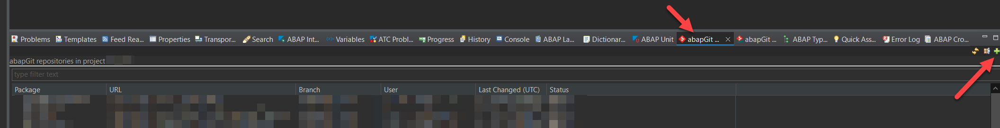
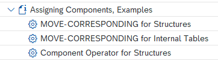

<br />
<div align="center">
  <a href="https://help.sap.com/doc/abapdocu_latest_index_htm/latest/en-US/index.htm?file=abenabap.htm">
    
  </a>

  <h3 align="center" style="font-size: 40px; color: #FCB913;">ABAP Cheat Sheets</h3>

  <p align="center">
    Explore ABAP syntax in a nutshell & executable examples
    <br />
    <!--<a href=""><strong>Expore ABAP syntax in a nutshell & executable examples</strong></a>
    <br />-->
    <br />
    <a href="#%EF%B8%8F-how-to-use">How to Use</a>
    ·
    <a href="#-abap-cheat-sheets-overview">Cheat Sheets</a>
    ·
    <a href="#-getting-started-with-the-examples">Examples</a>
  </p>
</div>
<br>
<hr>
<br>

[](https://api.reuse.software/info/github.com/SAP-samples/abap-cheat-sheets)

ABAP cheat sheets[^1] ...
- provide a **collection of information on selected ABAP topics** in a nutshell for your reference.
- focus on **ABAP syntax**.
- include **code snippets**.
- are supported by easy-to-consume **demonstration examples** that you can import into your [SAP BTP ABAP environment](https://help.sap.com/doc/abapdocu_cp_index_htm/CLOUD/en-US/index.htm?file=abensap_btp_abap_env_glosry.htm) (*main* branch) or [classic ABAP](https://help.sap.com/doc/abapdocu_cp_index_htm/CLOUD/en-US/index.htm?file=abenclassic_abap_glosry.htm) (on-premise ABAP system) (other branches) using [abapGit](https://abapgit.org/) to run and check out ABAP syntax in action in simple contexts.
- are enriched by links to glossary entries and chapters of the **ABAP Keyword Documentation** (the *F1 help*) for you to deep dive into the respective ABAP topics and get more comprehensive information.

<details>
<summary>💡 Note</summary>
<br>

- Since the ABAP cheat sheets provide information in a nutshell, they do not claim to be fully comprehensive as far as the described syntax and concepts are concerned. If you need more details, you can always consult the ABAP Keyword Documentation, for example, by choosing *F1* on a keyword in your code, or by searching directly using the online or the system-internal version.
- Unless otherwise stated in the cheat sheets, the content of this repository is relevant for these ABAP language versions:
  - [ABAP for Cloud Development](https://help.sap.com/doc/abapdocu_latest_index_htm/latest/en-US/index.htm?file=abenabap_for_sap_cloud_glosry.htm): Restricted ABAP language scope for [ABAP Cloud](https://help.sap.com/doc/abapdocu_cp_index_htm/CLOUD/en-US/index.htm?file=abenabap_cloud_glosry.htm) → [Online version of the documentation](https://help.sap.com/doc/abapdocu_cp_index_htm/CLOUD/en-US/index.htm)
  - [Standard ABAP](https://help.sap.com/doc/abapdocu_latest_index_htm/latest/en-US/index.htm?file=abenstandard_abap_glosry.htm): Unrestricted ABAP language scope, for example, for [classic ABAP](https://help.sap.com/doc/abapdocu_cp_index_htm/CLOUD/en-US/index.htm?file=abenclassic_abap_glosry.htm) → [Online version of the documentation (latest version)](https://help.sap.com/doc/abapdocu_latest_index_htm/latest/en-US/index.htm?file=abenabap.htm)
- Check the [Known Issues](#-known-issues) and [Disclaimer](#%EF%B8%8F-disclaimer).
- The cheat sheets provide links to glossary entries and topics in the ABAP Keyword Documentation. Note that unlike the classic ABAP-only cheat sheets, in most cases these links refer to ABAP for Cloud Development.
- [Here](https://help.sap.com/doc/abapdocu_cp_index_htm/CLOUD/en-US/index.htm?file=abenrestricted_abap_elements.htm) is an overview of the different ABAP language elements in the different ABAP versions, i.e. what is allowed in ABAP Cloud and what is not. See also the released APIs [here](https://help.sap.com/doc/abapdocu_cp_index_htm/CLOUD/en-US/index.htm?file=abenreleased_apis.htm).
</details>

<br>

## 🏗️ How to Use

1. **ABAP syntax info**: Get info in a nutshell on ABAP syntax and concepts related to various ABAP topics in the [ABAP cheat sheets](#-abap-cheat-sheets-overview).
2. **Demo examples**: Import the ABAP development objects of this repository (Note: *main* branch for ABAP Cloud only) into your system using [abapGit](https://abapgit.org/) as described [here](#-getting-started-with-the-examples) and run the demo classes by choosing *F9* in the [ABAP development tools for Eclipse (ADT)](https://tools.eu1.hana.ondemand.com/) for checking out the ABAP syntax in action.

<br>

## 📝 ABAP Cheat Sheets Overview

| Cheat Sheet        | Topics Covered           |  Demo Example  |
| ------------- | ------------- | ----- |
|[ABAP for Cloud Development](19_ABAP_for_Cloud_Development.md)| Briefly touches on the terms ABAP Cloud and classic ABAP to set the context for ABAP for Cloud Development | [zcl_demo_abap_cloud_excursion](./src/zcl_demo_abap_cloud_excursion.clas.abap) (see the notes in the cheat sheet) |
|[Data Types and Data Objects](16_Data_Types_and_Objects.md)| Contains basic information about data types and data objects in ABAP  | [zcl_demo_abap_dtype_dobj](./src/zcl_demo_abap_dtype_dobj.clas.abap)   |
|[Internal Tables](01_Internal_Tables.md)| Creating, filling, reading from, sorting, modifying internal tables  | [zcl_demo_abap_internal_tables](./src/zcl_demo_abap_internal_tables.clas.abap)   |
|[Structures](02_Structures.md)| Some basics when working with structures  |  [zcl_demo_abap_structures](./src/zcl_demo_abap_structures.clas.abap)  |
|[ABAP SQL](03_ABAP_SQL.md)| Reading from database tables using `SELECT`, changing data in database tables using `INSERT`, `UPDATE`, `MODIFY` and `DELETE`    | [zcl_demo_abap_sql](./src/zcl_demo_abap_sql.clas.abap)   |
|[ABAP Object Orientation](04_ABAP_Object_Orientation.md)| Working with objects and components, concepts like inheritance, interfaces, and more | [zcl_demo_abap_objects](./src/zcl_demo_abap_objects.clas.abap) |
|[Constructor Expressions](05_Constructor_Expressions.md)| Covers constructor expressions with operators such as `VALUE`, `CORRESPONDING`, `NEW`, `CONV`, `EXACT`, `REF`, `CAST`, `COND`, `SWITCH`, `FILTER`, `REDUCE`, iteration expressions with `FOR`, `LET` expressions  | [zcl_demo_abap_constructor_expr](./src/zcl_demo_abap_constructor_expr.clas.abap) |
|[Dynamic Programming](06_Dynamic_Programming.md)| Covers field symbols and data references as supporting elements for dynamic programming, dynamic ABAP syntax components, runtime type services (RTTS), i. e. runtime type identification (RTTI) and runtime type creation (RTTC) |  [zcl_demo_abap_dynamic_prog](./src/zcl_demo_abap_dynamic_prog.clas.abap)  |
|[String Processing](07_String_Processing.md)| Creating strings and assigning values, chaining strings, string templates, concatenating, splitting, modifying strings, searching and replacing, regular expressions  |  [zcl_demo_abap_string_proc](./src/zcl_demo_abap_string_proc.clas.abap)  |
|[ABAP for RAP: Entity Manipulation Language (ABAP EML)](08_EML_ABAP_for_RAP.md)| Setting EML in the context of RAP, standard (create, read, update, delete) and non-standard operations (actions) | <ul><li>[Demo RAP scenario with a managed RAP BO, external numbering (zcl_demo_abap_rap_ext_num_m)](./src/zcl_demo_abap_rap_ext_num_m.clas.abap)</li><br><li>[Demo RAP scenario with an unmanaged RAP BO, external numbering (zcl_demo_abap_rap_ext_num_u)](./src/zcl_demo_abap_rap_ext_num_u.clas.abap)</li><br><li>[Demo RAP scenario ("RAP calculator") with a managed, draft-enabled RAP BO,  late numbering (zcl_demo_abap_rap_draft_ln_m)](./src/zcl_demo_abap_rap_draft_ln_m.clas.abap) <br>Note that this example can also be checked out using the preview version of an SAP Fiori UI. Check the comments in the class for the steps.</li></ul>  |
|[Excursion Down to Bits and Bytes](09_Bits_and_Bytes.md)|Covers the technical background of data types and data objects|-|
|[ABAP SQL: Working with Hierarchies](10_ABAP_SQL_Hierarchies.md)|Summarizes the functions ABAP SQL offers together with ABAP CDS for working with hierarchical data that is stored in database tables|-|
|[ABAP SQL: Grouping Internal Tables](11_ABAP_SQL_Grouping_Internal_Tables.md)|Covers the `GROUP BY` clause in ABAP SQL|[zcl_demo_abap_sql_group_by](./src/zcl_demo_abap_sql_group_by.clas.abap)|
|[ABAP Managed Database Procedures (AMDP)](12_AMDP.md)|Covers ABAP Managed Database Procedures (AMDP): AMDP Procedures and AMDP Functions (including CDS Table Functions)|[zcl_demo_abap_amdp](./src/zcl_demo_abap_amdp.clas.abap)|
|[Program Flow Logic](13_Program_Flow_Logic.md)|Deals with control structures (`IF`, `CASE`), loops (`DO`, `WHILE`) and exception handling|[zcl_demo_abap_prog_flow_logic](./src/zcl_demo_abap_prog_flow_logic.clas.abap)|
|[ABAP Unit Tests](14_ABAP_Unit_Tests.md)|Contains basic information about unit testing in ABAP|[zcl_demo_abap_unit_test](./src/zcl_demo_abap_unit_test.clas.abap)|
|[CDS View Entities](15_CDS_View_Entities.md)|Note that cheat sheet content is available in [this blog](https://blogs.sap.com/2022/10/24/feature-matrix-data-modeling-with-abap-core-data-services/). The focus here is on the example CDS artifacts and the [executable example class](./src/zcl_demo_abap_cds_ve.clas.abap), which include comments.|[zcl_demo_abap_cds_ve](./src/zcl_demo_abap_cds_ve.clas.abap)|
|[SAP LUW](17_SAP_LUW.md)|Provides a high-level overview on the [SAP LUW](https://help.sap.com/doc/abapdocu_latest_index_htm/latest/en-US/index.htm?file=abensap_luw_glosry.htm) concept that deals with data consistency with a focus on SAP LUW-related statements <br> 💡 Several statements covered in the cheat sheet and the executable example are only relevant to [classic ABAP](https://help.sap.com/doc/abapdocu_cp_index_htm/CLOUD/en-US/index.htm?file=abenclassic_abap_glosry.htm)|Program `ZDEMO_ABAP_SAP_LUW`|
|[Dynpro](18_Dynpro.md)|Provides a high-level overview of dynpro topics with a focus on dynpro-related statements <br> 💡 The content of this cheat sheet and the executable example are only relevant to [classic ABAP](https://help.sap.com/doc/abapdocu_cp_index_htm/CLOUD/en-US/index.htm?file=abenclassic_abap_glosry.htm)|Program `ZDEMO_ABAP_DYNPRO`|

<br>

## 🎬 Getting Started with the Examples

The main focus of the ABAP Cheat Sheets is ABAP Cloud. The examples in the *main* branch of the repository are designed to be imported into the SAP BTP ABAP environment.
For classic ABAP, you can find examples in the other branches of the repository that you can import into your SAP system. Just select the appropriate version (*v757* stands for ABAP version 7.57). Check the information in the following collapsible sections for your system environment and perform the required steps.

<details>
  <summary>1) General info</summary>
  <br>

- Some **DDIC artifacts**, such as database tables, are part of the repository. They are used by the examples to ensure self-contained examples. All artifacts must be imported for all examples to work.
- Most examples are designed to **display some output in the ADT console**. Once successfully imported, you can **run** the examples in ADT by choosing *F9* to display the output in the ADT console. The programs included in the branches for classic ABAP can be executed with *F8*.
- The examples **include descriptions and comments** in the code to provide explanations and set the context.
</details>

<details>
  <summary>2a) SAP BTP ABAP environment</summary>
  <br>

**Prerequisites**
- [x] You have access to an SAP BTP ABAP Environment instance (see [here](https://blogs.sap.com/2018/09/04/sap-cloud-platform-abap-environment) for additional information).
- [x] You have downloaded and installed the ABAP development tools for Eclipse (ADT). Make sure that you are using the latest version, as indicated on the [installation page](https://tools.hana.ondemand.com/#abap).
- [x] Before importing the code, you have performed a system-wide search for classes named `ZCL_DEMO_ABAP*`, for example, so that you do not run into errors when you try to import the code. If someone has already imported the content into the system, you can simply check out that imported version and proceed to the step *3) Run the code*.
- [x] You have created an ABAP cloud project in ADT that allows you to access your SAP BTP ABAP Environment instance (see [here](https://help.sap.com/viewer/5371047f1273405bb46725a417f95433/Cloud/en-US/99cc54393e4c4e77a5b7f05567d4d14c.html) for more information). Your login language is English.
- [x] You have installed the [abapGit](https://github.com/abapGit/eclipse.abapgit.org) plug-in for ADT from the [update site](http://eclipse.abapgit.org/updatesite/).


**Import Code**

Use the abapGit plug-in to install the <em>ABAP Cheat Sheets</em> by carrying out the following steps:

1. In your ABAP cloud project, create a package, for example, *ZABAP_CHEAT_SHEETS* as the target package. It is recommended that you assign the package to a transport request that is suitable for demo content.
2. Add the package to the *Favorite Packages* in the *Project Explorer* view in ADT.
3. To add the <em>abapGit Repositories</em> view to the <em>ABAP</em> perspective, choose *Window* → *Show View* → *Other...* from the menu bar and choose *abapGit Repositories*.
4. In the <em>abapGit Repositories</em> view, click the `+` icon in the upper right corner of the ADT tab to link a new abapGit repository.
  <br>

5. The *Link abapGit Repository* popup appears. Enter the following URL:

```
https://github.com/SAP-samples/abap-cheat-sheets.git
```

6. Choose *Next*.

7. On the *Branch and Package Selection* screen, enter the name of the created package (for example, *ZABAP_CHEAT_SHEETS*) in the *Package* field.
8. Choose *Next*.
9.  On the *Select Transport Request* screen, select the created transport request that is suitable for the demo content and choose *Finish* to link the Git repository to your ABAP cloud project. If the created package is already assigned to a transport request for the demo content, and a message appears that an object is already locked in a transport request, choose *Finish*, too.
10. In the *abapGit Repositories* view, filter for your package. The repository appears in the *abapGit Repositories* view with the status <em>Linked</em>.
11. Right-click on the new abapGit repository and choose *Pull...* to start the cloning of the repository contents.
12. On the *Branch and Package Selection* screen, choose *Next*.
13. If the *Locally Modified Object* screen is displayed, select the objects (for example, the package to automatically select all artifacts) from the list and choose *Next*.
14. On the next screen, select a transport request and choose *Finish*. Same as above, if an *object already locked* message is displayed, choose *Finish* as well. The status in the *abapGit Repositories* view changes to <em>Pull running...</em>. Note that the pull run may take several minutes.
15. Once the cloning is complete, the status changes to *Pulled Successfully*. You may need to refresh the *abapGit Repositories* view to see the progress of the import. To do this, choose the  *Refresh* icon in the upper right corner of the view.
16. Refresh your project tree. For example, in ADT, right-click the package and choose *Refresh*. The package should contain all the artifacts from the GitHub repository.
17. Make sure that all artifacts are active. To activate all inactive development objects, choose the *Activate all inactive ABAP development objects* button from the menu (or choose *CTRL+Shift+F3*).
</details>

<details>
  <summary>2b) Classic ABAP (on-premise ABAP systems)</summary>
<br>

**Prerequisites**
- [x] You are running an [ABAP release](https://help.sap.com/doc/abapdocu_latest_index_htm/latest/en-US/index.htm?file=abennews-75.htm) for which examples are available. See the different branches of the repository. For example, you can find out about your ABAP release by checking the value of `sy-saprl`:  
  ```abap
  DATA rel LIKE sy-saprl.
  rel = sy-saprl.
  BREAK-POINT.
  ```
- [x] Before importing the code, you have performed a system-wide search for classes named *ZCL_DEMO_ABAP**, for example, to avoid errors when you try to import the code. If someone has already imported the content into the system, you can simply check out that imported version and proceed to the step *3) Run the code*.
- [x] You have downloaded and installed the ABAP development tools for Eclipse (ADT). Make sure that you are using the latest version, as indicated on the [installation page](https://tools.hana.ondemand.com/#abap).
- [x] You have created an ABAP project in ADT that allows you to access your application server as mentioned above. Your login language is English.
- [x] You have downloaded and installed the standalone version of the abapGit report. Make sure you are using the latest version, as indicated on the [installation page](https://docs.abapgit.org/). You can create a report, for example, *zabapgit_standalone*, and copy and paste [this code](https://raw.githubusercontent.com/abapGit/build/main/zabapgit_standalone.prog.abap) into the program.

**Import Code**

Use the standalone version of the abapGit report to import the demo examples of the ABAP cheat sheets by performing the following steps:
1. In your ABAP project, create a package, such as *TEST_ABAP_CHEAT_SHEETS* as a target package suitable for demo content (for example, by using *LOCAL* as the software component).
2. Add the package to the *Favorite Packages* in the *Project Explorer* view in ADT.
3. Run the standalone version of the abapGit report.
4. Choose the *New Online* button. If the button is not available, for example, if another repository is already open, choose the *Repository List* button.
5. On the *New Online Repository* screen, make the following entries:
   - ***Git Repository URL***:

      ```
      https://github.com/SAP-samples/abap-cheat-sheets.git
      ```

   - ***Package***: Your demo package, for example, *TEST_ABAP_CHEAT_SHEETS*
   - ***Branch***: Choose the button with the 3 dots to the right of the input field. In the pop-up window, select the appropriate branch, e.g. *v757* if your ABAP release is 7.57, and choose the *Continue* (✔️) button. **Note**: The examples in the *main* branch are for ABAP Cloud only. 
   - ***Folder Logic***: *Full*
6. Choose *Create Online Repo*.
7. The *Repository* screen displays the available ABAP artifacts to be imported into your ABAP system.
8. Choose the *Pull* button. The import of the artifacts is triggered. This may take a while.
9. If the *Inactive Objects* popup is displayed, select all artifacts and choose *Continue* (✔️).
10.	When the cloning is complete, refresh your project tree. For example, in ADT, right-click on the package and choose *Refresh*. The package should contain all artifacts from the GitHub repository.
11. Make sure that all artifacts are active. To activate all inactive development objects, choose the *Activate all inactive ABAP development objects* button from the menu (or choose *CTRL+Shift+F3*).

</details>

<details>
  <summary>3) Run the code</summary>
<br>

- Open the package you created containing the imported ABAP artifacts in the ABAP development tools for Eclipse (ADT).
- Classes: 
  - Open one of the ABAP cheat sheet example classes listed in the [ABAP Cheat Sheets Overview](#-abap-cheat-sheets-overview) section, for example, *zcl_demo_abap_string_proc*. The classes are located in the *Source Code Library* → *Classes* folder.
  - Choose *F9* to run the class. Alternatively, choose *Run* → *Run As* → *2 ABAP Application (Console)* from the menu. 
  - Check the console output.
    > **💡 Note**<br>
    >- Check the notes on the context and the ABAP syntax used that are included as comments in the class.
    >- Due to the amount of output in the console, the examples include numbers (e.g. 1) ..., 2) ..., 3) ...) that represent the headers of each example code section. Also, in most cases, the variable name is displayed in the console. Therefore, to find the relevant output in the console more easily and quickly, simply search the console for the number (e.g. search for *3)* for the particular output) or variable name (*CTRL+F* in the console), or use breakpoints in the code to check variables in the debugger.
    >- You may want to clear the console by right-clicking in the console and choosing *Clear* before running another demo class to avoid confusing the output of multiple classes.
- Programs:
  - The programs included in the repository can be executed with *F8* (or *Run* → *Run As* → *1 ABAP Application*). 


</details>

<br>

## ⚡ Known Issues
- Only one user on the system can import this repository because all object names must be globally unique. Before importing the code, you should perform a system-wide search for classes named *ZCL_DEMO_ABAP**, for example. If someone has already imported the content into the system, you can simply check out that imported code.
- Regarding possible code check warnings, e.g. for the many strings in the code, not using an `ORDER BY` clause, or messages regarding using `SELECT *`, the code deliberately avoids [pragmas](https://help.sap.com/doc/abapdocu_cp_index_htm/CLOUD/en-US/index.htm?file=abenpragma_glosry.htm) and [pseudo comments](https://help.sap.com/doc/abapdocu_cp_index_htm/CLOUD/en-US/index.htm?file=abenpseudo_comment_glosry.htm) in order to focus on the available ABAP syntax. See also the [Disclaimer](#%EF%B8%8F-disclaimer).
- Regarding the examples to be imported into on-premise ABAP systems, note the following: The cheat sheet documents cover ABAP syntax regardless of the ABAP release to avoid scattering information and to have the information in one place. Therefore, the lower the release, the fewer syntax options and examples are available. For example, the RAP examples in particular require at least ABAP version 7.56.

<br>

## ℹ️ More Information
- For the system-internal version of the ABAP Keyword Documentation in 
  - ... **classic ABAP**: Access the documentation in the SAP GUI via the transactions `ABAPDOCU` (opens the documentation directly) and `ABAPHELP` (opens an input field with which you can search the documentation content, for example, you can search for a keyword such as `SELECT`). Or, of course, choose `F1` on a keyword in your code. If you are in the SAP GUI (e.g. in `SE80`), the system-internal version opens. If you are in ADT, the documentation opens in the *ABAP Language Help* view.
  - ... **ABAP Cloud**: In ADT, the documentation is in the *ABAP Language Help* view, where you can also search. If you choose `F1` on a keyword in your code, the documentation opens there.
- Links to the online version of the ABAP Keyword Documentation for:
  - **Standard ABAP**: Unrestricted ABAP language scope for [classic ABAP](https://help.sap.com/doc/abapdocu_cp_index_htm/CLOUD/en-US/index.htm?file=abenclassic_abap_glosry.htm) → [Online version of the documentation (latest version)](https://help.sap.com/doc/abapdocu_latest_index_htm/latest/en-US/index.htm?file=abenabap.htm). To access the online documentation for a specific ABAP version, e.g. 7.54, you can select the version from the drop-down list [here](https://help.sap.com/docs/ABAP?locale=en-US) (*latest* is preselected). The *ABAP* link under *Development* will take you to the documentation of choice.
  - **ABAP for Cloud Development**: Restricted ABAP language scope for developments, for example, in the SAP BTP ABAP environment → [Online version of the documentation](https://help.sap.com/doc/abapdocu_cp_index_htm/CLOUD/en-US/index.htm)
- Regarding demonstration examples of the ABAP Keyword Documentation in classic ABAP: Have you ever checked out the package `SABAPDEMOS`? This package contains all the examples used in the ABAP Keyword Documentation. To get the context, program names, etc., see the [example page](https://help.sap.com/doc/abapdocu_latest_index_htm/latest/en-US/index.htm?file=abenabap_examples.htm) (also available in the system-internal SAP GUI version as a node in the topic tree), which summarizes the executable examples. Of course, you can also find the example topics in the context of the individual ABAP Keyword Documentation topic. The example topics are marked with a ⚙️ icon:

  

- [This blog](https://blogs.sap.com/2021/04/28/video-tutorials-on-how-to-use-the-abap-keyword-documentation-abap-f1-help/) features videos about the ABAP Keyword Documentation in the [SAP Help Portal](https://www.youtube.com/watch?v=a4ckF1XkfG8), [SAP GUI](https://www.youtube.com/watch?v=fsX-085MlD8), and [ADT](https://www.youtube.com/watch?v=hNGEYFpWwh0).

<br>

## ⚠️ Disclaimer
The code examples presented in this repository are only syntax examples and are not intended for direct use in a production system environment. The code examples are primarily intended to provide a better explanation and visualization of the syntax and semantics of ABAP statements and not to solve concrete programming tasks. For production application programs, a dedicated solution should therefore always be worked out for each individual case.
There is no guarantee for either the correctness or the completeness of the code. In addition, there is no legal responsibility or liability for possible errors or their consequences, which occur through the use of the example code.

<br>

## 📟 Support and Contribution
This is not intended to be a contribution repository, so please do not create pull requests. If you like to address issues or suggestions, please create an issue. However, this project is provided "as-is": there is no guarantee that raised issues will be answered or addressed in future releases.

<br>

## 📜 License
Copyright (c) 2022 SAP SE or an SAP affiliate company. All rights reserved. This project is licensed under the Apache Software License, version 2.0 except as noted otherwise in the [LICENSE](LICENSE) file.

[^1]: "A written [...] aid (such as a sheet of notes) that can be referred to for help in understanding or remembering something complex" (Definition for "cheat sheet" in Merriam-Webster Dictionary).